# Overview of NLP tasks (1)

## 分类

### 1. 输入文本输出类别

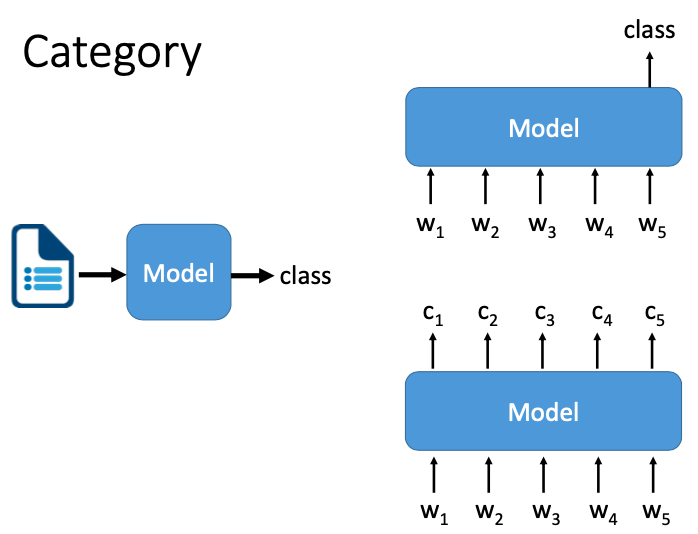

- 输入token，输出类别
- 输入token，输出每个token的类别

### 2. 输入文本输出文本

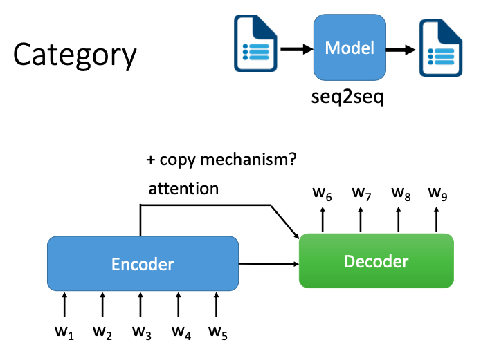

常使用的是seq2seq模型，中间可能使用注意力机制。有一种特殊的情况是输出的一部分可以直接copy输入的。

### 3. 多个句子的输入

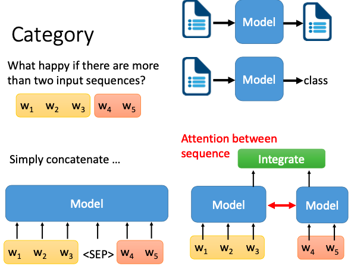

- 之前的：如右图，把两个序列，分别用两个模型去做编码。再把它们编码后的嵌入，丢给另一个整合的模块，去得到最终的输出。有时，我们也会在两个模型之间加 Attention，确保二者的编码内容能互相意识。
- 现在的：如左图，近年来比较流行的做法是直接把两个句子连接起来，中间加一个特殊的字符，如 BERT 里面的 <SEP>，来提示模型去意识到这是两个句子的分隔符。接起来的序列丢给模型后，就可以直接预测下游任务。。

## NLP文本任务分类总述

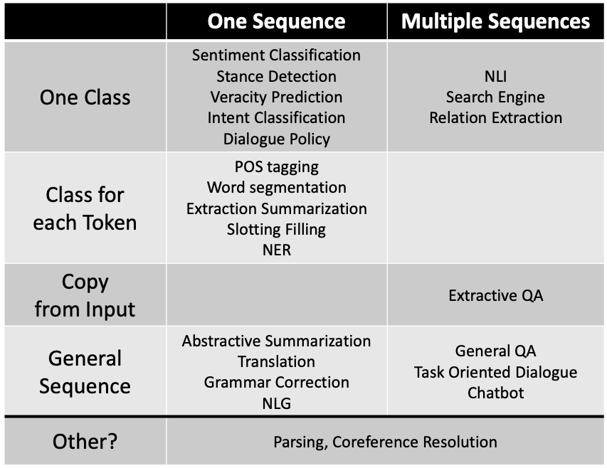

虽然 NLP 的任务千变万化，但根据模型的输入输出可以分成几个大类。模型的输入可以分成一个序列和多个序列，模型的输出可以分成整个序列一个类别，每个位置都有类别，是否需要复制输入，还是要输出另一端文本。除了这些以外，还有一些例外，比如 Parsing 和 Coreference Resolution。

## NLP任务

### POS（词性标注）

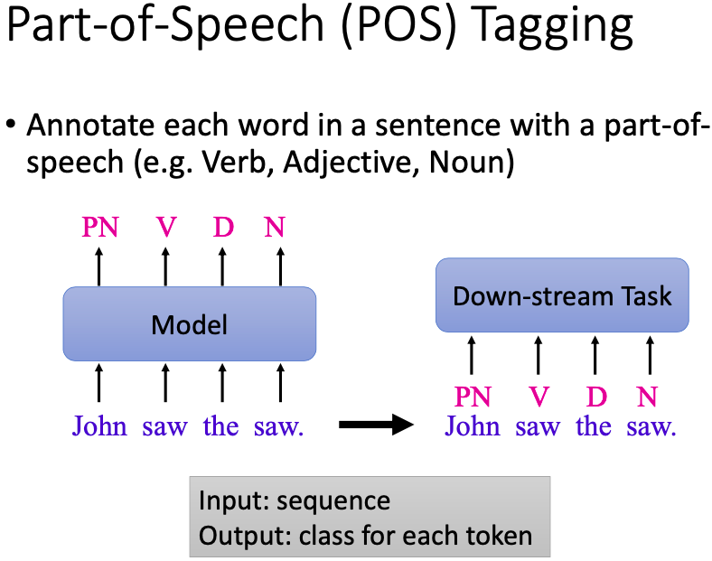

Part-of-Speech (POS) Tagging 词性标注，需要我们标记出一个句子中的每个词的词性是什么。模型进行词性标注后可能获得更好的效果，但比较强的模型可能不需要预先进行pos，因为更强的模型本身就可能带有或者可以学到。

### Word Segmentation（中文分词）

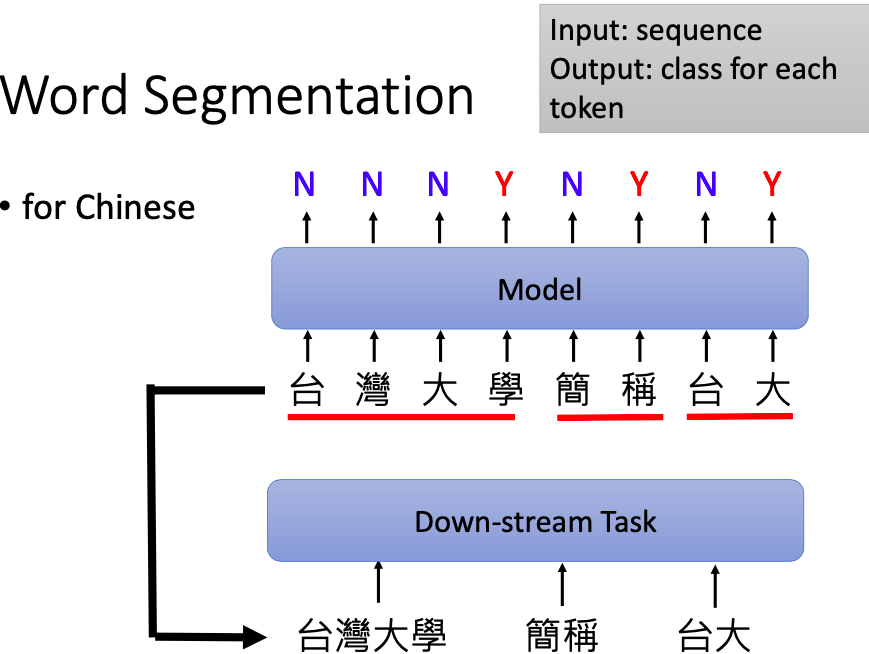

中文分词。英文词汇有空格符分割词的边界，但中文中，却没有类似的方式来区分，所以我们需要中文分词。在一个句子中找出词的边界有时并不是一个简单的问题，所以也需要模型来做。一般中文分词是对句子中的每个字的位置做二分类。如果标注为Y，表示这个字是词汇的结尾边界，如果标注为 N，表示这个字不是词汇的结尾。到了下游任务，我们就可以利用分好的词来作为模型输入的基本单位，而不一定用字。但是否有必要用词表征来替代字表征还是一个值得探究的问题。因为 BERT 在处理中文的时候，它已经不是以字为基本单位了。它很有可能已经自动学到了分词这件事。因此输入要不要用词表征倒显得无关紧要。但 BERT-wwm的实验表明，预训练过程中，让 BERT 要预测的随机 MASK 掉的是一个分词的 span 而不是单独的字能表现更好。说明知道词汇的边界在哪里，对语义的理解是非常重要的。

分词也不是一定必要的，bert没有预先进行分词，输入是以字进行处理的，因为模型内部会自动学会要进行分词这个操作。

### Parsing

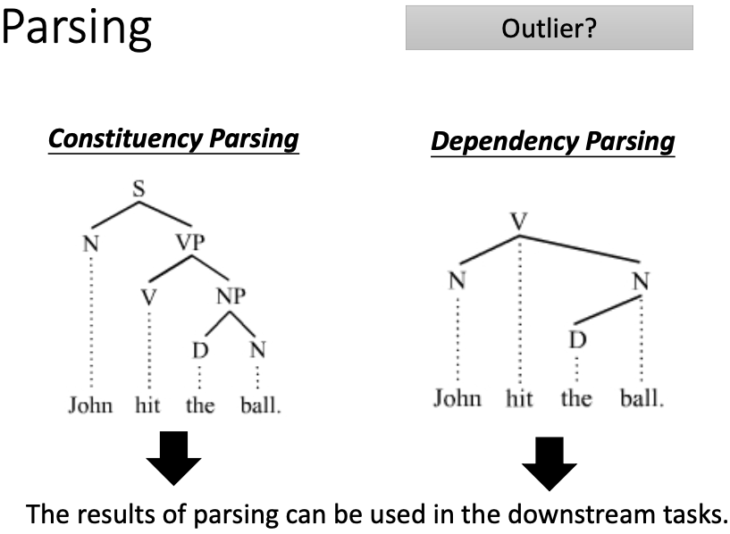

常用作NLP任务的前处理任务。它的输入是一个句子，输出是一棵句法树。它的输出有时会被当作是额外的特征，在接下来的任务中被使用到。

### Coreference Resolution（指代消解）

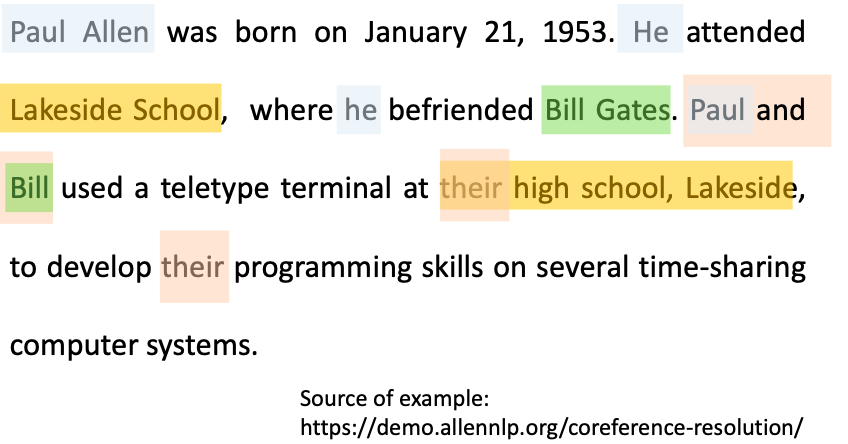

常用作NLP任务的前处理任务，将指代消解的结果当作其他NLP任务的输入。模型需要把输入文章中指代同样东西的部分，找出来。比如文中，He 和 Paul Allen 指的就是同一个人。

### Summarization（摘要）

#### Extractive summarization（抽取式摘要）

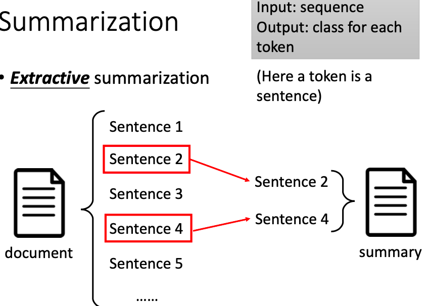

把一篇文档看作是许多句子的组成的序列，模型需要从中找出最能熔炼文章大意的句子提取出来作为输出。它相当于是对每个句子做一个二分类，来决定它要不要放入摘要中。但仅仅把每个句子分开来考虑是不够的。我们需要模型输入整篇文章后，再决定哪个句子更重要。这个序列的基本单位是一个句子的表征。存在的一个问题是：如果有两个意思相近的句子，但是这两个句子还有不同的地方，都应该体现在摘要中，但是模型绝大多数情况下都会选择只保留一个句子。

#### Abstractive summarization（生成式摘要）

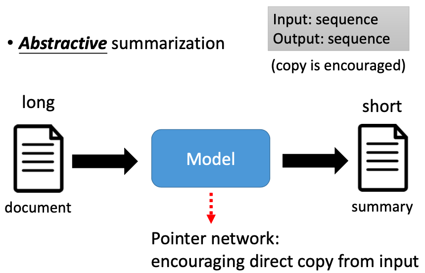

模型的输入是一段长文本，输出是短文本。输出的短文本往往会与输出的长文本有很多共用的词汇。这就需要模型在生成的过程中有把文章中重要词汇拷贝出来，放到输出中的复制的能力，比如 Pointer Network。

### Machine Translation

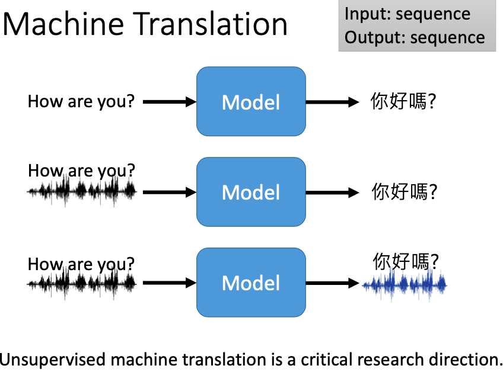

输入文字或语音可以直接输出文字。为什么我们要做输入语音输出翻译文字的翻译模型呢？因为很多语言比如说当地的一些方言，连文字都没有。我们只能做语音到文字的对应。如果我们输入输出的语言都没有文字，我们有机会做语音到语音的翻译。对于机器翻译领域来说，一个很关键的问题就是无监督学习。因为世界上的语言有非常多，大约7000种语言。两两匹配大约有 7000² 对组合。我们现实中很难收集到所有的两两语言组合，这是不切实际的。因此无监督学习是很有必要的。模型通过看了一大段英文句子，也看了一大段英文句子，但没有给出中文和英文的对应关系，却能够自动学会把英文转换为中文，把中文转换为英文。

### Grammar Error Correction

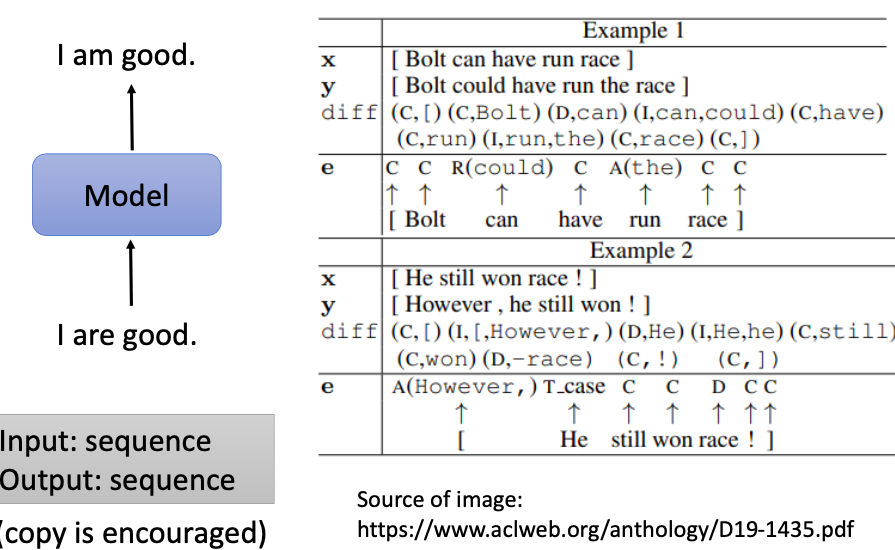

语法改错任务，也是文本序列到文本序列。考虑到输入和输出有很多字是重复的，我们考虑用一些复制机制，让模型把没有错的词汇保留下来。这种语法改错任务其实还可以更进一步简化。输入是一个序列，输出是该序列上每个位置的类别标注。标注类型包括是要保留复制，还是要修改删除。

### Sentiment Classification

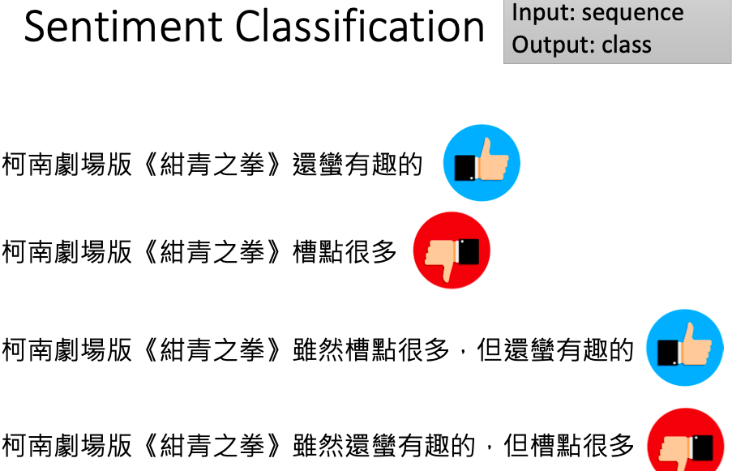

从序列到类别，则包括商品评论的情感分类。句子中可以同时包括正面的词汇和负面的词汇，模型需要根据上下文学到语境中更侧重正面还是负面。比如虽然……但是这种转折关系，"但是"后面的词汇会得到更多的侧重。

### Stance Detection

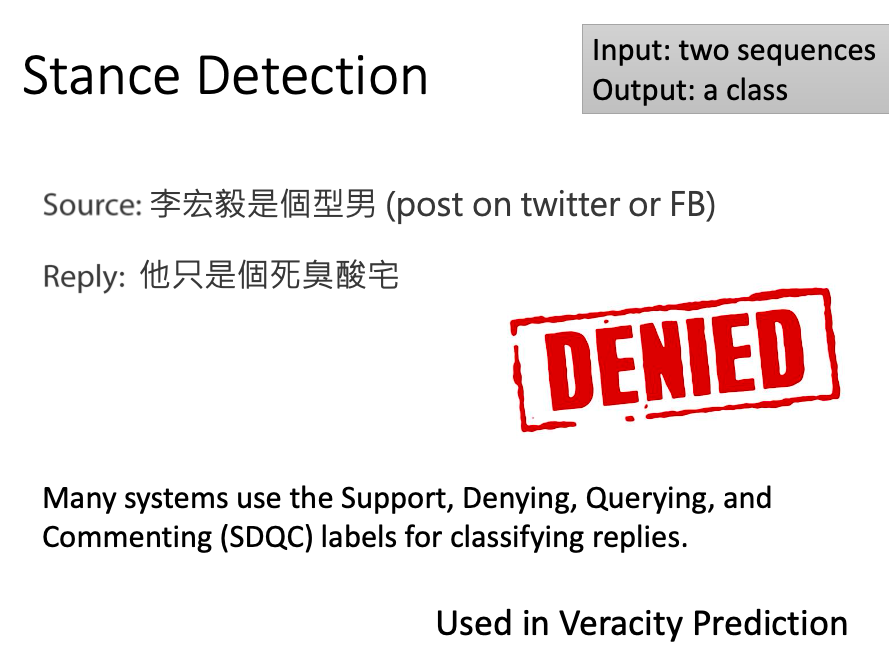

立场检测任务也是分类。它的输入是两个序列，输出是一个类别，表示后面的序列是否与前面的序列站在同一立场。常用的立场检测分类结果包括 SDQC 四种标签，支持 (Support)，否定 (Denying)，怀疑 (Querying)和Commenting (注释)。立场检测也常用在事实验证里。

### Veracity Prediction

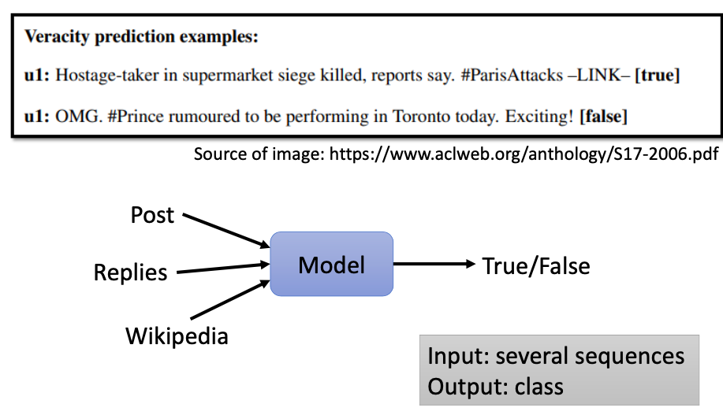

事实验证也是文本分类的一种。模型需要看一篇新闻文章，判断该文章内容是真的还是假的。有时从文章本身，我们人自己都很难判断它的真假。因此有时我们还需要把文章的回复评论也加入模型的输入，去预测真假。如果一个文章它回应第一时间都是否认，往往这个新闻都是假新闻。我们还可以让模型看与文章有关的维基百科的内容，来增强它的事实审核能力。

### Natural Language Inference (NLI)

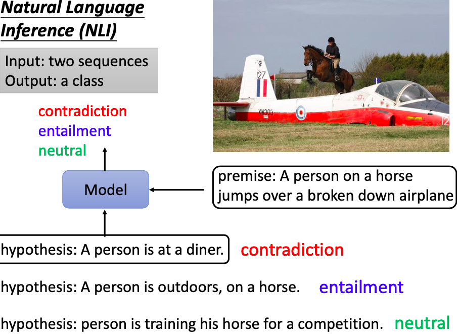

自然语言推断 (NLI)。输入给模型的是一个陈述前提(premise)，和一个假设(hypothesis)，输出是能否通过前提推出假设，它包含三个类别，分别是矛盾(contradiction)，蕴含(entailment)和中性(neutral)。比如前提是，一个人骑在马上跳过一架破旧的飞机，假设是这个人正在吃午餐。这显然是矛盾的。因为前提推不出假设。如果假设是，这个人在户外，在一匹马上。则可以推理出蕴含。再如果假设是这个人正在一个比赛中训练他的马。则推理不能确定，所以是中性的。

### Search Engine

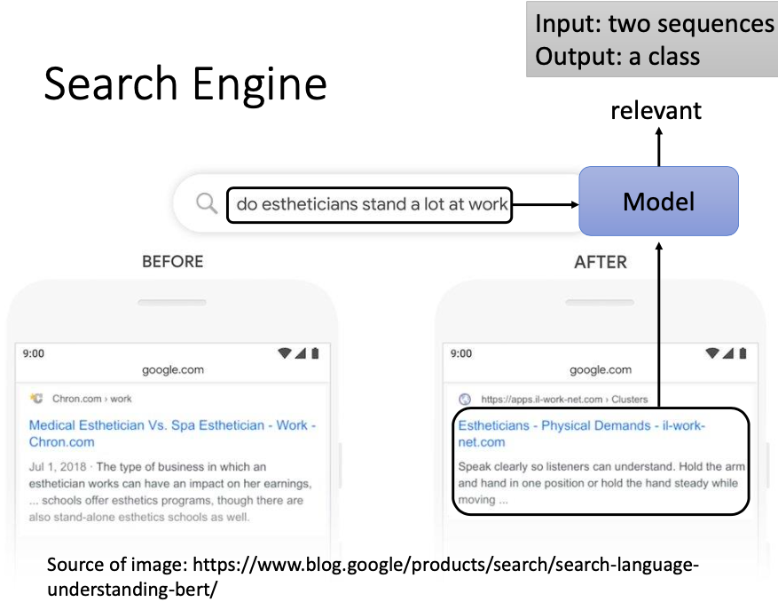

搜索引擎。模型的输入是一个关键词和一堆文章，输出是每篇文章与该关键词的相关性。谷歌有把 BERT 用在搜素引擎上在语义理解上得到了提升。比如搜帮你做美容的人是否经常站着工作。没有 BERT 之前，模型会利用关键词 estheticians 和 stand-alone 做合并结果输出。但有了 BERT 之后，搜出的结果会更倾向于文章语义的理解而非单纯的关键字匹配。

## 参考

- **[Encoder-Decoder 和 Seq2Seq](https://easyai.tech/ai-definition/encoder-decoder-seq2seq/)**

- **[Attention机制](https://easyai.tech/ai-definition/attention/)**

