# Overview of NLP tasks (2)

## NLP文本任务分类总述

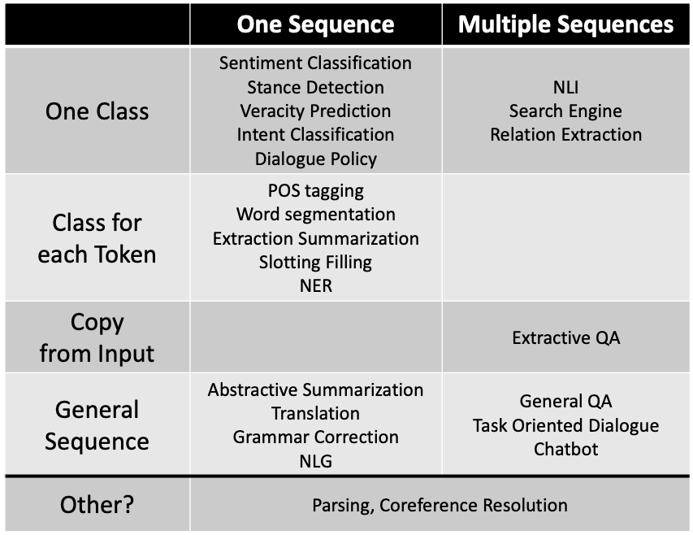

## NLP任务

### Question Answering (QA 问答)

#### 过去的QA

问答系统一般都是基于检索式的，会有如下几个模块：

- 问题预处理（Query 规范化表示，答案类型）
- 用 Query 去召回一波文档，根据一系列的特征去做排序，找出相关性较强的段落
- 对候选答案评分再排序、用答案类型去约束提取出的候选答案，返回最终结果

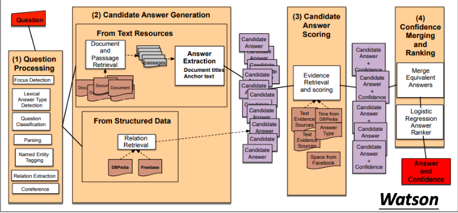

Watson 之所以强大是因为它把每个模块部分做的非常的精细。光问题处理的答案类型它就有几千个，使用了很多特征。在候选答案生成中，它也利用了海量的文档资源，包括结构性的资源数据。输出的候选答案之后，它还会合并相同答案，根据证据做进一步的逻辑回归再排序，选出置信度最高的那个答案。

#### 现今的QA

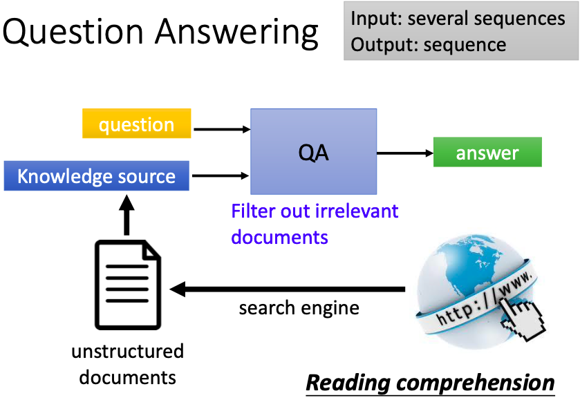

QA的输入是问题和从搜索引擎得来的知识资源，QA系统筛选掉不相关的文档，输出答案。搜索引擎只是做相关性检索，但如果想要理解文档篇章，还是需要机器阅读理解。

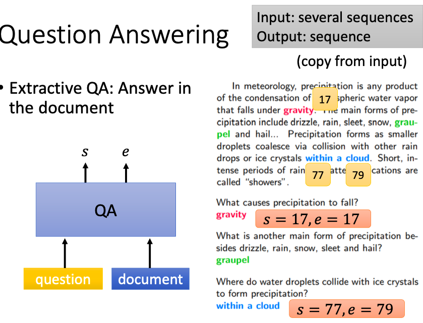

当前主流的研究，其实并没有让模型吐出完整的答案。通常我们做的是抽取式的QA，即给定一段文章和问题，模型需要输出答案在文章段落中的位置。它是强制copy原文中的内容，而不是自主生成基于文章所回答的答案（不在文章中的答案）。

### Dialogue (对话)

#### Chatting (闲聊)

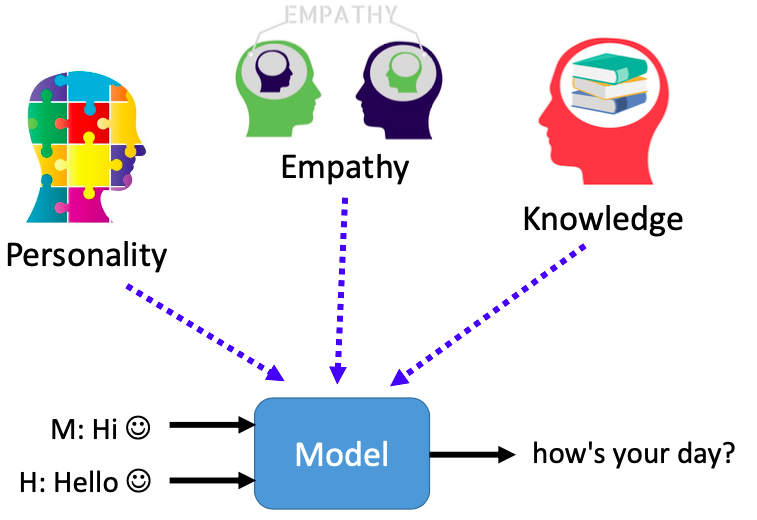

对话机器人可以分成两种，闲聊和任务导向型。闲聊机器人基本上都是在尬聊，有一堆问题待解决，比如角色一致性，多轮会话，对上下文保有记忆等。当前的闲聊机器人缺乏个性、常识、领域知识和同理心。

#### Task-oriented (任务导向)

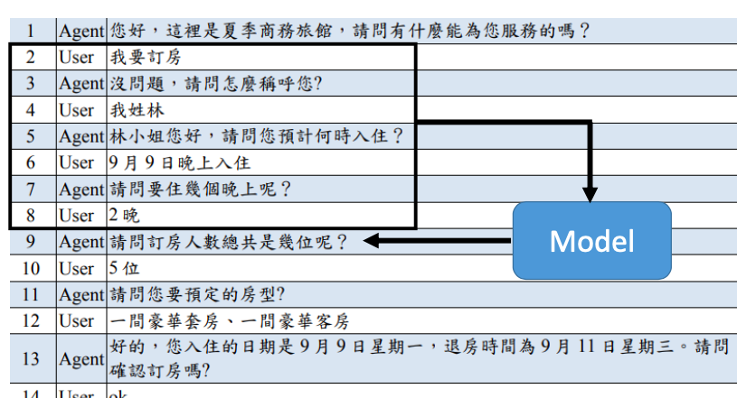

任务导向的对话机器人能够协助人完成某件事，比如订机票，调闹钟，问天气等。我们需要一个模型把过去已经有的历史对话，统统都输入到一个模型中，这个模型可以输出一个序列当作现在机器的回复。一般而言，我们会把这个模型再细分成很多模块。

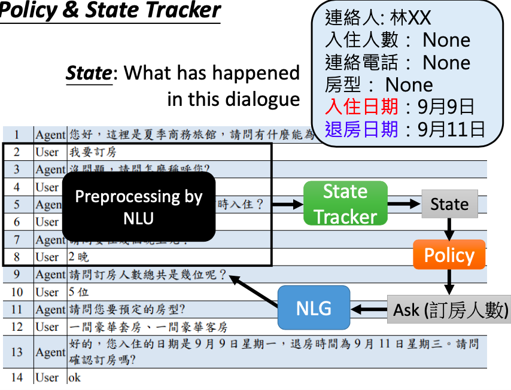

这些模块通常包括自然语言理解(NLU)，状态追踪(State Tracker)，行动策略管理(Policy)，以及自然语言生成(NLG)。NLU 会用来根据上下文来理解哪些信息是对当前任务重要的，比如订房任务中的联系人，入住人数，入住日期等。理解出的信息，会变成一个类别作为状态(State)，交给策略管理模块去判断当前还有哪些信息缺失，是否需要继续询问，还是说信息已经全部补全，可以通过NLG回答问题。如果是要补充信息，则要根据缺失的信息去让自然语言生成模块生成问题。

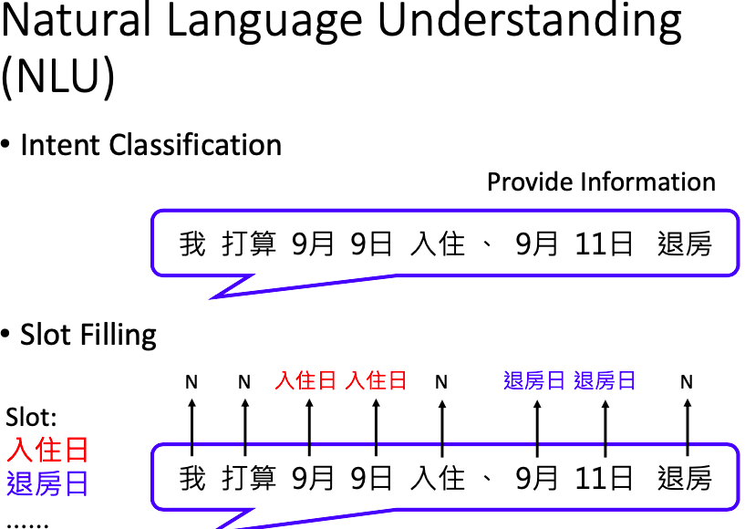

NLU 模块在任务型对话机器人中，通常会有两个任务，一个是意图识别，另一个是槽位填充。意图识别需要弄清楚用户在做什么，是提供信息还是询问问题，它是一个分类任务。假如确认了用户是在提供信息，则槽位填充任务需要从用户回复文本中提取出关键信息，如时间，地点，对应的是入住时间还是退房时间等。但如果意图识别出的是询问问题，比如9月9号还有没有空房，那9月9号就可能不是入住的日期。而是要根据当天有无空房间来进行判断。槽位填充实质在做的与实体命名识别一样。

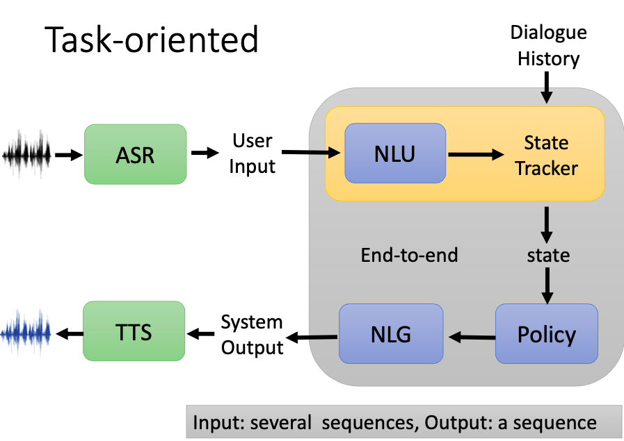

除了之前三个模块，语音助理中，再加上语音识别 ASR 和 语音合成 TTS 就成了完整的对话系统。

所以一个完整的对话系统可能是：文本输入 —> NLU(自然语言理解)理解重要的信息 —> State Tracker(状态追踪)通过NLU理解的信息和对话历史进行信息追踪 —> state 理解在对话中发生了什么 —> Policy(策略管理) 判断当前还有哪些信息缺失，是否需要继续询问，还是说信息已经全部补全，可以执行相关命令 —> NLG(自然语言生成) 生成相关的回家或者生成相关问题 —> 文本输出

### Knowledge Graph (知识图谱)

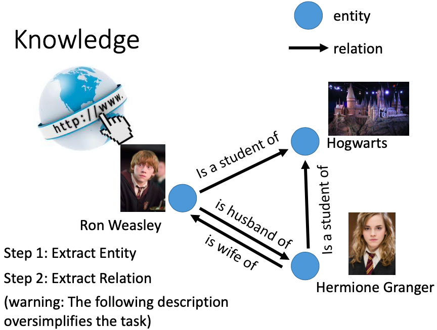

知识图谱的构建简化地去理解可以看作是实体提取和关系抽取。实体可以是人可以是物，也可以是组织机构，非常灵活。关系可以是人与人的关系，可以是谓语动作，也可以是企业之间的资本流动。信息抽取任务希望从海量文本中自动挖掘出实体关系三元组。这个问题其实非常地复杂。这里只是简单地讲。

#### Name Entity Recognition (NER)

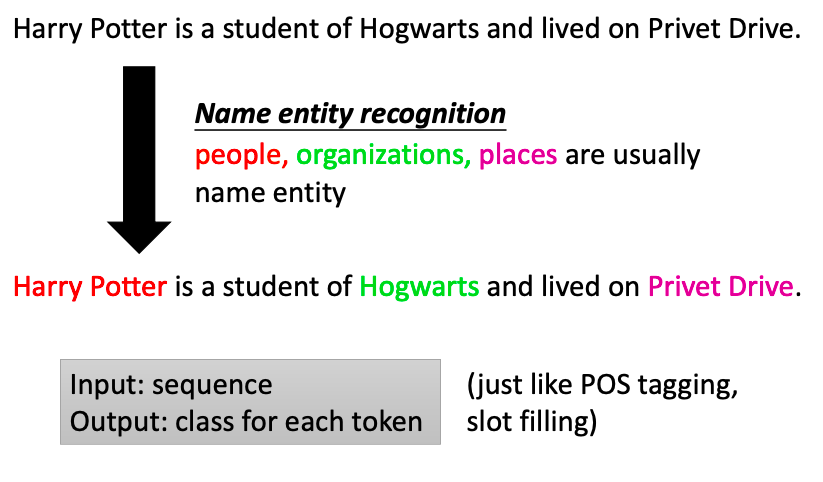

什么是实体命名识别呢？其实命名实体它的内容并没有非常清楚的定义。它取决于我们对哪些事情关心。随着领域的不同，有所差异。一般的实体包括人名、组织和地名等等。但这不是完整的实体的定义。它取决于我们的具体应用。比如我们想让机器读大量医学相关的文献，希望它自动知道有什么药物可以治疗新冠状肺炎。这些药物的名字，就是实体。它输入的是一个序列，输出的是序列上每个位置的类别。它就和词性标注、槽位填充一样。NER常见的两个问题是，名字一样但指的是不同的东西，有多个标签需要实体消歧；不一样的名字指的却是相同的东西，需要实体归一化。总之，怎么抽取实体是有非常多的相关研究。

#### Relation Extraction

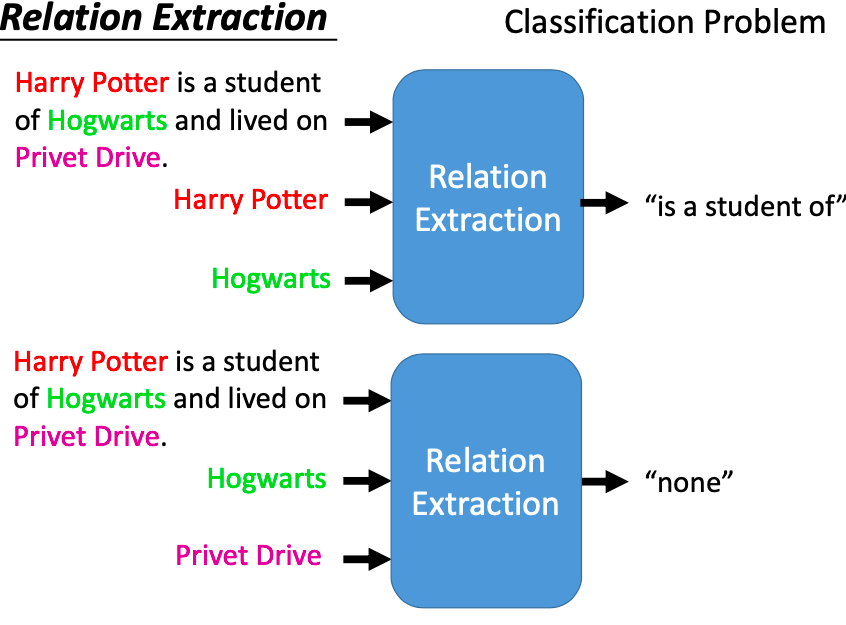

假如我们知道如何从文本中获得实体，接下来还需要知道它们之间的关系。比如输入一段文本：哈利波特是霍格沃茨的学生居住在女贞路，再输入哈利波特和霍格沃滋，关系抽取的结果是：哈利波特是霍格沃茨的学生。若输入的是文本、霍格沃滋和女贞路，对于好一点的关系抽取模型只会得到none的结果。

关系抽取的输入是序列和抽取出的实体，输出是两两实体之间的关系。它是一个分类任务。
