# BERT and its families (1)

## 现今的预训练语言模型

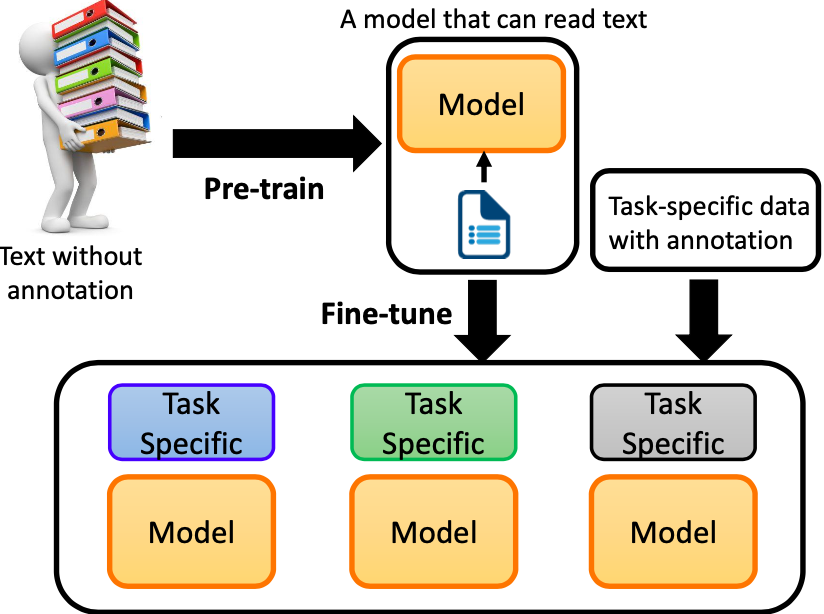

过去 NLP 领域是一个任务用标注数据训练一个模型，而现在我们可以在大量无标注的语料上预训练出一个在少量有监督数据上微调就能做很多个任务的模型。这其实也会比较接近我们学习语言的过程。测试英文能力的好坏，考个雅思，里面有各式各样的任务，有听说读写，有各式各样的题型，有填空有选择。但我们学习英文的方法并不是去做大量的选择题，而是背大量的英文单词，理解它的词性、意思，阅读大量的英文文章、掌握它在段落中的用法。你只需要做少量的考点题，就可以通过某个语言能力的测试。这便是 NLP 领域所追求的目标。我们期待可以训练一个模型，它真的了解人类的语言。在需要解各式各样的任务的时候，只需要稍微微调一下，它就知道怎么做了。

## BERT大家庭 - 芝麻街

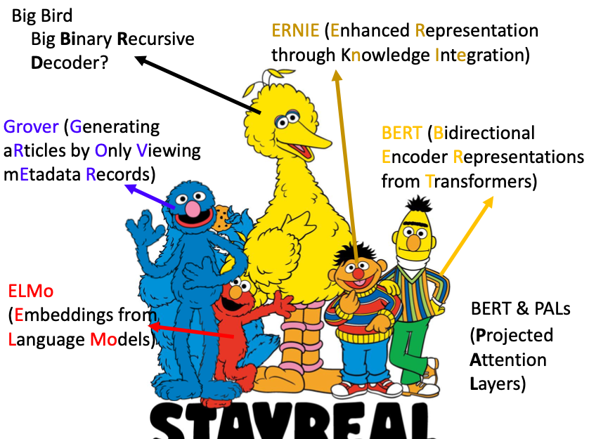

预训练语言模型的缩写大多是芝麻街的人物

## What is pre-train model

### Pre-train Model

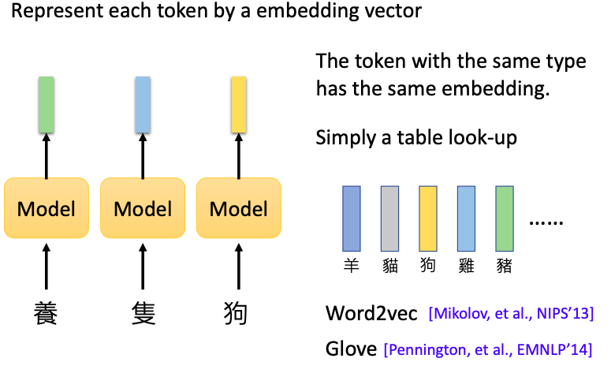

预训练语言模型希望做的是把输入的每个 token 表示成一个 embedding vector。这个向量应该包含了该 token 的语义。意思相近的 token，应该要有比较相近的嵌入。嵌入中的某些维度，应该能看出语义的关联性。在没有 Elmo 和 BERT 这一套预训练方法之前，模型通常是输入一个 token ，输出一个向量，就结束了。输入一个独热编码，输出一个有连续值的向量有很多种做法。常用的是 Word2vec 和 Glove。

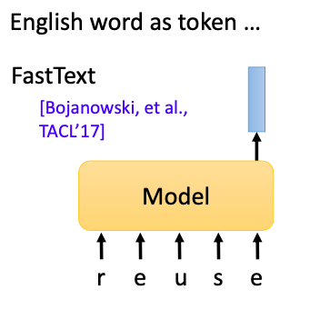

对于英文，如果只是把英文词汇当作 token，容易出现新词不在词表内的问题。我们可以把输入变成是英文单词的字符，输出是一个向量。我们期待模型可以通过读取词汇的字首和字根，判断一个没有看过的词汇的意思。其中的代表模型就是鼎鼎大名的 FastText。

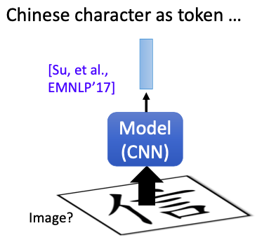

如果是中文，我们可以以中文字符作为输入单位，也可以把中文字形图像作为提取图像特征的 CNN 模型的输入单位。这样的模型可以通过认识部首偏旁来给词向量提供更丰富的语义信息。

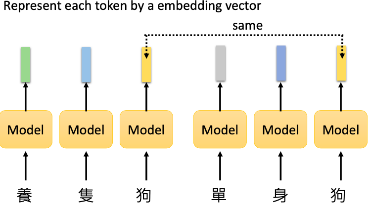

以上这种词向量会遇到相同字在不同语境下意思不同的问题。比如养只狗中的"狗"和单身狗中的"狗"是截然不同的意思。一种解决方案是对每个"狗"字用不同的下标去表示区分。但这又忽略了"狗"这个字在不同上下文意思不一样，但依然有相关。因此我们需要一种能基于上下文语义变化的动态词向量。

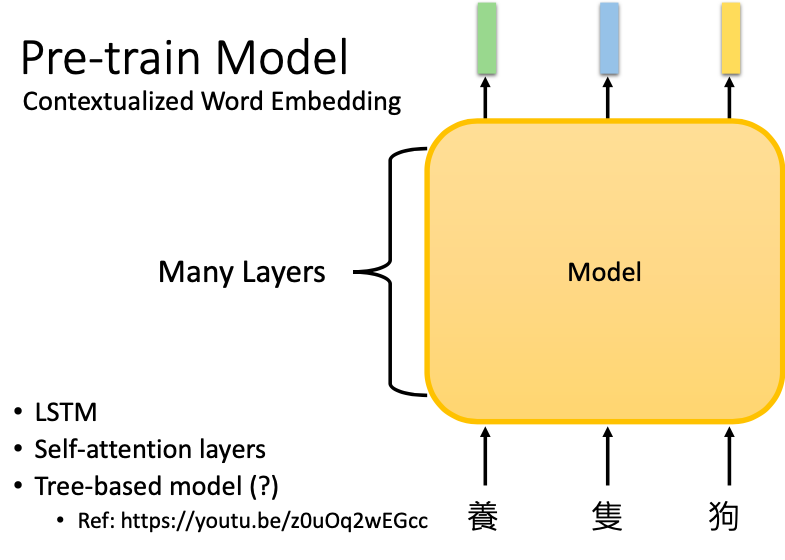

过去的 Word2vec 是吃一个 token 吐出一个 embedding。而到了 ELMo 和 BERT 这些预训练语言模型，它们是吃一整个句子，再给每个 token embedding。而接纳句子输入的模型部分，可以是各种编码器，比如 CNN，LSTM，或者 Transformer。考虑到词汇和词汇之间可能会有一些文法关系，我们也可以用一些 Tree-based 模型去把文法信息编码到模型中。但这样的想法今天并没有非常地流行。可能是因为 LSTM 和 Transformer 在预训练过程中就已经学到了文法的信息。Tree-based 模型就显得不是那么必要了。Tree-based 模型没有流行起来的另一个原因是，很多研究者实验中发现，它做出来的效果并不比 LSTM 好。它只有在处理文法结构非常清楚的问题时，比如数学公式，才会明显好过 LSTM。而其他文本序列任务上，表现一般。

这样的融合了上下文信息的词向量，确实能做到不同语境意思不一样。上图是 BERT embedding 的可视化。上面五个句子指的都是苹果，而下面五个句子指的都是公司。我们把这十个句子中的"苹"的嵌入都抽出来，两两之间去计算余弦相似度。图中颜色越亮表示相关性越高。结果发现，前五个句子的"苹"字之间，和后五个句子的"苹"字之间，语义会比较像。

### Bigger Model

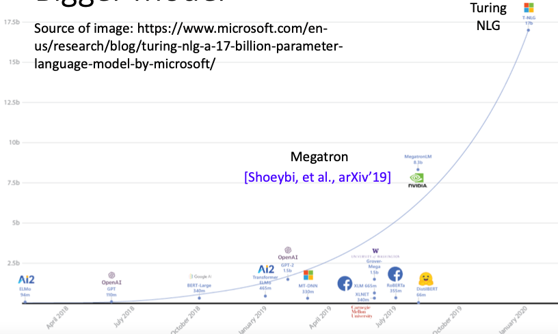

在商业上，预训练语言模型越拉越大。

### Smaller Model

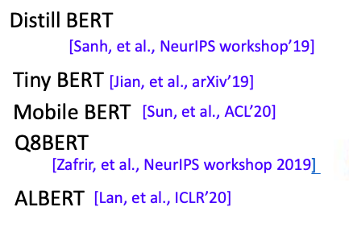

预训练语言模型较小的有Distill BERT，Tiny BERT，Mobile BERT，Q8BERT 和 ALBERT 。其中ALBERT用同样的参数，性能却比 BERT 还好一点。

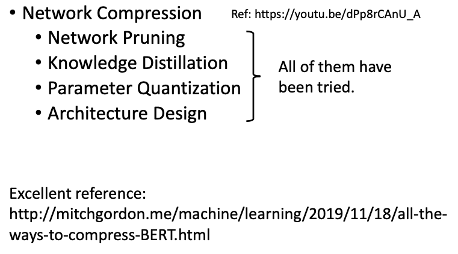

将模型变小可以参照李宏毅之前机器学习讲的模型压缩那一节。可以尝试的技术有网络剪枝，知识蒸馏，量化和架构设计。

### Network Architecture

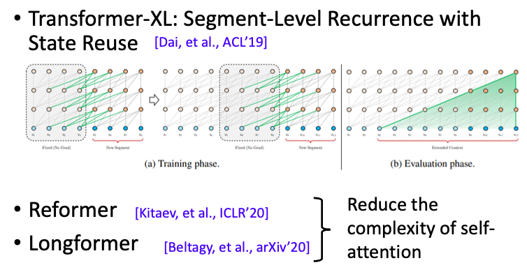

近年来比较火的尝试是架构设计。为了能让机器可以读非常长的序列，Transformer-XL 可以让机器读跨越片段的内容。为了让自注意力的计算复杂度变小，从 O(T²) 变成了 O(TlogT)，甚至更低， Reformer 使用了局部敏感性的哈希注意力。为了让自注意力的空间复杂度也变小，从O(T²)变小，Longformer 用注意力模式来稀疏完整的注意力矩阵。

## How to fine-tune

## How to pre-train

