# BERT and its families (2)

## How to fine-tune

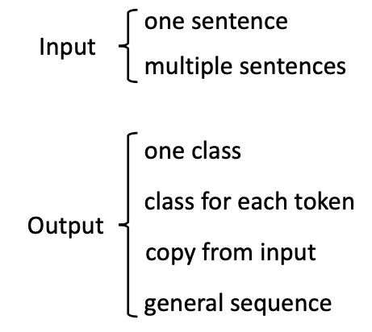

NLP任务按输入两类，输出四类的话，共有八类。而预训练语言模型要做到一个模型，通过微调训练出能处理多种任务的模型。

### Input

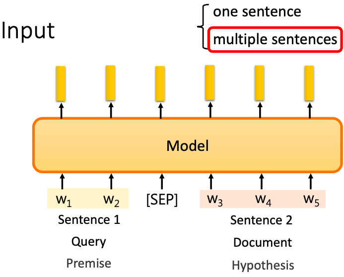

NLP预训练语言模型，通常输入分为两类，一个句子输入和多个句子输入。其中多个句子输入可能是多个句子、问题和文档、陈述前提和假设。它们中间用 [SEP] 分隔符分开，输出接一个MLP分类，端到端训练下来就结束了。

### Output

NLP预训练语言模型，通常输出分为四类

#### one class

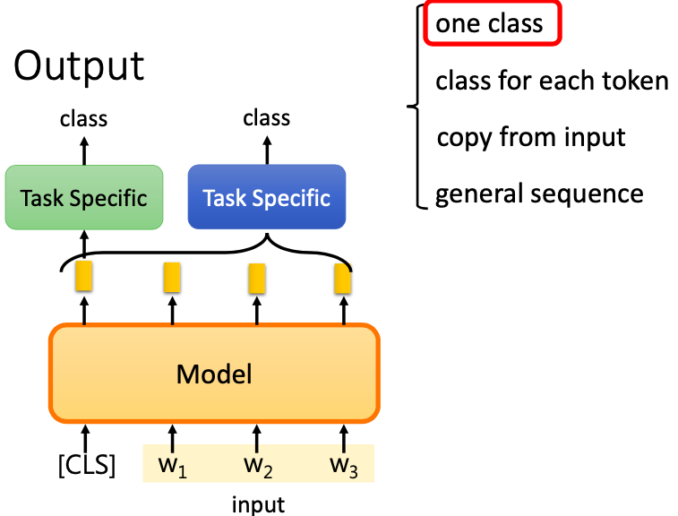

如果输出是一个类别，有两种做法。一种是直接对 [CLS] 这个 token 的嵌入接 MLP 进行分类。另一种是把所有位置的嵌入接 MLP 进行分类。

#### class for each token

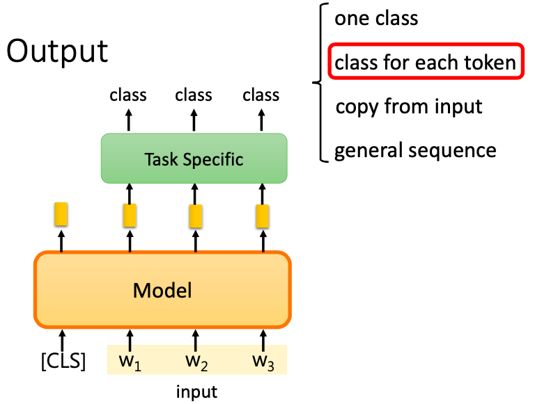

如果输出是每个位置一个类别，则对非 [CLS] 的 token 各接一个MLP，输出分类。

#### copy from input

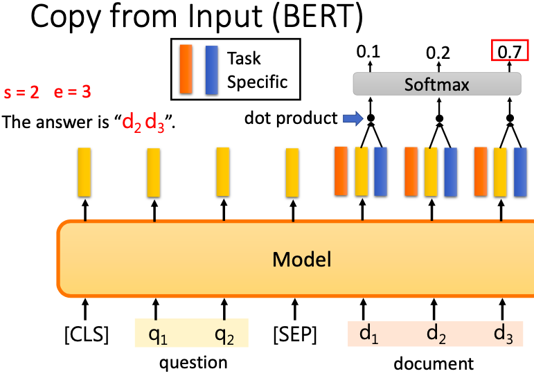

如果输出需要复制部分的输入，比如抽取式机器阅读理解。则输出接两个 MLP，一个输出答案的开始位置，一个输出答案的结尾位置。

#### general sequence

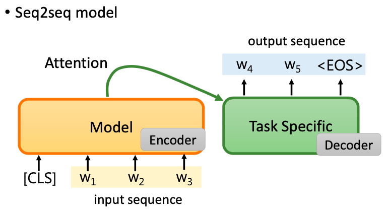

如果我们要做 Seq2Seq 的模型，比如翻译。一种思路是，可以把预训练语言模型的输出经过一个注意力层后，丢给另一个解码器解码。

另一种 Seq2Seq 的方式是自回归式的。每次让分类器生成一个 token 后，再把这个 token 与源输入拼接起来，再丢回给模型，用分类器生成下一个 token。以此类推，直至生成出 <EOS> 结尾符号。

### how to fine-tune

预训练语言模型要如何进行微调呢？一种方法是固定住预训练语言模型，让它作为一个特征提取器。训练的时候，只训练下面接的 MLP 的参数。另一种是不固定住预训练语言模型，对整个模型进行训练微调。第二种方法实践中会好很多。

### Adaptor

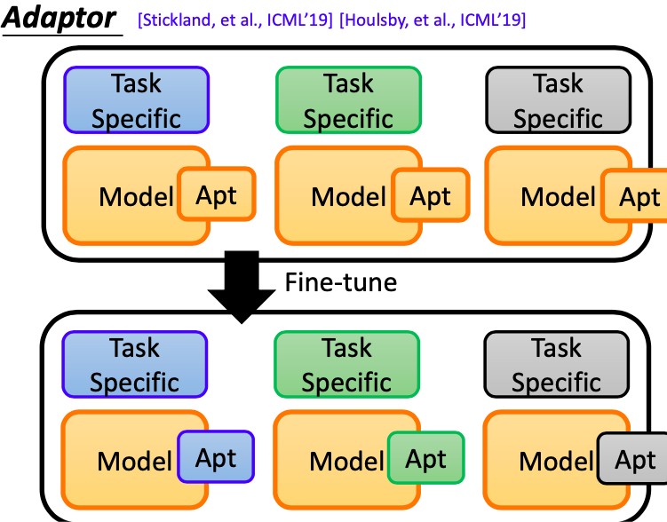

如果我们现在采取的是对整个模型进行微调，这个模型在不同的任务里面会变得不同。每个任务我们都要存一个巨大的模型，显然是行不通的。所以我们需要一个 Adaptor 的结构，来让我们微调的时候，不是更新整个预训练语言模型的参数，而是只需要更新其中很小一部分的 Adaptor Layer 的参数，就可以获得和更新整个模型参数一样好的效果。这样，我们对不同任务模型储存的时候，就只需要把这一小部分 Adaptor 的参数给储存下来。用的时候，把它放到原版的 BERT 中就可以了。这样就会比每一个任务都要存一个很大的预训练语言模型要小得多。其实模型参数的储存并不是一个大问题。问题是当我们要做集成学习的时候，只储存 Adaptor 的参数会非常方便。

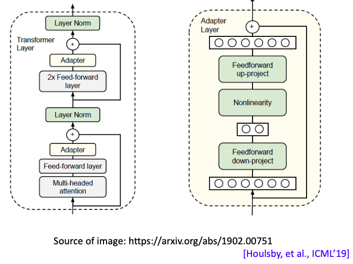

Adaptor 是怎样运作的呢？相关的研究有好几篇，每篇的解法还都不一样。怎样解是好的，还是一个待研究的问题。这边只是举一个例子来给大家参考。这篇 ICML 19 的论文做法是把 Adaptor 插入在 Transformer 中的 Feed-forward 和 Lyaer Norm 层之间。它的架构也很简单，一个线性层+非线性单元再加一个线性层，输入输出之间用 ResNet 的思想相加。微调时，只调整 Adapter 的参数。

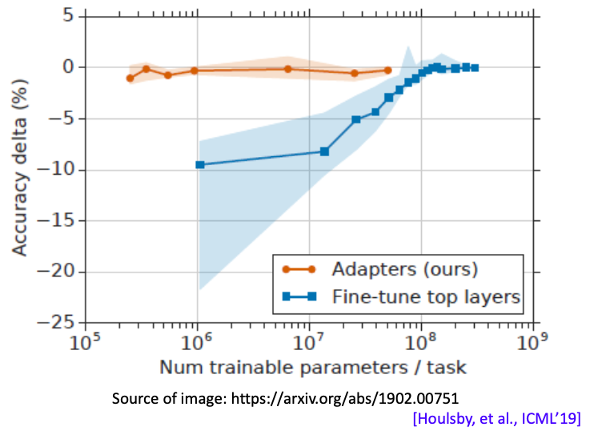

这种方法的效果很不错。相比于要预训练整个模型，只训练 Adaptor 表现也差不多。把 Adaptor 加在哪里，模型结构怎么设计都是值得研究的话题。

### Weighted Features

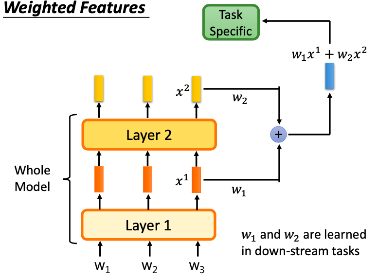

微调还有一种不一样的做法。我们可以把不同层的输出都抽出来做加权求和再去分类。加权求和后的嵌入融合了浅层和深层的输出，并依据任务的不同来调整浅层特征和深层特征的权重。

## 为什么预训练模型

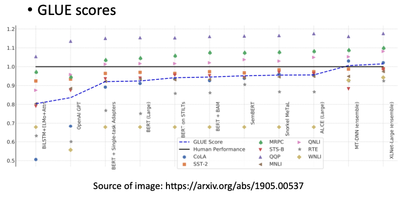

为什么我们需要这些预训练的模型呢？一是因为这些预训练语言模型，真的能给我们带来比较好的表现。二是预训练语言模型在 GLUE 上的表现逐年增高，到近年来超越人类水平。

## 为什么要微调模型

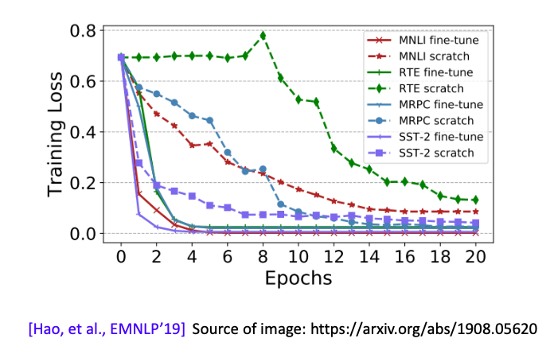

EMNLP 2019这篇文章表明，预训练语言模型可以大大加速损失的收敛。而不使用预训练语言模型，这个损失比较难下降。 可以理解为，预训练语言模型提供了一种比随机初始化更好的初始化。

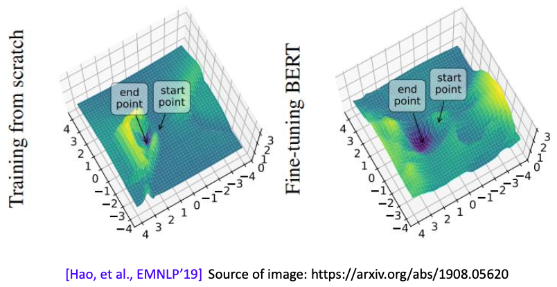

另外一个结论是，预训练语言模型可以大大增加模型的泛化能力。如何看模型的泛化能力可以参照李宏毅之前讲过的深度学习理论的课程。上图表示给模型不同参数的时候，模型的损失。图中模型训练后结束点的损失会抵达一个 local minima 的位置。这个 local minima 越陡峭，则泛化能力越弱。因为输入稍微变化，它的损失就有变大的倾向。反之，这个 local minima 越平缓，则泛化能力越强。上图可以看到，使用了预训练语言模型微调后，结束点的损失平面 local minima 周边比较平缓，说明泛化能力强。

## How to pre-train

