# BERT and its families (3)

## How to pre-train

### Pre-training by Translation

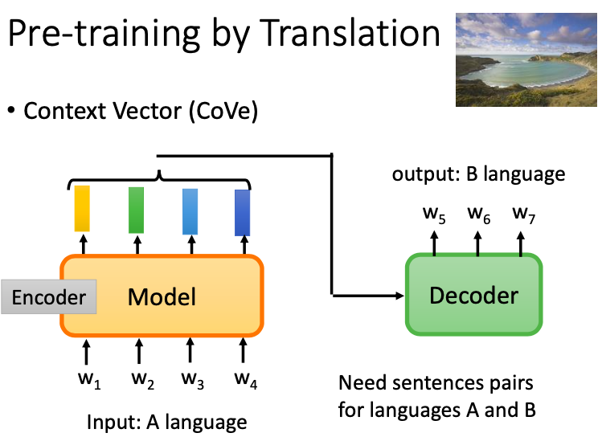

较早的时候，CoVe 使用的是基于翻译的方法来训练模型得到句子的嵌入。我们用翻译模型的 encoder 对输入语言A的句子编码经过 attention 之后再丢给解码器输出语言B的句子。我们用encoder最后的隐层作为这个句子的表征。这里用翻译会比用摘要好，因为翻译需要把句子的意思如实地呈现到输出句子中。因此输入句子中的每一个词汇都需要被考虑到。但 CoVe 这种方法的缺点在，它需要大量的成对数据，而成对数据缺乏。

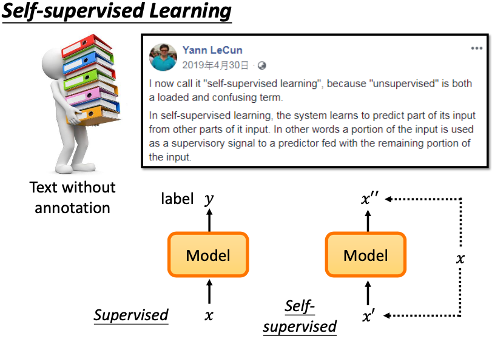

如果我们能够用自监督的方式去训练，则能利用海量的现有文本。

### Predict Next Token

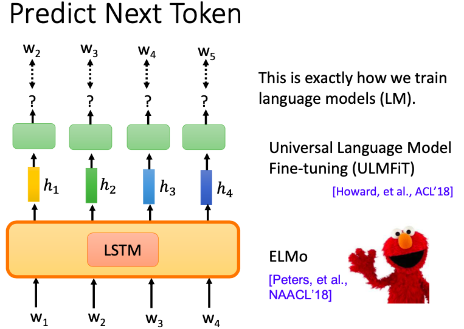

要怎么样从无标签的数据本身获取信息呢？一种方法是给定一个的句子，遮住下一个 token，让模型去预测这个遮住的 token。 这种预测下一个 token 的方式，是最早语言模型训练的方式，还没有 Transformer 之前，大家用的都是 LSTM 作为编码器，包括著名的 ULMFiT 和 ELMo。

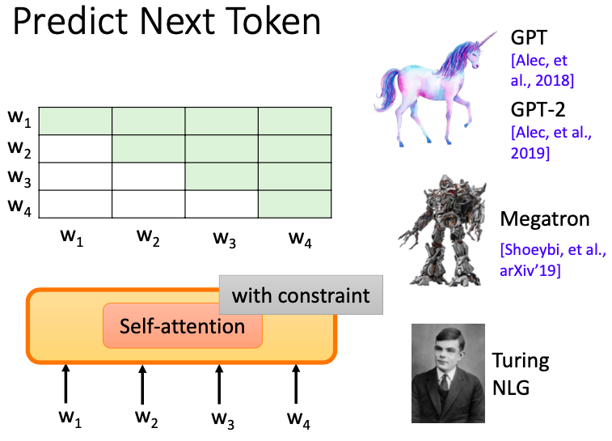

如果我们把 LSTM 换成是 Self-attention 去预测下一个token，就有了 GPT，GPT-2，GPT-3，Megatron，以及 Turing NLG 等模型。但使用自注意力有个要注意的点是，它不像 LSTM 那样会有先后顺序输入模型一个个进行编码。它一次性能看到上下文的每一个 token。因此我们需要设计好 MASK 矩阵来约束，好让做自注意力的时候看不到后面的token。

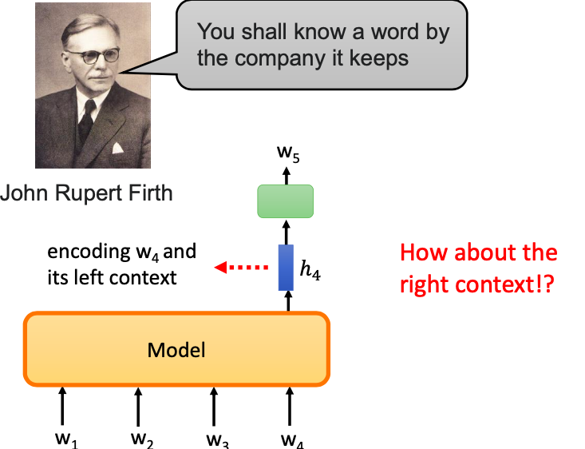

为什么我们只通过让模型预测下一个 token 就可以得到我们想要的 embedding 呢？因为它符合语言学中，一个词汇的意思往往取决于它的上下文的准则。

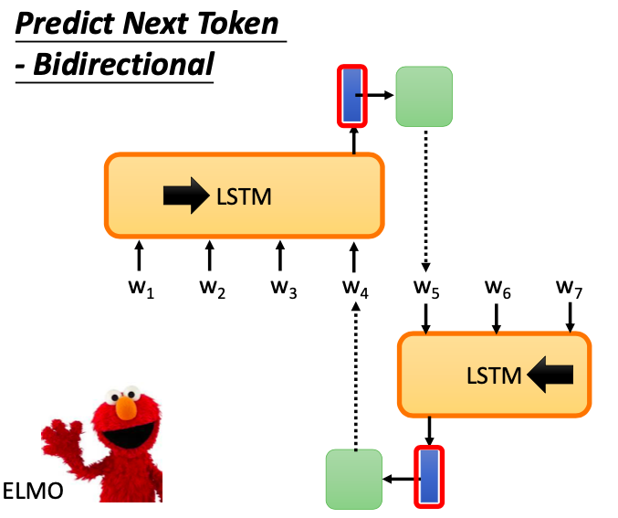

如果我们只是用 LSTM从左往右过一遍句子，那预测下一个token 所依赖的信息就只能取决于它左边的内容。为了能真的利用这个 token的上下文。我们可以从右到左再过一遍句子，即用 BiLSTM 来做。这也是ELMO。

### Masking Input

对于 Transformer 而言，自注意力能同时看上下文，每一个 token 两两之间都能交互，所以不需要像 LSTM 那样双向。只需要用特殊的 token 用 MASK 遮住就可以或者换成一个随机的token。

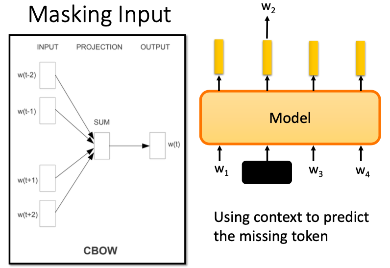

在7-8年前，Word2vec 刚刚掀起一波 NLP 革命的时候。 CBOW 的训练方式和 BERT 的训练方式几乎一样。它们都是使用文本去预测某个隐藏的token。它们的一个关键性差别在，BERT 左右能关注的词的范围长度是灵活可变的，而 CBOW 是固定窗口。

随机地 MASK 掉某个 token 是否真的是好方式呢？对于中文来说，词的粒度是由多个字组词。一个字为一个 token。如果我们随机 MASK 掉某个 token，模型可能不需要学很多语义依赖，就可以很容易地通过前面的字或后面的字来预测这个 token。为此我们可以把难度提升一点，盖住的不是某个 token，而是某个词 span，模型就需要用更多的语义去把遮住的 span 预测出来。这便是 BERT-WWM。同理，我们把词的 span 再延长一些，拓展成短语层面、实体层面。这些短语实体得用NER模型或知识图谱辅助识别出来。因此训练出来的模型能得到知识增强。

### SpanBert

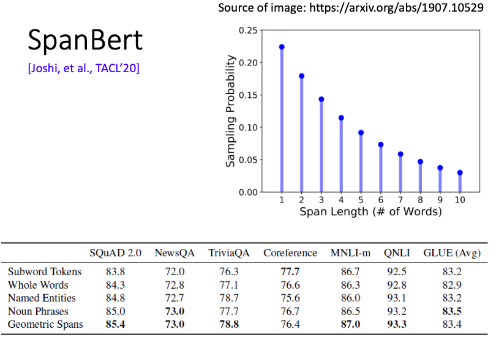

还有一种增强方法叫 SpanBert。它每次会盖住一排 token 。每次要盖多长它是根据短语词频统计得到的一个分布。结果实验发现，这种基于 span 的预测方法能显著好于盖全词，盖短语或实体的方法。而且这种覆盖方法不需要 NER 或知识图谱辅助，非常方便。

SpanBert 中还提出了一种 SBO 的训练方法。一般我们训练只是把盖住的 MASK 的 tokens 给训练出来。而SBO做的是，希望被盖住范围的左右两边的嵌入，去预测被盖住的范围内，有什么样的东西。如图所示，SBO单元会输入 w3 和 w8 的嵌入，和一个指定数值。这个数值表示的是MASK span 中的第几个 token。如果输入的是3，就是要还原出 w5 的内容。为什么要这样呢？这样对共指解析非常有用。共指解析任务中，我们希望一个 span 前后两边字的嵌入包含整个 span 的内容。

### XLNet

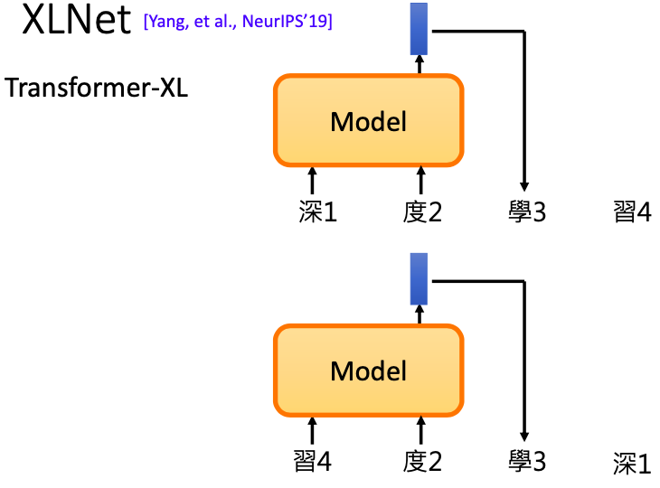

XLNet 中的 XL 指的是 Transformer-XL。XL的好处是可以为跨越 segment 的信息编码，利用了相对位置编码。XLNet指出，原版的 BERT 会用 MASK 把 New York 这两个 token 一起盖住，这样我们就没有办法学到根据 New 去预测 York，或者根据 York 去预测 New。但如果在 BERT 中，对于同一个句子，我们是每次都随机去遮住 token，就可以有时盖住 New，有时盖住 York。这便是 RoBERTa。原版的 BERT 对于一个句子只会固定一开始随机要 MASK 的索引去预测。而 RoBERTa的这种方法可以解决 XLNet 提出的批判。XLNet 可以从两个观点去看。如果是从自回归语言模型去看，我们是要从左往右去一个个看句子中的词再预测下一个 token。

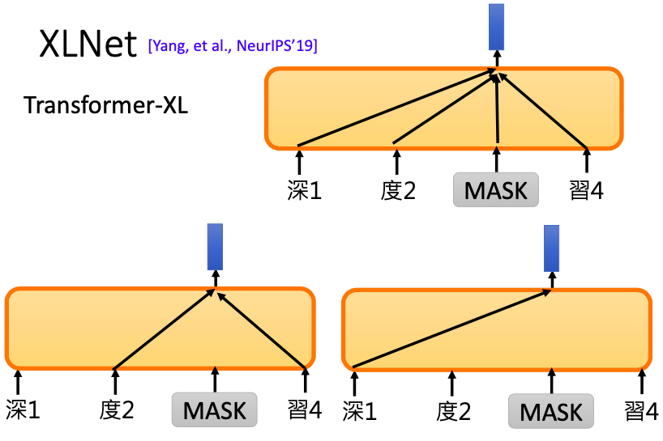

如果从 BERT 的观点来看，我们会把一些 token MASK 起来，然后根据整个句子的信息和 MASK 的位置信息去预测 MASK 的内容。在 XLNet 中，我们希望不是根据整个句子的信息，而是根据 MASK 左边的信息或 MASK 右边的信息。而且，与 BERT 不同在，XLNet 的输入没有 MASK 的存在。它给的只是 MASK token 所在的位置信息。即通过1、2个位置的token，去预测第三个位置的 token。

### MASS/BART

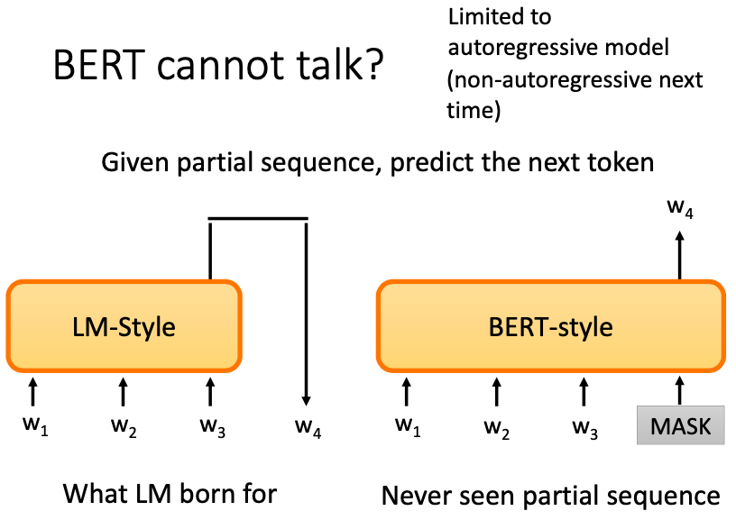

BERT 做生成任务并不是很好。因为我们要做生成，必须要有给定一段句子序列，让它能预测下一个 token 的能力。对 BERT 来说，并不是没有类似地训练过。比如它预训练时，会经历根据 w1-w3 预测第四个遮住的 token 的情况。但 BERT 并不是把遮住的 token 的右边或左边 token 的信息当作未知去预测，BERT是根据上下全文预测的。这种讨论都只局限于自回归模型。我们在说话、写字的时候，都是从左写到右。不会是左边写了一点，空出几格，再写右边，再把中间空出的格子补上。因此直觉上，正常产生句子的方式应该是一个自回归的过程。当然，非自回归的方式也可以产生句子。如何用更好的非自回归的方式去生成句子是当下值得研究的课题。

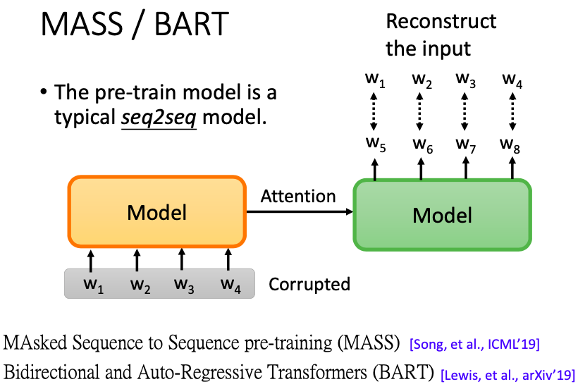

BERT 因为缺乏生成的能力。所以它不大适合做 Seq2Seq 的预训练语言模型。如果我们想要做 Seq2seq 的任务，BERT 只能当做编码器。解码器的部分，我们就没有训练到。我们有没有方法直接预训练一个 Seq2seq 的模型呢？答案是可以的。我们把一个句子输入编码器，解码时，希望它能重构回原来的句子。但我们必须把输入的句子做某种程度的破坏。因为如果没有任何破坏，模型可以直接复制粘贴输出，它可能学不到任何东西。所以我们要增加问题的难度。

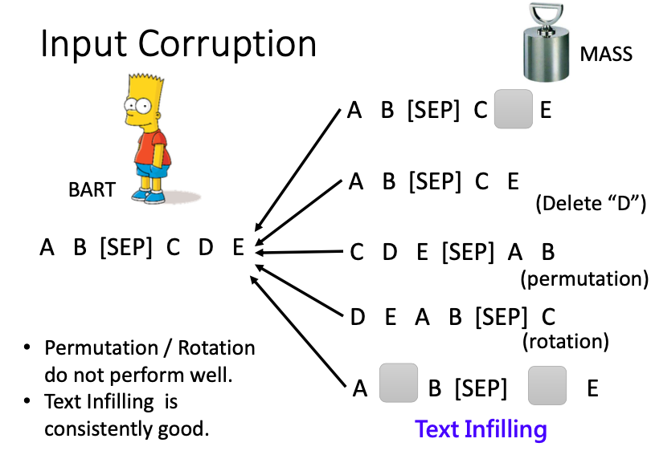

MASS 的做法是，把输入的一些部分随机用 MASK token 遮住。输出不一定要还原完整的句子序列，只要能把 MASK 的部分预测正确就结束了。在 BART 论文中，它又提出了各式各样的方法。除了给输入序列随机 MASK 以外，还可以直接删除某个 token。或者也可以随机排列组合，希望输出的句子能够把他们变成正确的语序。再或者用旋转的方式，把某些放在尾部的 tokens，放到前面去。还有一种方法叫 Text Infilling。我们会在句子中加入 MASK，可以在A 和 B 的 token 之间随机插入一个 MASK，做误导。也可以把一连串的 token ，比如 C 和 D 都 MASK。BART 的结论表示，排列组合和旋转的方式表现都不好，但文本填充的预训练方式能够稳定地好。

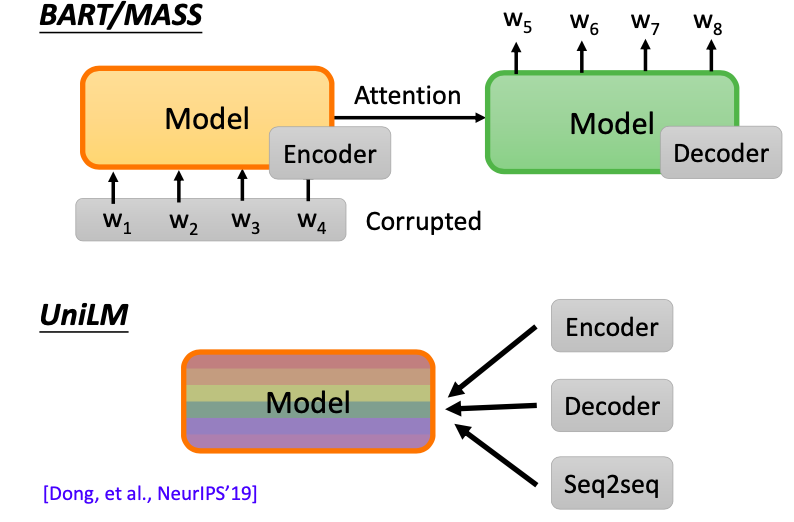

UniLM，它同时是编码器和解码器，还是Seq2seq 的模型。

UniLM 模型它是很多 Transformer 堆叠起来的。它同时进行三种训练，包括 BERT 那样作为编码器的方式，GPT那样作为解码器的方式，以及 MASS/BART 那样作为 Seq2seq 的方式。它作为 Seq2seq 使用时，输入被分成两个片段，输入第一个片段的时候，该片段上的 token 之间可以互相注意，但第二个片段中，都只能看左边的 token。

### ELECTRA

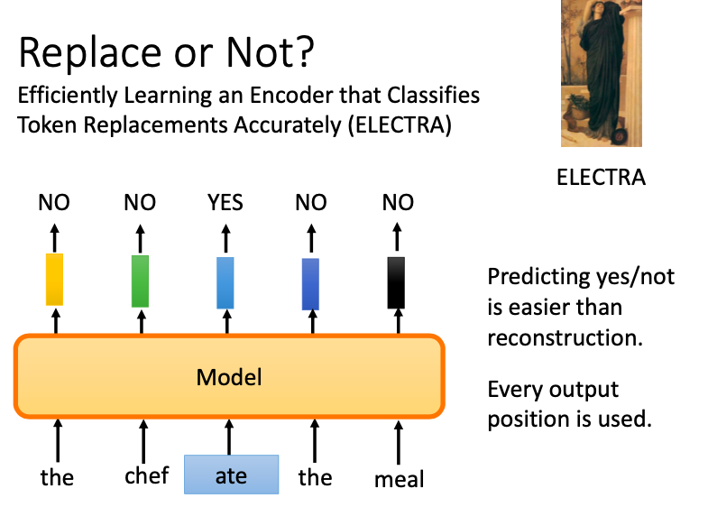

到目前为止，我们都是要去预测一些序列的信息来实现自监督的预训练。ELECTRA 则采用了一种其它做法。预测一个东西需要的训练强度是很大的。ELECTRA 就想要避开预测需要生成这件事。ELECTRA 是一个希腊人物，恋母情结的意思。ELECTRA 预训练的时候，只做二分分类。它直接把输入随机替换成某个其它词汇，预测是该词汇是否被随机替换了。这样预训练起来重构就变得简单。而且每一个位置都有预测输出。

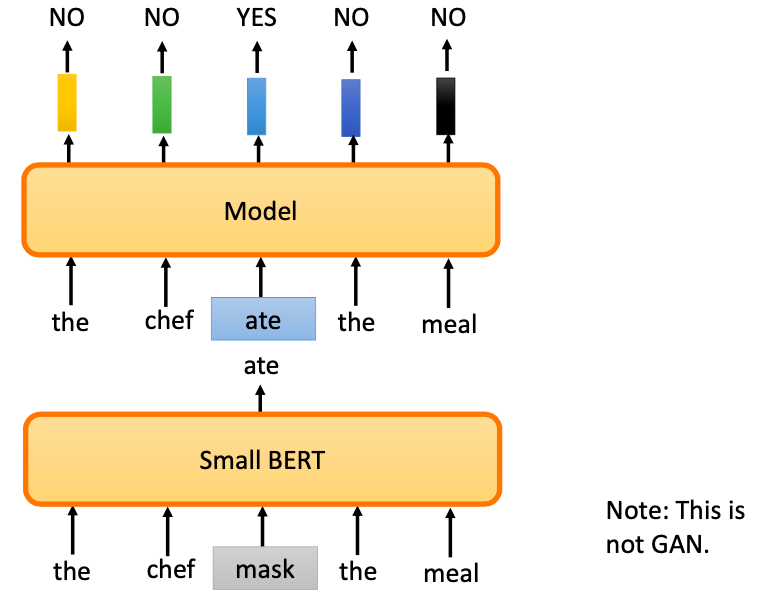

怎样把一些词汇替换成其它词汇，可以产生文法上没有错，语义上不是太怪的句子呢？因为如果被替换成了一些奇怪的 token或者正确的token，模型很容易就能发现。ELECTRA 就学不到什么厉害的东西。所以论文用另外一个比较小的 BERT 去产生被 MASK 的东西，比较小的BERT是因为最好不要产生的和原文相同的词汇。这个看起来有点像 GAN，但它不是 GAN。因为GAN生成器在训练的时候，要骗过判别器。而这里的小的BERT 是产生和原文比较相近的词汇。其实还有另外一个原因是，文本的 GAN 比较难训练。

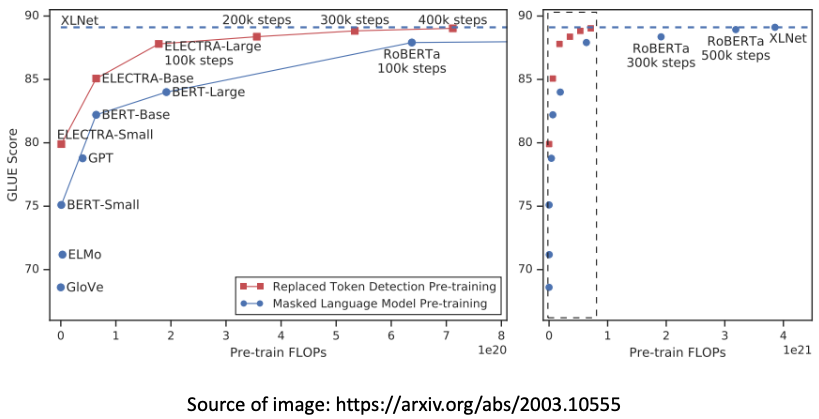

ELECTRA 的结果也很惊人。在相同的预训练量下，GLUE 上的分数显著比 BERT 要好。这样就会更加省资源。它只需要 1/4 的运算量，就能接近 XLNet 了。

### Sentence Level

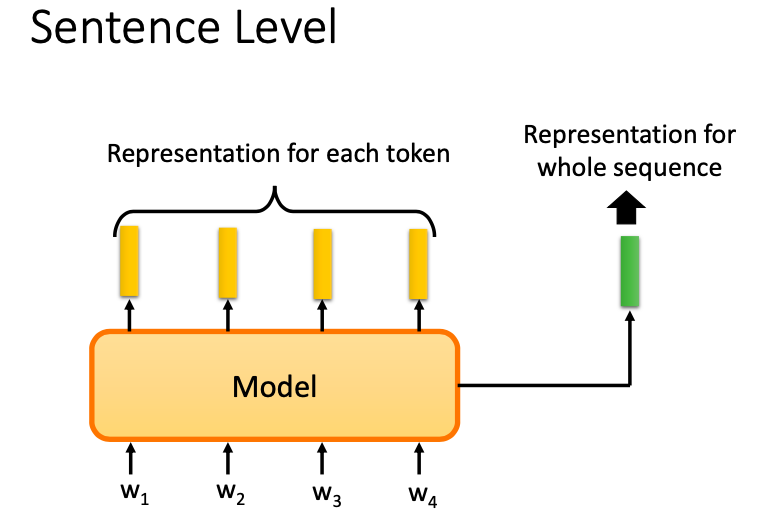

以上我们是想要给每一个 token 都有一个融合了上下文的局部嵌入。现在我们想给整个句子一个全局的嵌入。比如我们要给整个句子做分类的时候，希望有一个向量能代表这整个句子，而不是 N 个 token 的嵌入向量拼接在一起的矩阵。这种句嵌入要怎么做呢？

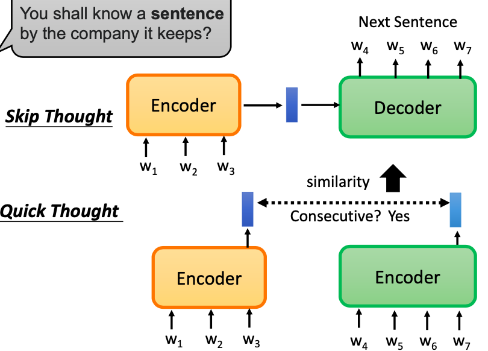

直觉上看，一个句子的句意取决于它上下文根哪些句子相邻。基于这样的想法，有一招叫 Skip Thought。通过训练一个 Seq2Seq 的模型，输入一个句子，预测它的下一个句子。如果有两个不同的句子，它们下一个接的句子都比较像，那么这两个句子就有类似的嵌入。但 Skip Thought 训练起来是比较困难的。因为生成任务的搜索空间巨大。由此我们有了 Quick Thought。它和 ELECTRA 的思路一样，想办法去避开做生成这一件事。它有两个编码器，分别把两个句子编码成向量，再做一个二分类预测它们是不是相邻顺接在一起的。如果是，则二者比较接近。

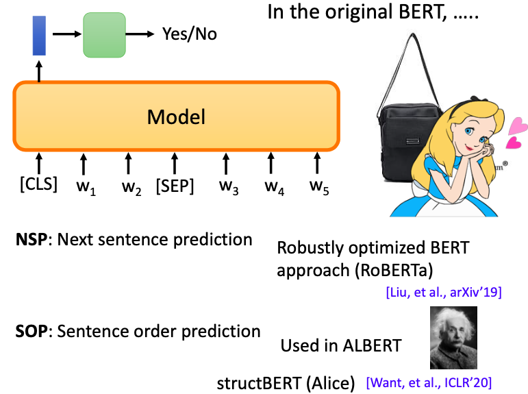

在原始的 BERT 之中，有一个叫作 CLS 的 token，我们希望它的嵌入代表了整个输入句子的嵌入。可是要怎么训练出这样的 embedding 呢？对 BERT 来说，它希望去解一个比较全局的任务。它输入是两个句子，用 SEP 分割开来。这两个句子是不是相邻接在一起的，CLS 这个 token 位置的分类器输出的就是 yes。这个任务叫作 NSP。后来这个任务在 RoBERTa 中正式发现，它不是很好。后来被一致证明用途不大。有另外一种方法叫作 SOP。我们给机器两个前后相邻的句子，BERT 要输出 Yes，但如果把二者顺序掉转过来，BERT 要输出 No。后来在 ALBERT 中有被用到。NSP 不起作用的根本原因是它这个任务太过简单，而 SOP 更加困难。还有一种方法是阿里提出的 strucBERT (Alice)，里面也有用到类似 SOP 的想法，但是它有三个类别。相当于把 NSP 和 SOP 结合起来了。

### T5 - Comparison

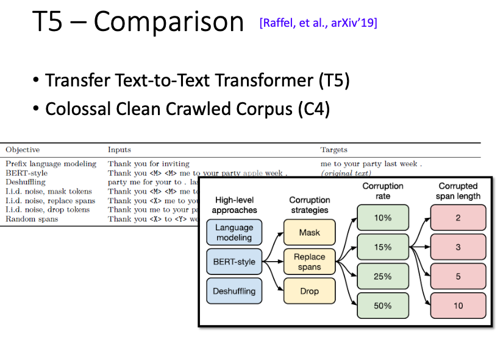

预训练语言模型的预训练需要的资源太大，不是普通人随随便便就可以做的。谷歌有篇论文叫作 T5，它展现了谷歌强大的财力和运算资源。它把各式各样的预训练方法都尝试了一次，然后得到了一些结论。帮助日后研究这一领域的研究者踩坑，让别人没有研究可做。

### Knowledge

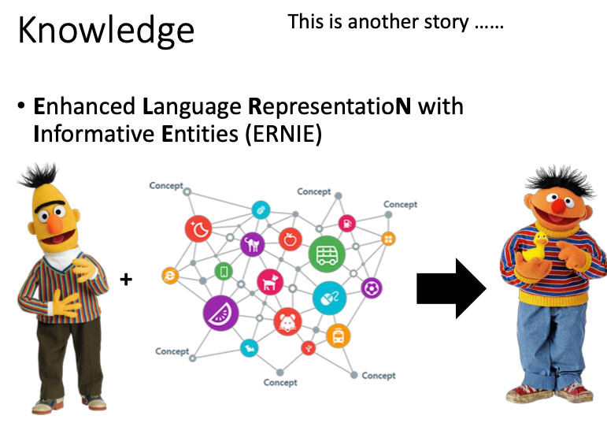

百度的 ERNIE 是希望在预训练的过程中，加入知识图谱的信息。

