# GPT-3

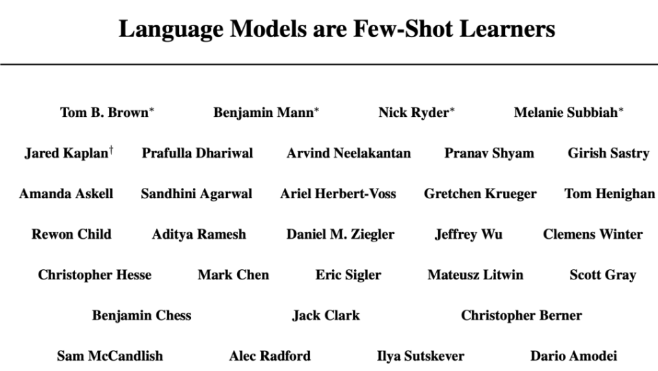

GPT-3同样是NLP语言模型。

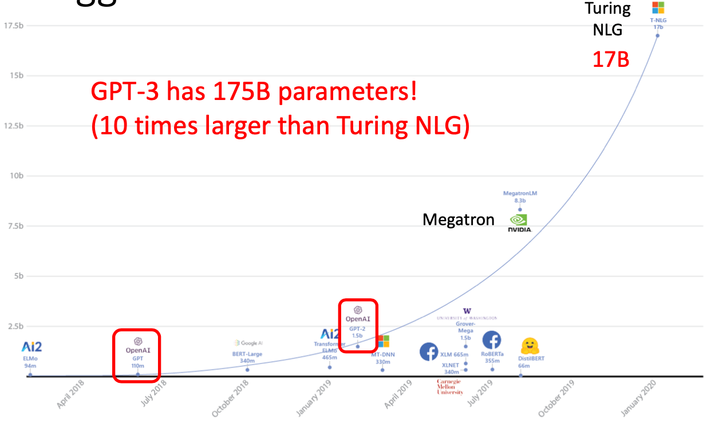

GPT-3过于巨大，有175B的参数，是之前Turing NLG的十倍大。

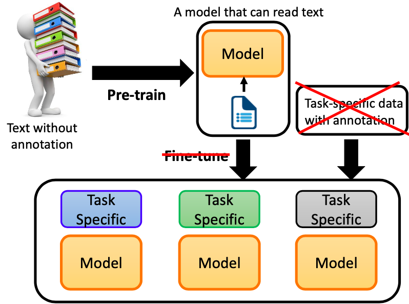

之前的NLP模型是获取文本数据先预训练模型，再通过微调结合任务数据处理某个特殊NLP任务。而GPT-3想做的是去掉微调和针对任务的数据，直接通过预训练来解决某个NLP任务。
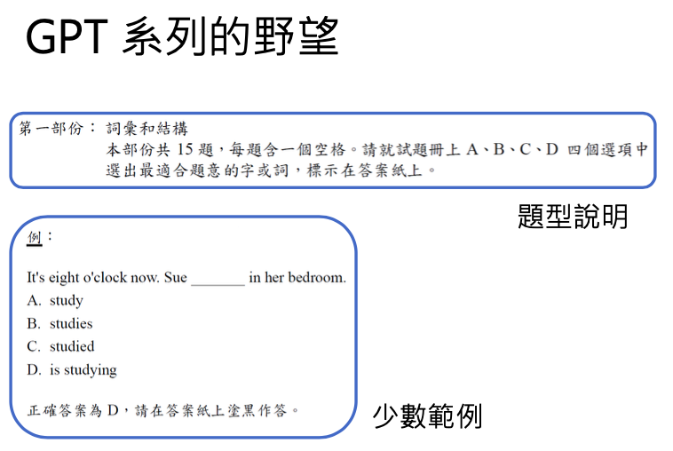

GPT想要做的是，给出任务描述和少量的例子就能解决NLP任务。

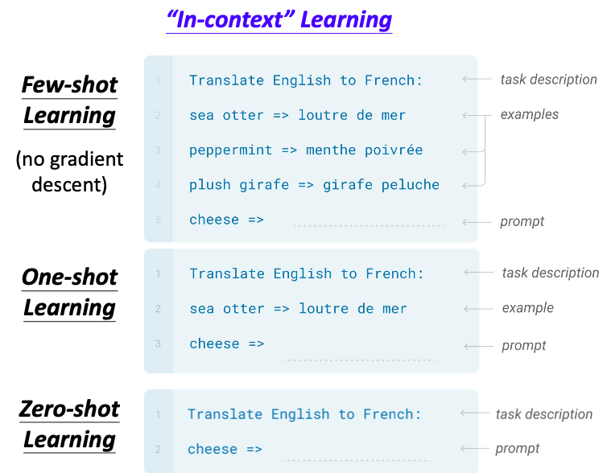

GPT里面做的事情可以分为三类（以翻译任务为例）：

- Few-shot Learning：（在GPT中没有fine-tune）给出任务说明和一些例子，就能把一个问题解决出来。

- One-shot Learning：给出任务说明和一个例子，就能把一个问题解决出来。

- Zero-shot Learning：只给出任务说明，没有额外的训练，就能把一个问题解决出来。

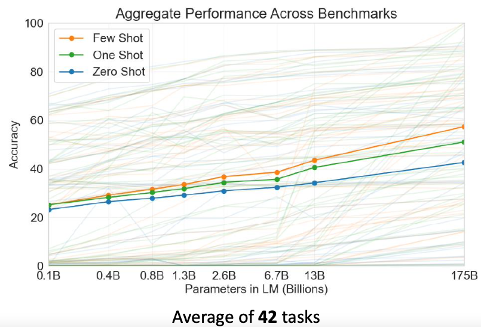

42个任务中，上述三个的表现。

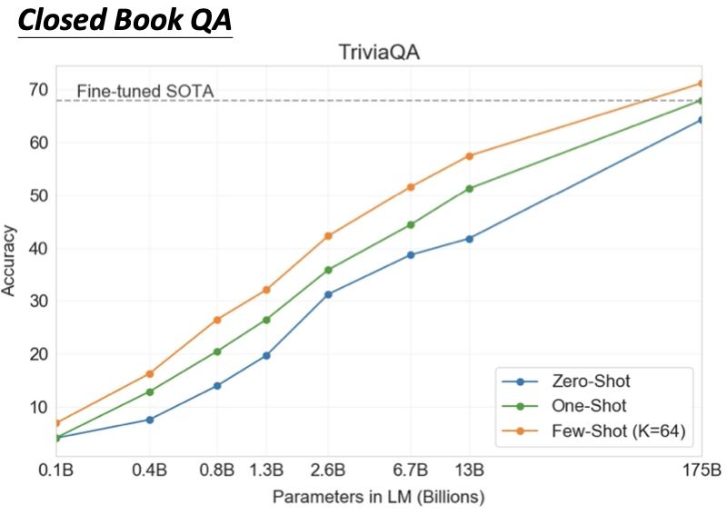

上图为在Closed Book QA（Closed-Book代表“仅参数化”,Open-Book代表“检索方法”即先查资料再答题）中，可以看到Few-Shot在参数大到175B的情况下，正确率超过了经过Fine-tuned的SOTA模型。

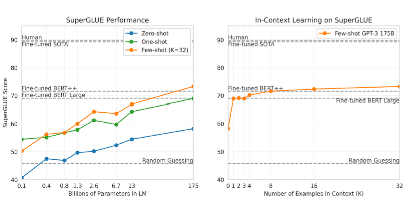

随着参数越来越多，Few-shot、one-shot和Zero-shot的性能越来越好，在模型参数最大的情况下超过了Fine-tune BERT++。而例子给的越多，相应性能也有所上升，但上升也会随着例子的增多逐渐平缓。

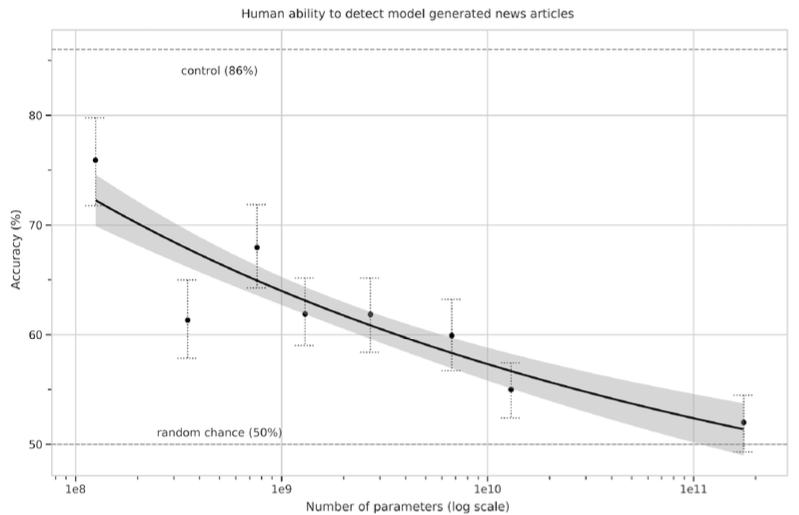

上图为给GPT-3一个新闻标题，让其生成新闻内容。若不给GPT-3例子，它的生成可能像一个推特文。当参数最大化，模型大到一定程度，甚至人都不能分清这片新闻的真假。

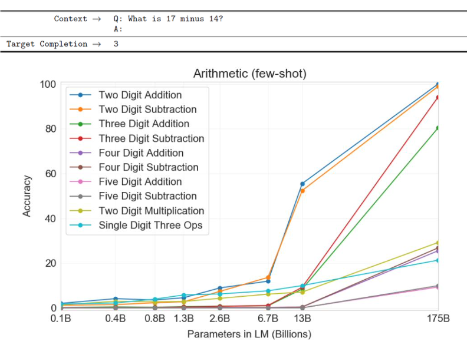

GPT-3也可以处理数学问题，即问一个数学问题，它能给出回答。特别是在处理两位数的加减上准确率比较好。

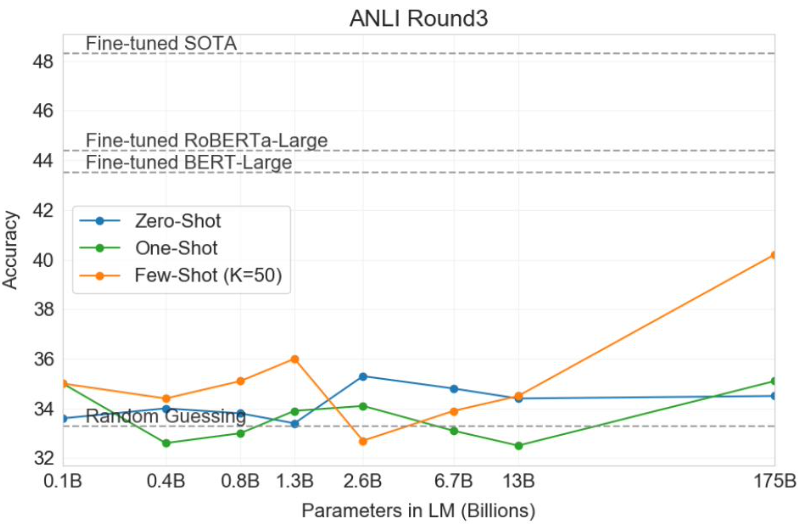

GPT-3在处理NLI的问题上效果不太好，所谓NLI问题就是给机器两个句子，让机器判断这两个句子是矛盾、互相包含，还是总领的关系。One-Shot和Zero-Shot效果都不是很好，只有Few-Shot在给50个例子的情况下，性能有所好转。

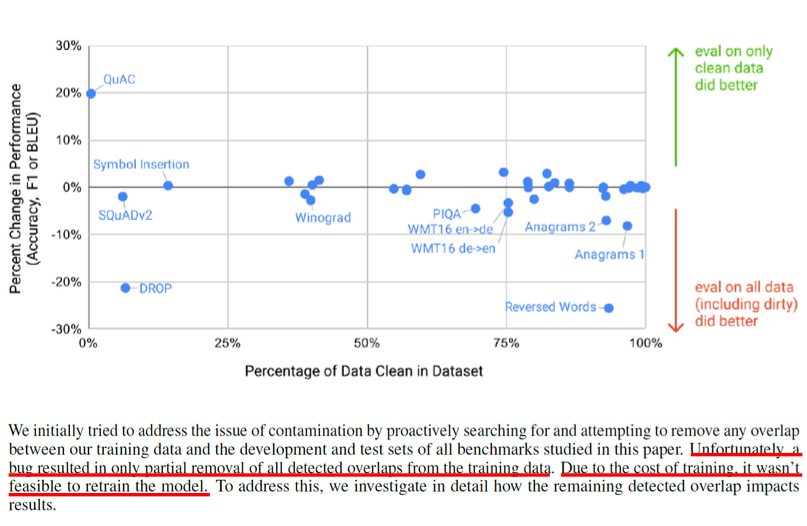

数据集中有混杂的数据可能对GPT-3的影响不会那么大。

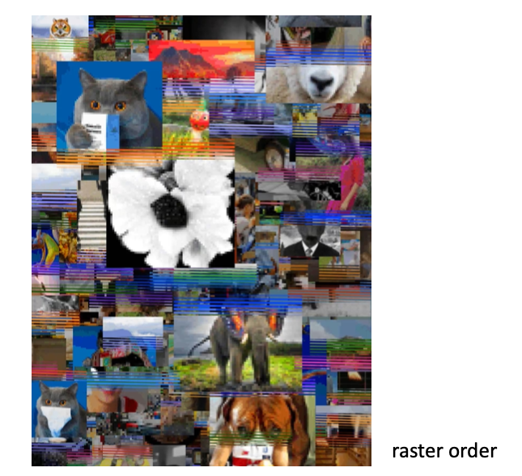

GPT-3也可以用来处理图像任务。
