# Multi-lingual BERT

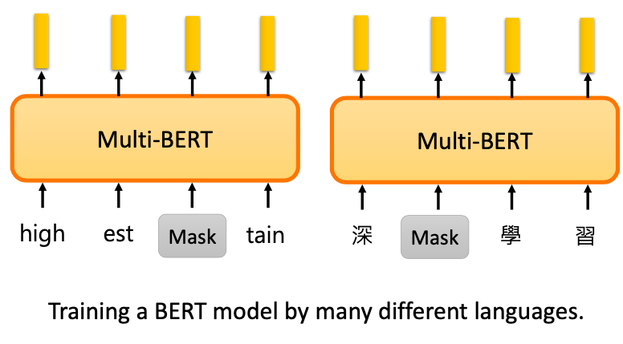

世界上有6000-7000的语言。这么多种语言，我们需要每种语言都训练一个BERT吗？我们可以训练一个精通各种语言的模型，Multi-lingual BERT。

我们只需要用 MLM 的方法，在不同语言的语料上，训练同一个模型。我们需要准备一个巨大的词表，这个词表包含了所有语言的 token。

## Zero-shot Reading Comprehension

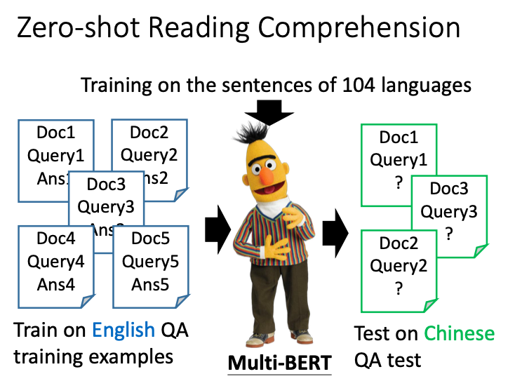

训练这样一个多语言的 BERT 比训练很多个单语言的 BERT 有什么好处呢？它神奇之处在，它可以做零样本学习的机器阅读理解。比如，我们在英文的 QA 数据集上微调了之后，它可以直接在中文的数据集上做 QA。

以上便是零样本实验的结果。可以看到，MultiBERT 的零样本学习，在104种语言预训练后，经过不同的语言微调，最后都用中文来测试，效果在 F1 值上都表现还不错。

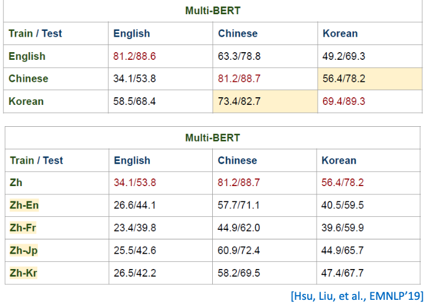

这个实验比较了中英韩三种 QA 语料上的效果。模型在其中一种语言上微调，在另外两种语言上测试比较。中文和韩文属于同类语系，训练在中文，测试在韩文上，结果会显著好于测试在英文上。有意思的是，在翻译结果上，这种增益却没有了。比如在英文上微调一个英语到中文的翻译模型，其中文到英文的效果，还不如直接训练在中文上，跑在英文上的结果。

## So many evidences 

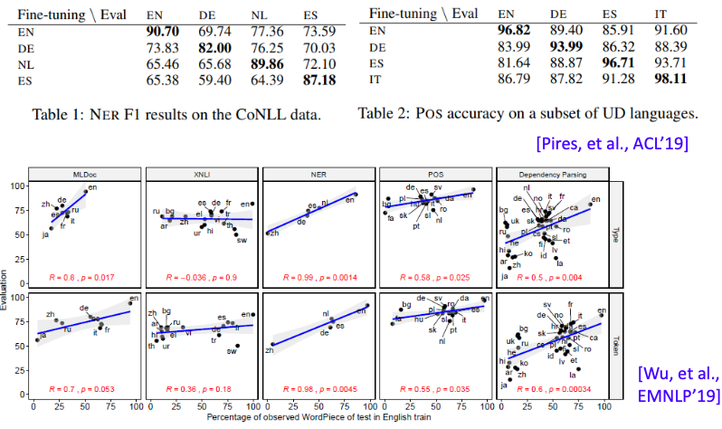

除了以上任务，在很多其它任务上，我们也观察到类似的结果。在 NER 任务上，可以做到zero-shot NER。在英文上训练的 NER 模型，可以直接做德文的实体识别。词性标记也可以。下面有篇 EMNLP 19 的文章，它做了 5 种不同的任务。这五种不同的任务都是训练在英文上，测试在其它不同的语言上。纵轴是该任务的正确率，横轴是该语言和英文有多少共同的词汇是重叠的，越靠近右边的语言，和英文越接近。一般来说，越接近英语的语言，在做跨语言的任务时，效果会越好。

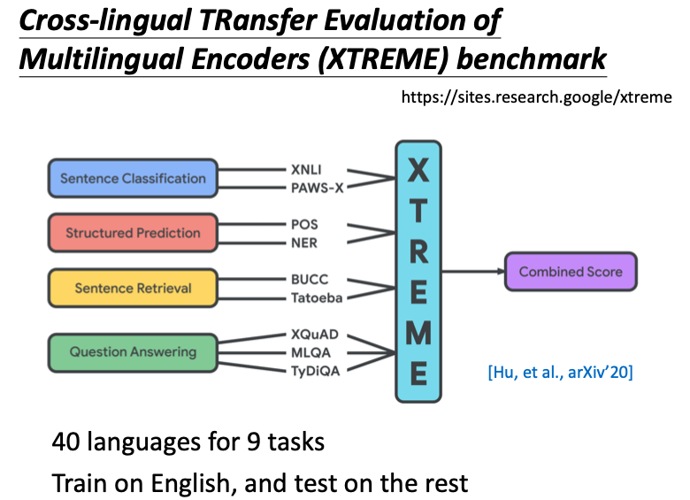

MultiBERT 可以做跨语言这件事基本上是一个共识了。甚至 Google 还做了一个 Benchmark 语料 XTREME，专门来测试模型跨语言的能力。XTREME 有9个任务。每个任务都有40种不同的语言。它需要在英文上微调模型，在其它39种不同的语言上测试。

## Cross-lingual Alignment?

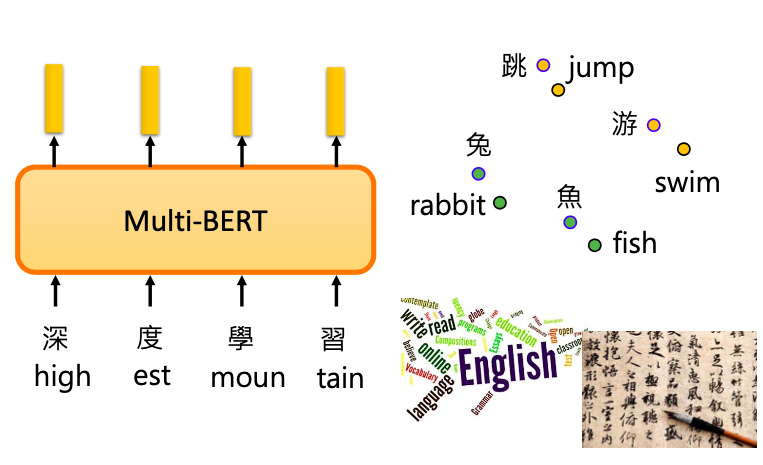

为什么跨语言预训练语言模型可以表现更好呢？有可能是它学到了把不同语言去掉，只保留语义的信息。对于 MultiBERT 而言，中文的兔子的嵌入和英文的 rabbit 的嵌入，是很接近的。对于它来说，不同的语言都是同一个语言。所以只要教它某一个语言的任务，它就可以在另外一个语言上，学会同样的任务。

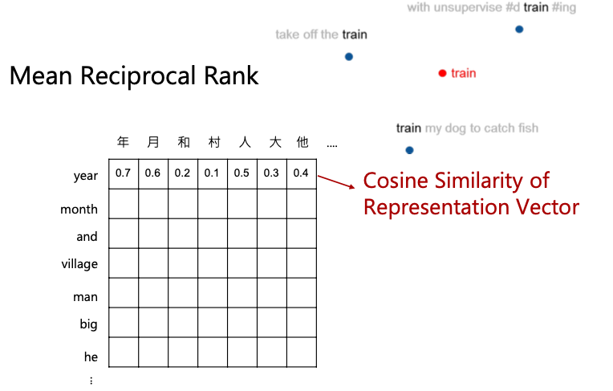

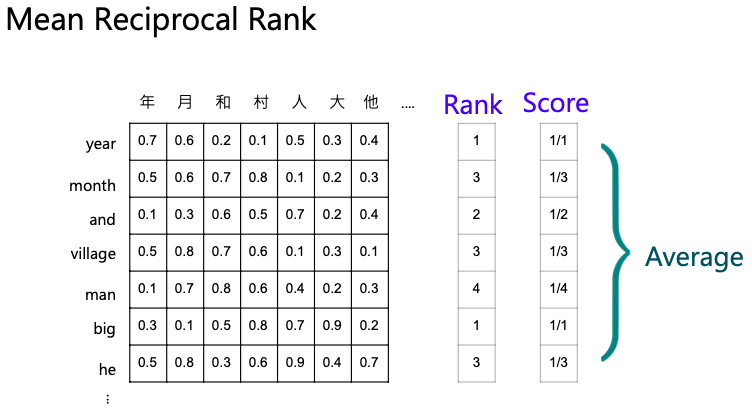

为验证这一想法，我们可以做一个实验。我们把不同句子中同一个词汇的嵌入平均起来，中英文都如此。接着我们计算每个中文字的嵌入和每个英文词的嵌入之间的语义相似度。我们想看看是不是不同语言但是意思一样的 token，在语义相似度上是不是更大。最终我们用每个 token 得分的平均作为指标。

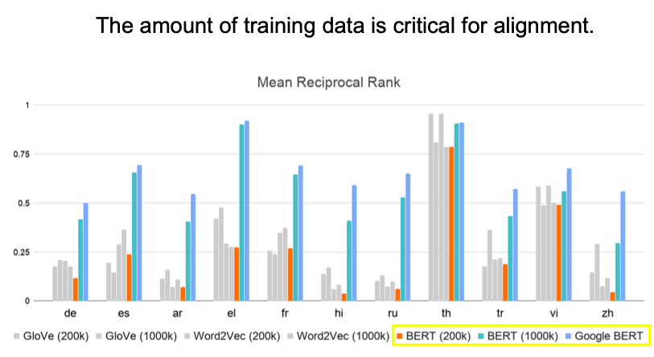

测试了英文和其它10种不同的语言，它们的对齐关系分数。最右边的bar，是谷歌的 MultiBERT 的结果。结果发现，在某些语言上，对齐分数惊人的高。比如说泰文和希腊文。而且很多语言都能高过 0.5 分，说明效果非常好了。要让机器学到对齐这件事，语料的数量是很重要的。

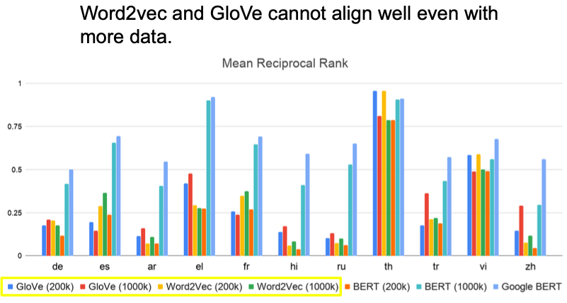

是不是语料的影响更大呢？于是我们也给之前的技术，大量的数据去训练。发现在多数的状况，BERT 的结果还是比 word2Vec 和 Glove 上的结果好。也就是说，跨语言的对齐任务上成功，取决于数据量和模型。

## How alignment happens?

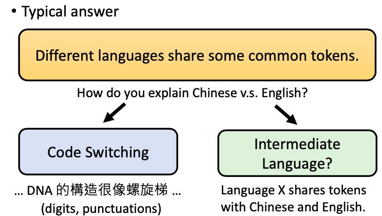

 MultiBERT 可以做到语料对齐，典型的认为：一方面原因是不同语言还是有很多共同的 tokens。比如同样语系的语言。但就算是中文和英文差异很大的语言，MultiBERT 也可以把它们的词对齐。有可能是因为 Code Switching 的关系。中文中会经常掺杂一些英文。还有可能是存在一种中间的元语言。某个语言会先把token映射到元语言，在从这个中间的语言映射到其它语言的 token。

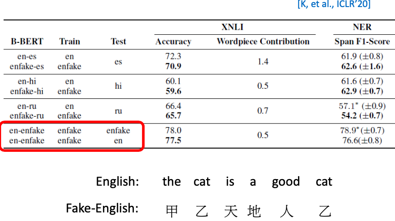

ICLR 20 的一篇论文破解了刚刚的两个猜想。它把英文的所有 token，都换成另外一个绝对不存在于英文中的另外的 token。接着我们拿英文和假英文去训练一个 BERT，看看它能不能把两种语言对齐。结果表明，假英文做微调的结果是最好的，但真的英文作微调也没有差太多。这显示说，不需要两个语言有相同的 token，也不需要中间语言的存在。MultiBERT 究竟是如何学到对齐信息的，仍是一个尚待研究的问题。

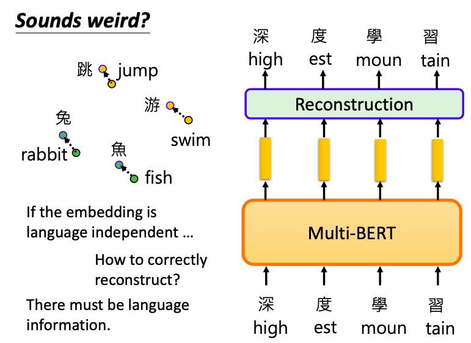

不同语言的token，如果有同样的意思，它们的嵌入就很接近，其实是不太合理的。因为 MultiBERT的训练目标是，对英文句子重构出英文，对中文句子重构出中文。但对齐任务却要把不同语言的差异抹掉。这二者在某种程度上是违背的。所以 MultiBERT 显然是知道语言的信息的。所以我们接下来要寻找 MultiBERT 的语言信息究竟藏在哪里。

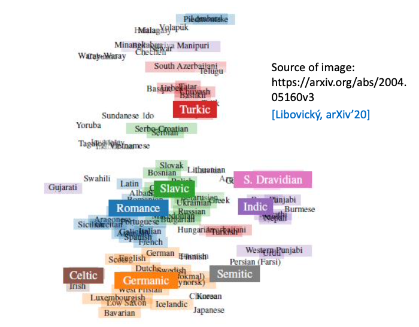

MultiBERT 内部藏有语言信息这件事，有文献发现了类似现象。它把多种不同语言的 embedding 平均起来，发现不同语言还是有一些差异的。图中每一串文字代表一个语言，其位置代表所有不同embedding 的平均。你会发现，语言和语言之间有不少差异，但同样语系的语言是被聚集在一起的。

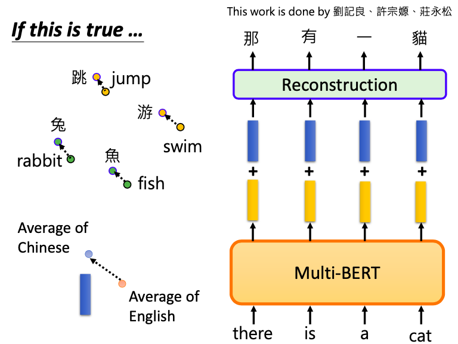

但MultiBERT 是用什么样的方式把语言信息储存在嵌入中的呢？ 李宏毅的学生，想出了一个方法。他们把所有中文的嵌入都平均起来，所有英文的嵌入也平均起来，二者在空间上的向量差，表示两种语言的差异。这个想法的假设是，虽然MultiBERT表面看起来中文和英文的嵌入是混杂在一起，但是仔细去看会发现，它们对齐的每个 token 的嵌入差异，与两种语言的平均嵌入差异一致。比如中文平均嵌入在英文平均嵌入的左上角，则其中文某个token的嵌入，也会在它的英文对齐的token的嵌入的左上角。知道了这一点，我们就可以把英文句子序列丢给 MultiBERT，得到嵌入，再加上两种语言的平均差异向量。它就能够重构出中文的句子。

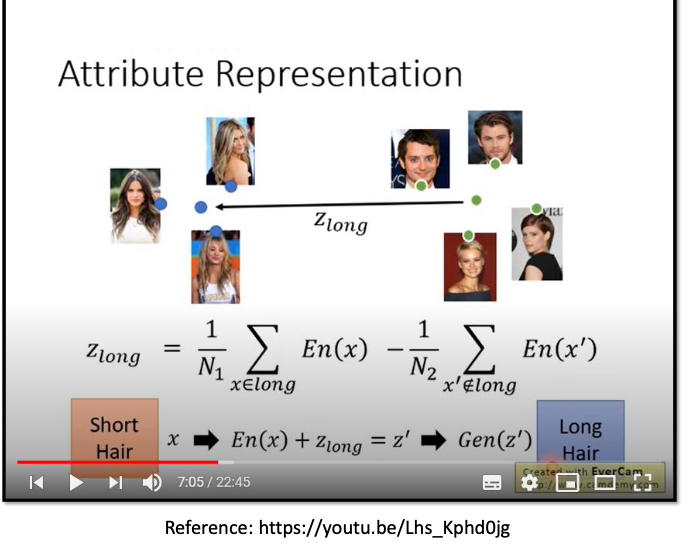

这让我们联想到 GAN 做图像编辑任务的时候。我们把短发的人的嵌入算一个平均，长发人的嵌入做一个平均，就可以找到短发和长发之间的差异。我们把短发的人加上这个差异向量，就可以把短发的人变成长发的人。

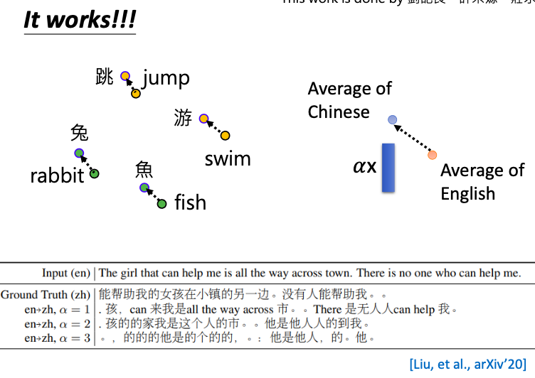

神奇的是，实验结果发现还真的可以这样。图中α为微调差异向量增益多少的超参。当α为1的时候，它会出现中英混杂的文字，带有一点点的翻译效果。嵌入的平均确实能代表某一种语言的特征。当我们调大α，英文变成中文的比例就会越来越大。这表明，MultiBERT 中确实有包含语言的信息。而我们可以把这些语言的信息做一点点修改，就可以转换MultiBERT 输出的语言类型。即便如此，这招表面看起来似乎没有什么用。

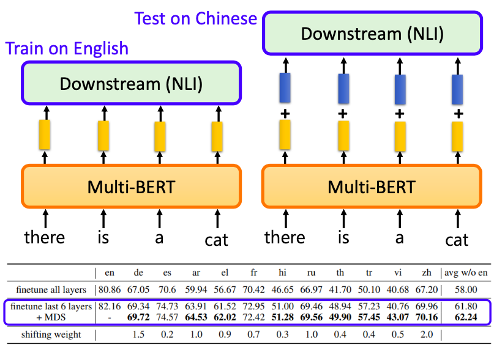

我们要把某一个模型训练到英文上，然后直接测试在其它语言上。MultiBERT 会把不同的语言对齐在一起。不同语言对于 MultiBERT 似乎是无差异的，所以它能在英文上微调，中文上测试。我们有没有办法可以把不同语言信息的差异从MultiBERT中抹除掉，这样跨语言的零样本学习的效果就会变得越来越好。我们可以做一个非常简单的尝试。我们先把MultiBERT在英文上微调，然后测试在中文上。不同的是，我们在输出的时候，再加上刚才那个平均语言差异向量。结果表明，在各式各样不同的语言上，得到的结果都有不同程度的微小提升。当然，目前用的抹掉语言差异的方法还很粗糙。未来可以研究出更好的技术。
