# 基于轨迹数据为共享电动汽车部署电池交换站

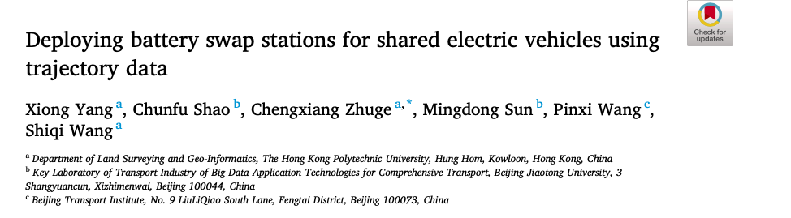

期刊：ELSEVIER（爱思唯尔）时间：2021年8月

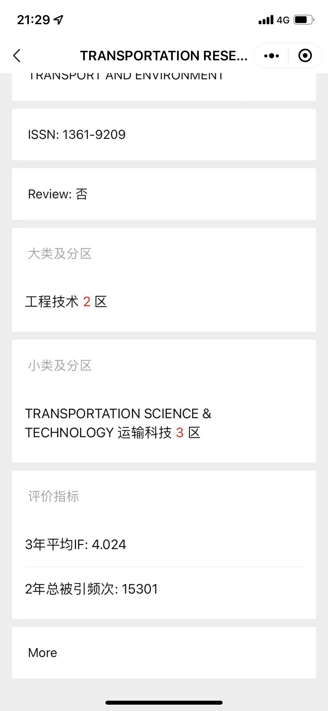

## 论文重点（共享电动车）

- 提出一种新颖的站对点 (S2P) 电池交换模式。

- 从轨迹数据中提取共享电动汽车 (SEV) 的电池更换需求。

- 一种部署和运行电池交换站 (BSS) 的数据驱动方法。

- 设置场景来测试方法和关键参数的敏感性。

- 期望的服务质量对 BSS 的部署和运行有影响。

## 站对点 (S2P) 电池交换模式

### BSS模型缺点

通常，电池交换是在 BSS 进行的。这就需要更换电池的电动汽车用户必须将他们的车辆开到 BSS，然后将用过的电池更换为充满电的电池。但是，这种正常的电池更换方法可能不适用于 SEV。具体而言，SEV 通常停在租赁站或公共停车场，租赁服务完成后。SEV 运营商有责任为 SEV 充电。因此，SEV 运营商需要指派人员将那些低荷电状态 (SOC) 的 SEV 驾驶到附近的 BSS 进行电池更换，然后在更换电池后将它们开回租赁站或公共停车场。当将这种正常的电池更换方法应用于 SEV 时，这些是一些限制：

1. 由于额外的人员分配，这将导致高运营成本；
2. 服务的SEV在返回租赁站或停车场的途中会消耗电力；
3. 低荷电状态的 SEV 不可能达到 BSS 进行电池更换。

### 站对点（S2P）电池交换模式

BSS 可以有一辆或多辆运送车辆（或电池更换货车）执行电池运送和更换。每辆运输车都配备一个电池存储架、一个电池更换机器人和一套牵引系统。送货车辆负责将充满电的电池运送到 SEV 停放且处于低 SOC 的电池更换需求 (BSD) 点（即 SEV 有电池更换需求的地方）。用完的电池将被充满电的电池替换，然后由运输车辆运回BSS。

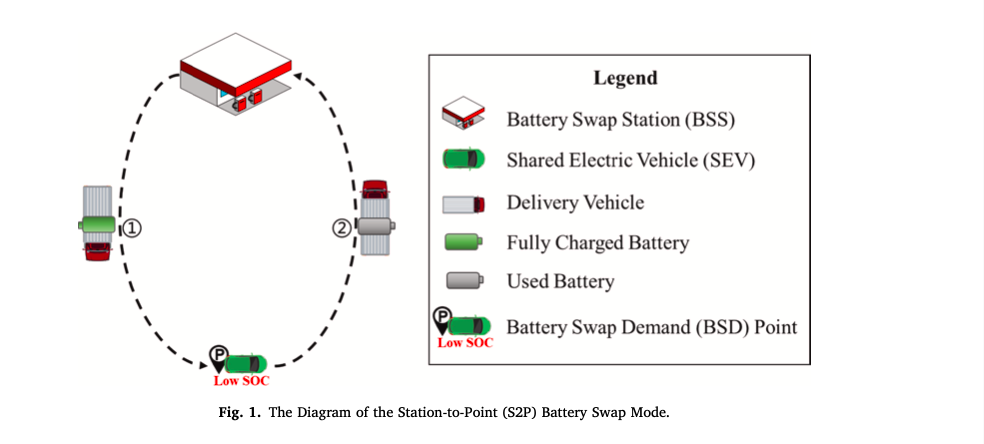

S2P电池交换模式涉及三个关键要素，即BSS、运载工具和电池。对于BSS运营商来说，他们在为SEV提供换电服务时面临以下三个问题：

1. SEV的换电需求点（BSD）的时空格局是怎样的？
2. 如何部署BSS来适应BSD？
3. 如何为每个部署的BSS正确分配电池和运输车辆？

本文解决（基于SEV的GPS轨迹数据）：

1. 使用北京实际514辆 SEV的一个月轨迹数据集来提取BSD的时空模式。
2. 将开发优化模型来规划BSS以适应提取的BSD。
3. 根据 BSD的说法，将制定日常运营策略，为每个BSS分配电池和运输车辆。

## 数据集

一个 SEV 上的GPS轨迹数据示例：

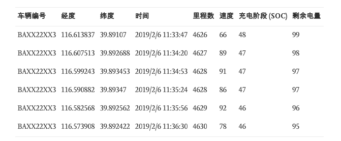

## 方法

### 数据清洗

假设车辆到达目的地时，发现连续 5 条速度为零的记录，且这些记录的时间间隔大于 3 分钟。这些记录中的位置应该是相同的，并被视为旅行目的地。该行程识别方法可以排除那些短暂停留（例如，由于红灯而在十字路口短暂停留）。同样，所有 SEV 的行程都可以通过这种行程识别方法提取出来。通过识别的出行，可以进行统计和时空分析来表征 SEV 的出行模式。

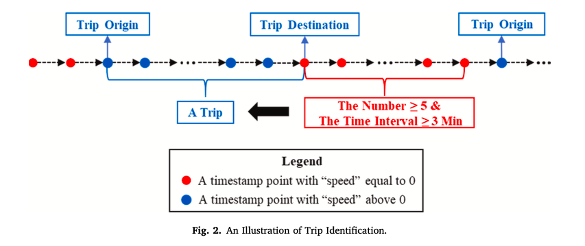

### 量化电池更换需求点（BSD）

1. 那些 SOC 低于 20% 的 SEV 需要更换其车载电池（即产生 BSD），因为这些电池的进一步使用低于 20% 的 SOC 可能会缩短电池的寿命（[Marra 等人，2010 年](https://www.sciencedirect.com/science/article/pii/S1361920921002418?via%3Dihub#b0270)）；
2. 另一个原因是那些 SOC 不足以满足下一次旅行的 SEV 将更换其车载电池（即产生 BSD）。

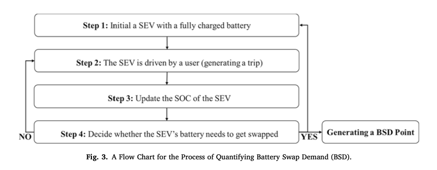

每个 SEV 提取 BSD，从而产生分布在整个研究区域的一系列需求点。每个需求点都附加了两个时间属性：一个是生成需求的时间；另一个是下一次出行（即换电后的第一次出行）的出发时间。

### 用于部署BSS的优化模型

目标：总成本最小化（BSS数量最小化）

方法：优化模型旨在在给定研究区域内的一组候选 BSS 的情况下，部署最少数量的 BSS 以覆盖具有一定服务半径的 BSD 点。

1. 使用DBSCAN 空间聚类算法，对BSD进行聚类，找出BSS的候选位置
2. 使用优选模型（Set Cover Model）进行设施选址

| 优化模型主要参数 |                             含义                             |
| :--------------: | :----------------------------------------------------------: |
|        Q         |     表示期望的 BSD 点覆盖率，表示可以满足现有需求的程度      |
|        R         | 表示一个BSS的服务半径，它与一个BSS覆盖BSD点的能力、电池交付效率和所需的运输车辆数量相关 |
|        L         |               表示一个BSS应该覆盖的最小BSD点数               |

### BSS日常运营策略

#### 电池管理策略

充电策略（降低电网压力）：

1. 采用智能协调充电策略，在非高峰时间充电。
2. 电池充电与可再生能源（如太阳能和风能）的结合，例如使用过后的电池进一步运输到可再生能源发电厂，充完电后再运回BSS

电池管理策略：

- 集中管理（CM）策略

所有电池由调度中心集中管理（这有助于将SEV与上述可再生能源发电厂耦合），调度中心将电池分配给每个BSS每天根据他们的日常电池需求。因此，调度中心（即研究区域）所需的电池总数应等于或大于所有 BSS 每天所需的电池总数的最大值。

- 基于站的管理（SM）策略

其中每个 BSS 需要根据自己随时间变化的电池需求独立管理电池。因此，BSS每天所需的电池数量应等于或大于BSS每天所需电池数量的最大值，并且研究区域所需的电池总数等于最大值之和。

#### 配送车辆的管理策略

DT = WT + TT

电池交货时间（DT) 由两部分组成，即可用送货车辆的可能等待时间 (WT)，以及从最近的 BSS 到 BSD 点的实际旅行时间 (TT)。

排队系统：先到先得的原则

## 结果

### GPS轨迹数据结果

#### SEV出行模式

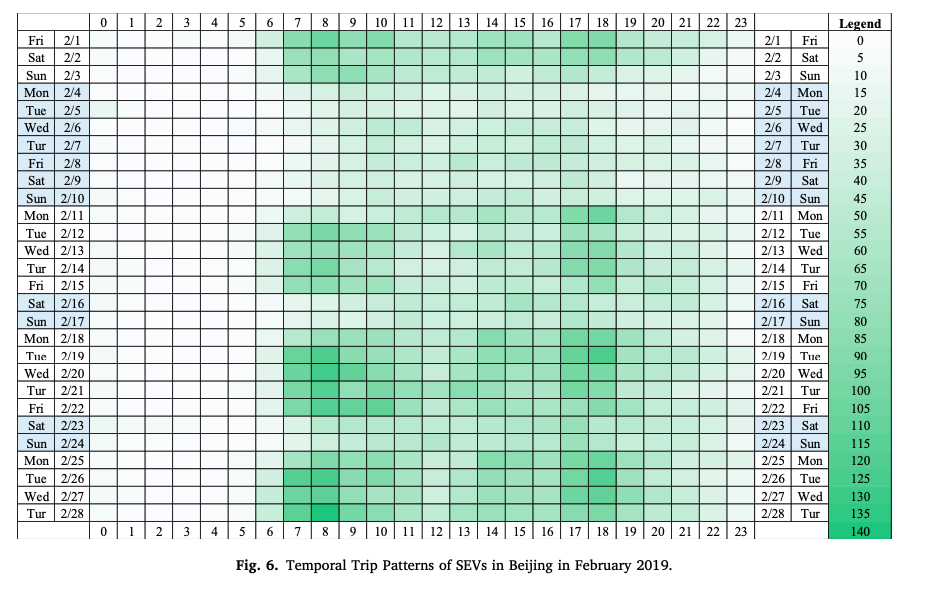

1. 早上 7 点到 10 点和下午 5 点到下午 6 点时段使用 SEV 的频率更高，这与北京的高峰时段一致，这表明这些 SEV 用户中的许多人可能是通勤者。
2. 工作日与非工作日存在显着差异。具体而言，工作日的出行次数往往远高于非工作日的出行次数

#### SEV的空间出行模式

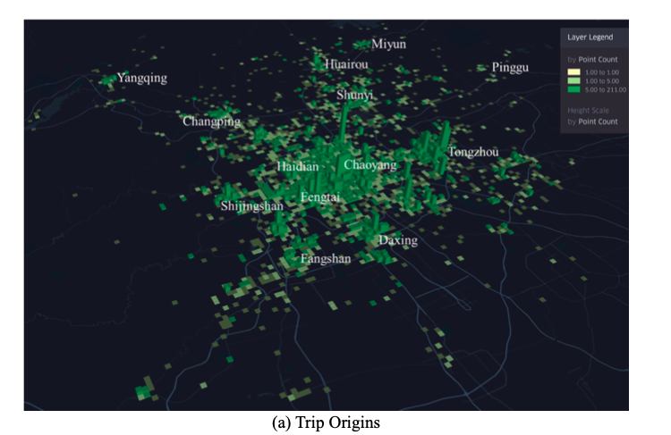

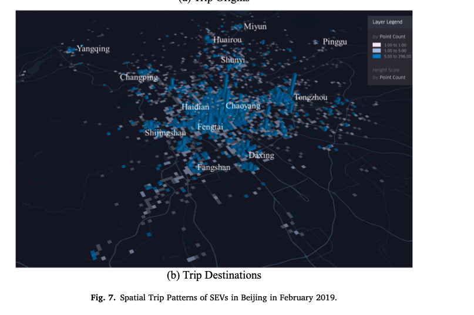

SEV 的行程起点和目的地的空间分布，具有更高高度的列表示相应网格中更多的旅行起点/目的地。可以看出，北京中心地区（包括东城、西城、朝阳、海淀和丰台）和新副中心通州区的出行起点和目的地数量往往更高。这意味着在那些公民进行更多日常活动（例如，购物和工作）的地区更频繁地使用 SEV。

### 电池更换需求（BSD）

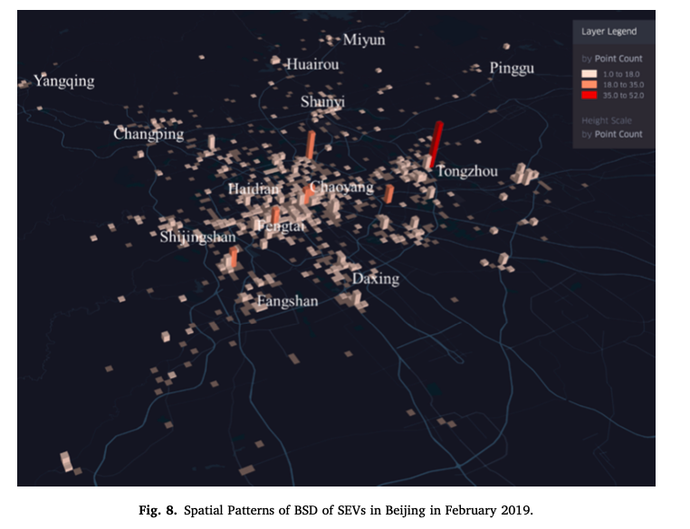

中心区和新副中心通州区往往有更多的 BSD 点。

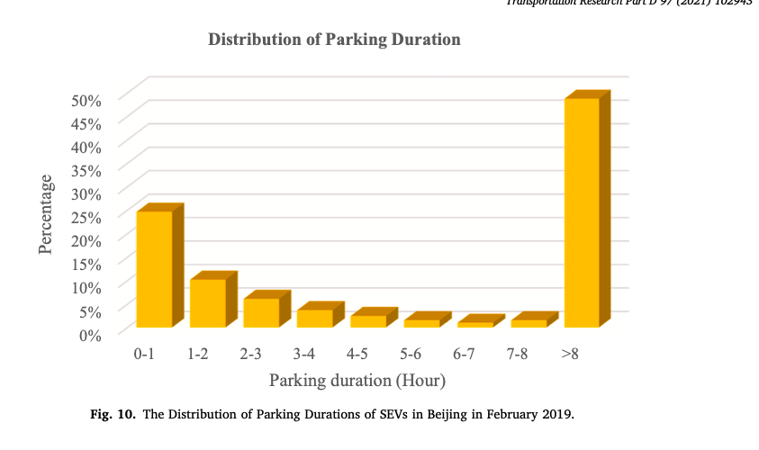

停车时长的统计分布，表明大约 25% 的停车时间短于 1 小时；而大约 45% 的停车时间超过 8 小时，表明部分 SEV 的空闲时间较长。这可能是因为 SEV 对北京市民来说是一种相对较新的交通工具，采用率较低。

### Baseline

#### 参数设置

在基线场景中，四个关键参数设置如下：

- Q：表示所需的 BSD 点覆盖率。Q 设置为 0.9，这意味着 BSS 应覆盖至少 90% 的已识别 BSD 点；
- R（单位：km）：表示BSS的服务半径。R 设置为 10，表示服务半径为 10 公里。该参数与电池传输效率和要部署的 BSS 数量相关；
- L：表示一个 BSS 应该覆盖的最小 BSD 点数。L 设置为 10，意味着研究区域内的任何 BSS 应至少覆盖 10 个 BSD 点；否则将不会添加BSS；
- AADT（Acceptable Average Delay Time；单位：min）：表示每天由电池交换（例如，由于排队）引起的可接受的平均延迟时间。AADT 设置为 15，这意味着平均延迟时间应小于每天 15 分钟。

#### BSS最优布局

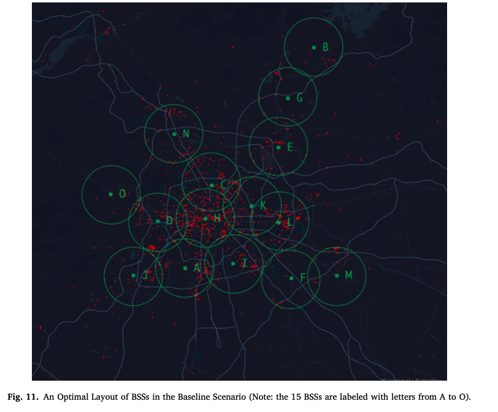

红色点代表BSD点，绿色圆圈代表BSS的服务覆盖区域。最优方案包含15个待部署的BSS，覆盖了研究区90.41%的BSD点（略大于参数Q）。

#### 电池需求数量

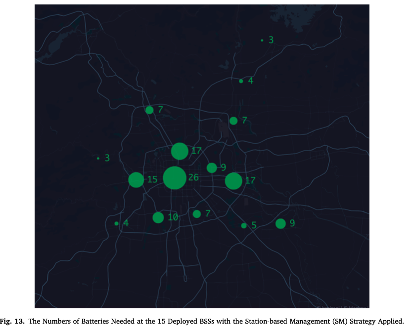

应用基于站的管理 (SM) 策略的 15 个已部署 BSS 所需的电池数量。

#### 运输车辆数量

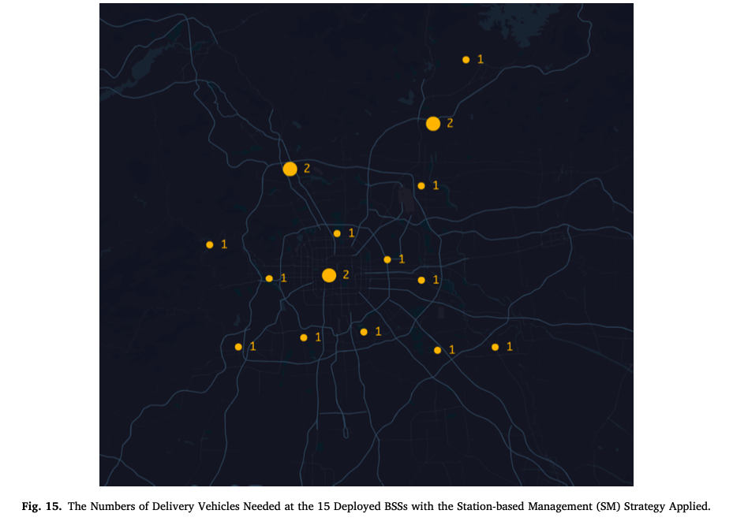

基于排队模型，应用了基于站点的管理 (SM) 策略的 15 个已部署 BSS 所需的运输车辆数量。

### 假设场景：测试关键参数

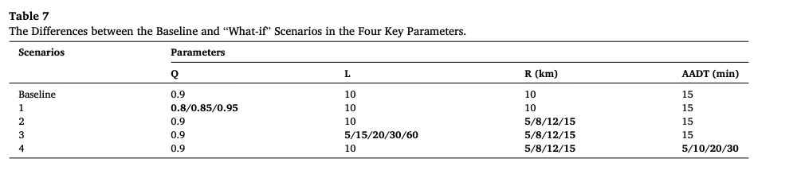

- Q（服务质量，覆盖率）：更高的 Q（意味着需要覆盖更多的 BSD 点）会导致需要更多的 BSS、电池和运载工具，很明显，因为通常需要更多的设施才能获得更好的服务质量。
- R（服务半径）：较大的服务半径可以减少所需的BSS、电池和运输车辆的数量，因为服务半径较大的BSS可以覆盖更多的BSD点。相应的平均延迟时间更长
- L（即 BSS 应覆盖的 BSD 点的最小数量）和 R 对所需 BSS 数量的联合影响：L大R小很多BSD无法覆盖，L小R大成本过高。发现L 与 R 密切相关，通常，当 R 较小时，L 也应设置为较小的值，以便找到最佳 BSS。
- AADT （即由电池更换引起的可接受平均延迟时间）和 R 的联合效应：BSS运营商如果想减少延迟时间（可以提高消费者对SEV服务的满意度），可以减小BSS的服务半径。然而，这可能会增加所需的 BSS、电池和运载工具的数量

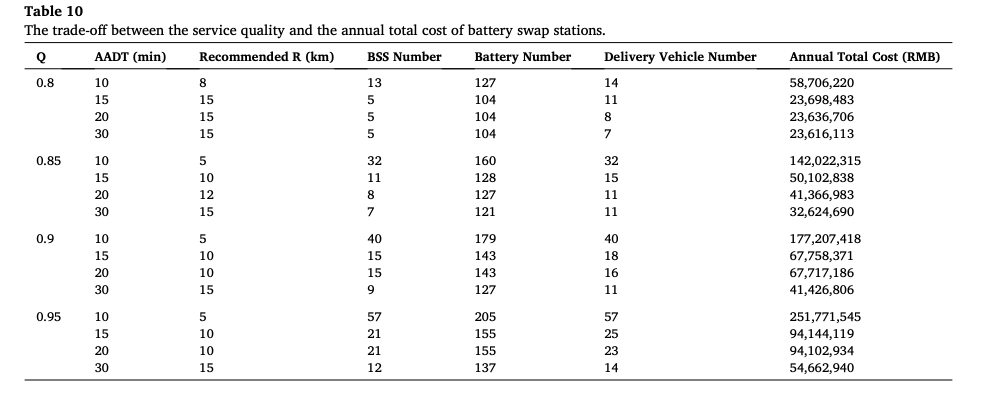

## 其他

###  数据集方面

暂未找到本论文的数据集，但一些论文也根据车辆的出行模式和纽约市目前的公共充电网络，将汽油驱动的出租车车队转变为电动出租车。发现，通过在出租车车队经常访问的区域部署额外的充电站，可以显着提高可行性。还有一些论文根据旧金山出租车队的移动模式，探索了这些车辆电气化的可能性，并估算了充电基础设施优化部署的充电需求。

### 移动换电方面

目前已经提出了移动电池更换策略，允许电动汽车在运输车辆（也称为电池更换车）的帮助下，在其停放点（而不是在 BSS）的帮助下更换旧电池（[Huang et al., 2015](https://www.sciencedirect.com/science/article/pii/S1361920921002418?via%3Dihub#b0195) , [Shao et al., 2017](https://www.sciencedirect.com/science/article/pii/S1361920921002418?via%3Dihub#b0315) )。已经尝试开发电池交换货车的架构：参见两项相关专利（[Gao et al., 2012a](https://www.sciencedirect.com/science/article/pii/S1361920921002418?via%3Dihub#b0150) , [Gao et al., 2012b](https://www.sciencedirect.com/science/article/pii/S1361920921002418?via%3Dihub#b0155) , [Lu and zhou, 2013](https://www.sciencedirect.com/science/article/pii/S1361920921002418?via%3Dihub#b0260)）。还进行了试点研究，将此类电池交换车纳入电池交换系统（[Raeesi 和 Zografos，2020 年](https://www.sciencedirect.com/science/article/pii/S1361920921002418?via%3Dihub#b0290)，[Shao 等人，2017 年](https://www.sciencedirect.com/science/article/pii/S1361920921002418?via%3Dihub#b0315)）。例如，[Raeesi 和 Zografos（2020）](https://www.sciencedirect.com/science/article/pii/S1361920921002418?via%3Dihub#b0290)解决了在使用电池更换货车的电池更换计划下货运电动汽车的路线问题。

### 该论文的参考论文

有价值
