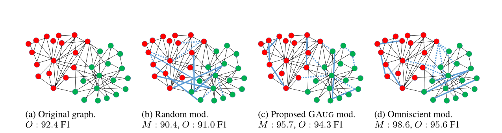
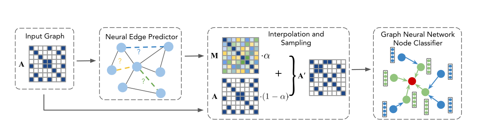
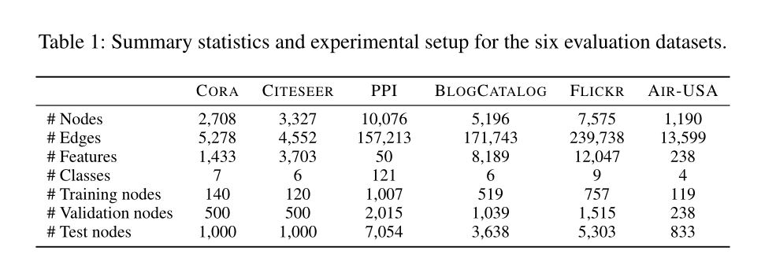
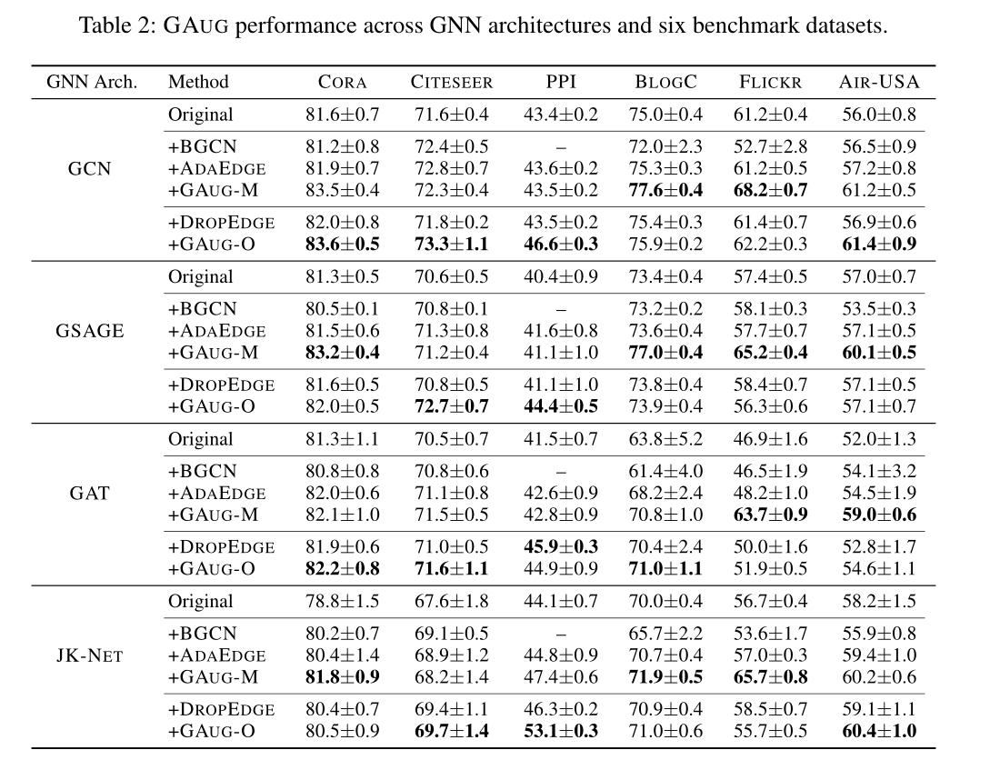
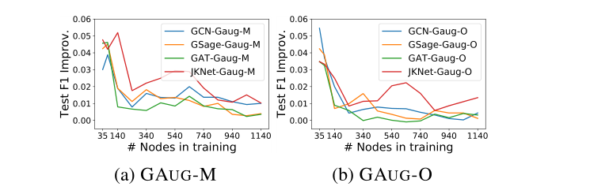

# 图神经网络的数据增强

2021，AAAI （美国人工智能协会）

## 摘要

数据增强技术已被广泛用于提高机器学习模型的通用性。然而，对图的数据增强的研究相对较少。这主要是由于图的复杂性和[非欧几里德结构](https://blog.csdn.net/imsuhxz/article/details/91361977)限制了可能的操作。本论文讨论了图数据增强的实践和理论动机，考虑了因素和策略。工作表明，神经边缘预测可以有效地编码类同质结构促进内部类变并降级类间的边。**该论文是在改进[半监督](https://www.cnblogs.com/bonelee/p/12653308.html)节点分类的背景下研究图神经网络（GNNs）的图数据增强**。

## 介绍

### Q&A

**Question：**

尽管GNN和数据增强是可互补的，但很少有将两者结合起来的方法，其主要困难：

图数据与其他数据不同的是，其他数据的结构是基于位置编码的，而图的结构是由节点连通性编码的，并且这种节点连通还是不规则的。

**Address:**

对于图的数据增强，最明显的方法是添加、删除边或节点。但对于节点分类任务来说，添加节点在标记和输入新节点的特征和连接性方面比较困难，而删除节点只会减少可用数据。因此，图最优的数据增强方法就是对边的添加或删除。

### 最近的三种图数据增强方法

1. DropEdge

   在每个训练阶段之前随机删除一部分图的边，类似于dropout

   缺点是不能从这些添加或删除的边中获益

2. AdaEdge

   在预测具有相同（或不同）标签的节点之间迭代添加（删除）边，类似于去噪

   缺点是容易出现错误传播，并且该方法很大程度上取决于训练规模（越大越好）。

3. BGCN

   利用GCN（图卷积神经网络）生成多个去噪图去训练混合随机块模型，并得到多个GCN集成结果。

   缺点也是容易出现错误传播

### 当前工作

黑色实线：原始图连通性；蓝色实线：新增加的边；蓝色虚线：新删除的边

O：在原始图上GCN（图卷积神经网络）性能的评估；M：在修改后的图上GCN性能的评估

(a)：表示GCN在原始图上的表现

(b)：表示随机删除、添加边，使得性能下降

(c)：使用GAUG增强方法（该论文用于数据增强的框架），显示了显著的相对性能改进。缩小了和d的差距

(d)：已知所有的标签，在理想情况下最优增删边

## 通过边操作进行图数据增强

### 图数据增强的修改和原始图设置

先前的CV（计算机视觉）文献认为**图像数据增强**是一个两步的过程：（1）应用一个转换函数f：S->T（用输入图像S去生成变化图像T）；（2）利用输入图像S和变化图像T合并来训练模型。

**图数据增强**也提出了两种类似但形式不同的方法：

（1）：应用一个或多个图转换操作（f: G -> G~m~  ，原始图G转换成修改图G~m~）,这样将G~m~(修改图)替换G（原始图）进行训练和推理

（2）：应用许多图转化（f~i~ : G -> G~m~(i)，for i=1…N，原始图转换成许多不同的修改图），然后将原始图和所有的修改图合并用来训练，但仅用原始图用来推理

基于推理场景，（1）为修改图设置；（2）为原始图设置

其中修改图设置最适用于给定图在推理过程中不变的情况，原始图设置适用于对动态图进行推理时

**FAQ**：*图转换是怎样转换的？图推理用来推理什么？*

看完GAUG框架可知，图转换有以下GAUG-M和GAUG-O两种转换方法。图推理是指利用节点分类任务反向传播。

## GAUG框架

该框架的关键思想是利用图中固有的信息来预测哪些不存在的边可能存在，哪些存在的边应该在 G（原始图） 中被删除，最后生成修改的图 Gm 以提高模型性能。

该框架包含两个模块，GAUG-M和GAUG-O，前者用于修改图设置，后者用于原始图设置。

### GAUG-M 用于修改图设置

GAUG-M，这是一种在修改图设置中进行数据增强的方法，它包括两个步骤：（1）使用边预测函数来获得 原始图（G）中所有现有边和可能边的边概率。(2)  使用预测的边概率，确定性地添加新的边或删除现有的边，来创建修改图（Gm），用作 GNN 节点分类器的输入。

在这项工作中，该论文使用图自动编码器(GAE)作为边预测模块，GAE 由两层 GCN 编码器和内积解码器组成

绿色线表示节点分类的性能，从中（a）中可以看出使用GAE，通过增加学习概率，会一直提高分类性能。（c）则显示学习删除提高了部分范围内的节点分类性能（直到20%）。而（b）和(d)随机添加删除边会损坏节点分类的性能。

### GAUG-O用于原始图设置

为了补充上述GAUG-M方法，论文为原始图设置提出了 GAUG-O。 GAUG-O  不需要离散指定边来添加/删除，而是端到端可训练的，它是利用边预测和节点分类损失通过反向传播来迭代提高边预测器的增强能力和节点分类器 GNN 的分类能力。下图显示了整体架构：每次训练迭代都会将节点分类器产生给一个新的数据增强图。

GAUG-O 由三个主要部分组成：

(1) 输入图A和一个边预测器（GAE图自动编码器）

(2) 稀疏图的插值和采样步骤，为了防止边预测器矩阵M偏离原始图邻接矩阵A，我们将预测矩阵 M 与原始图矩阵 A 进行插值以导出邻接 P。在边采样阶段，在每条边上用伯努利采样稀疏化P，得到原始图和修改图合并的邻接矩阵A`。

(3) 将A`用于GNN节点分类。通过计算分类和边预测损失，再通过反向传播进行迭代训练。

## 评估

### 实验数据集

6个基准数据集：引文网络（CORA,CITESEER）,蛋白质相互作用（PPI），社交网络（BLOGCATALOG，FLICKR）和空中交通（AIR-USA）。

### 实验结果

第一列：实验使用 4 种广泛使用的 GNN 架构评估。

第二列：GAUG-M（修改图）和 GAUG-O（原始图）性能与标准 GNN 性能以及三个最先进的baseline：ADAEDGE（修改图)、BGCN（修改图）和 DROPEDGE（原始图）分别评估。

从上表可以看出，GAUG 不仅实现了对以上 4 个 GNN 架构的性能改进。还实现了在每个GNN架构对所有 6 个数据集性能的改进。

上图显示这两个 GAUG 在弱监督下都特别强大，在标记样本很少的情况下产生了较大的性能改进。此外，数据增强有助于以更少的训练样本实现与标准方法相同的性能。自然，在有越强的监督的情况下，改进会缩小。在较多训练节点的情况下， GAUG-M的性能比GAUG-O的性能略有提高。

## 其他

论文后面还有一些证明、数据集详细信息、实现细节和超参数调优等。

