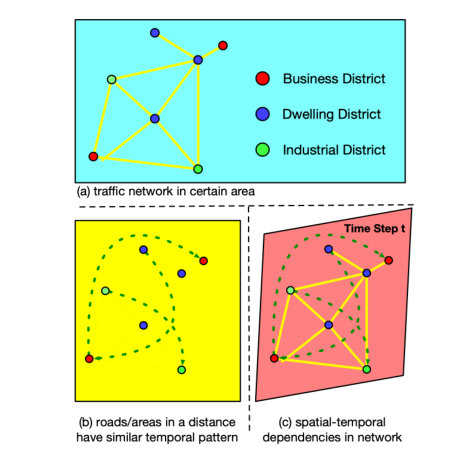
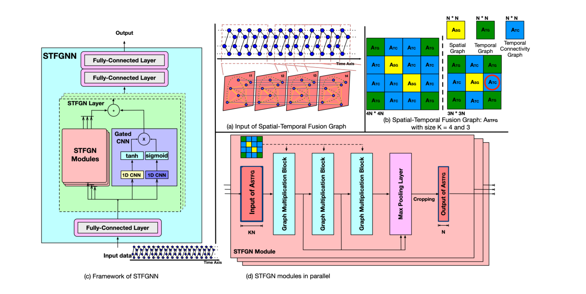
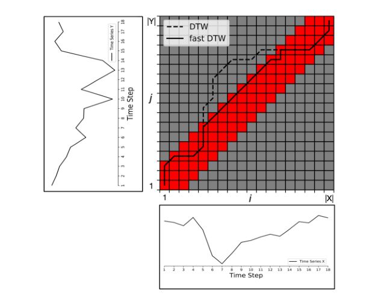
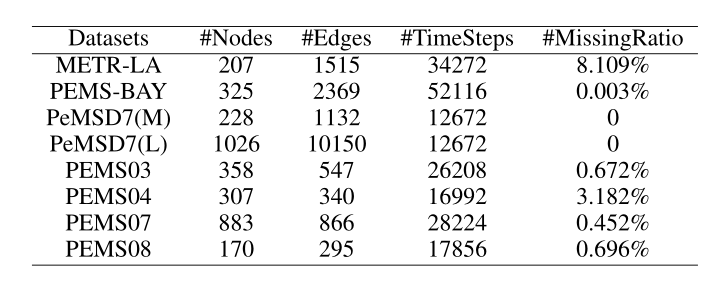
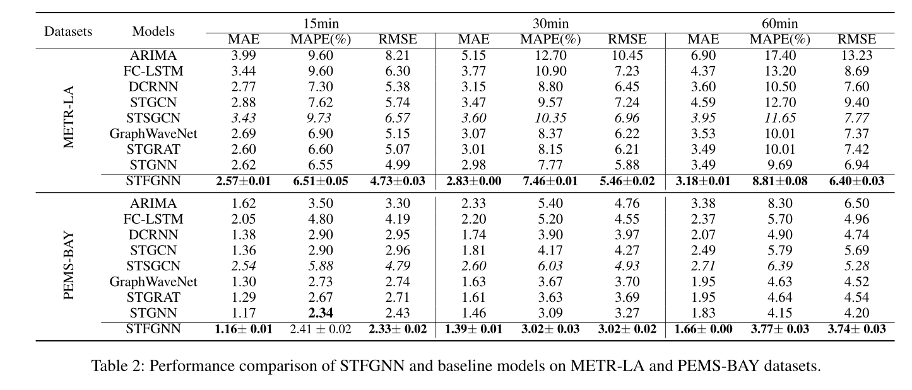
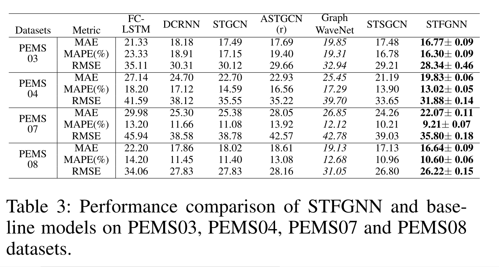
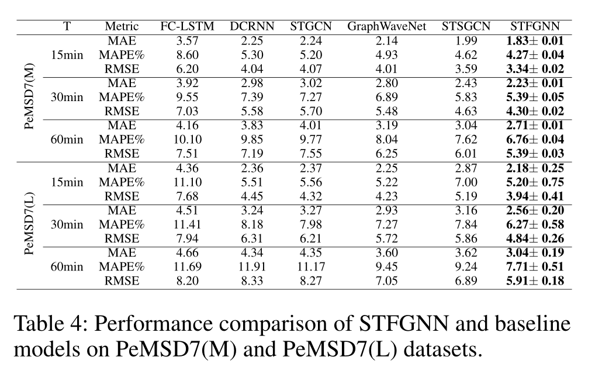
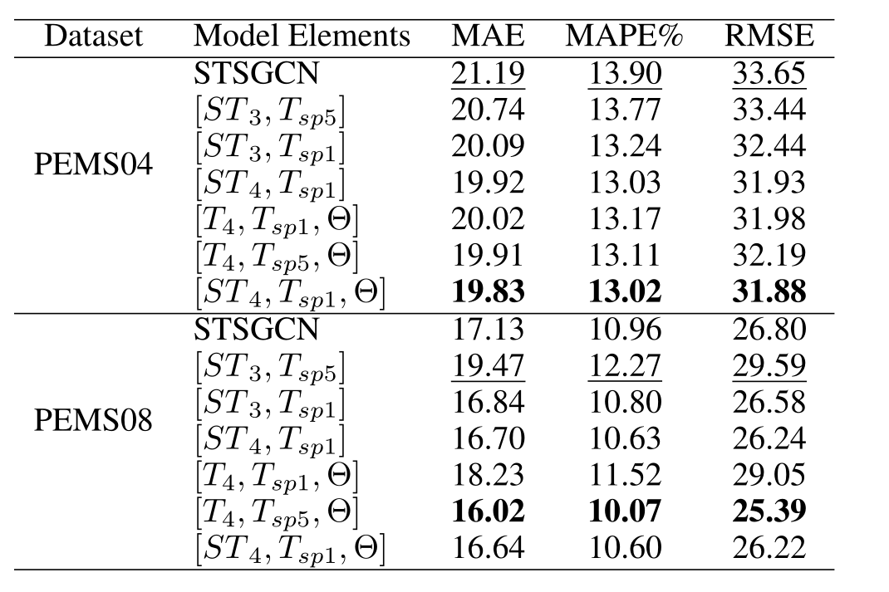
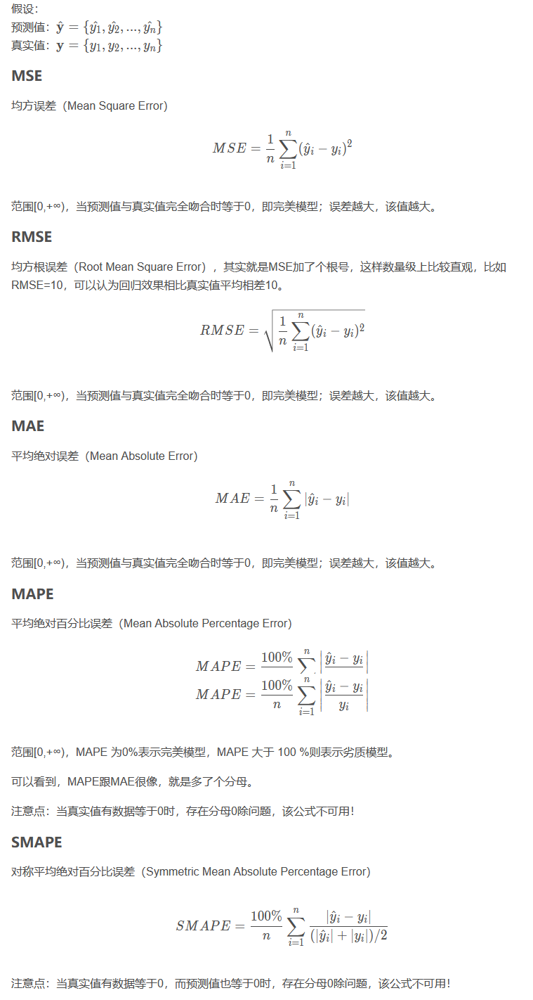

# 交通流预测的时空融合图神经网络

## 摘要

​	对于交通流的时空数据预测，现有的框架通常利用给定的空间关联图和复杂的机制对时空关系建模。但对于复杂的时空数据，现有的方法都是行不通的，它们通常使用单独的模块来实现时空相关性，或者只使用独立的组件来捕获局部或全局的多种依赖。

​	该论文提出一种生成“时序图”的数据驱动方法，以补偿空间图无法反映的几种现有相关性。STFGNN通过对不同时间段的各种时空图进行并行的融合运算，可以有效地学习隐藏的时空依赖关系。同时，通过将该融合图模块和一个新的门控卷积模块集成到一个统一的层中，SFTGNN可以通过学习更多的层叠的时空相关性来处理长序列。

## 介绍

**Question**： 尽管将图结合到时空数据预测模型中已经取得了改进，但是这些模型仍然面临一些缺点：

1. 缺乏信息图表结构，建模邻接矩阵时忽略节点之间的时间相似性。

   如图，那些遥远的节点可能具有一定的相关性，即它们将共享相似的“时间模式”。绿色虚线表示可能具有相似的时间模式。例如，在高峰时间，大多数靠近办公楼(在商业区)的道路在同一时期会遇到交通堵塞。

   

2. 当前的时空数据预测研究未能有效的捕捉局部和全局相关性之间的依赖性(某个时间某个区域)，要不就是耗时、面临梯度消失和梯度爆炸，要不就是忽略了全局相关性

**本论文提到的解决：**

1. 基于时间序列相似性学习的时序图。然后可以将多个图集成为一个时空融合图，以获得隐藏的时空依赖关系
2.  为了打破局部和全局相关性的权衡，引入了门控卷积模块，其较大的扩张率可以捕获长时间序列的相关性

将门控卷积模块与时空融合图模块并行组装

## 准备

​	把路网表示为一个图G = (V，E，ASG)，其中V是节点的有限集合|V | =  N^2^ ，对应N个传感器或道路的观测值，e是一组边，ASG是一个空间邻接矩阵，表示节点接近度或距离的矩阵。X(t)表示在时间步长t观察到的空间图形信息G，其元素是观察到的每个传感器的交通特征(例如速度）。

​	交通预测的目的是从先前的T速度观测值中学习函数f，以从道路网络上的N个相关传感器中预测下一个T速度。

​	

## 时空融合图的构建

### STFGNN的详细框架

**(a)**是时空融合图的输入示例，它将沿着时间轴迭代生成。

**(b)**是时空融合图的例子，其大小K分别为4和3。它由三种 N × N邻接矩阵组成:空间图ASG、时间图ATG和时间连通图ATC

​	ASG:由数据集给出的空间图；ATC：时间连通性图表示同一节点在相近时间步长上的连接，如果它的上一个和下一个时间步长是同一个节点，这个元素就是非零的；ATG：基于Fast DTW生成的时间图

​	利用Fast DTW基于时间序列的相似性生成时间图。

​	DTW:采用动态规划来计算两个时间序列之间的相似性，算法复杂度为O(N2)。当两个时间序列都比较长时，DTW算法效率比较慢，不能满足需求。Fast DTW的时间复杂度是 O(Tn)。

​	如图所示，给定两条道路的时间序列，其长度分别为|X|和|Y |。这两个时间序列Mc(|X|，|Y  |)的距离可以用公式计算。Fast DTW的扭曲路径在对角线(图2中的红色区域)，因此计算扭曲路径匹配i和j的成本比DTW算法少。

**(c)**中展示了时空融合图神经网络的框架。它由(1)输入层，(2)堆叠时空融合图神经层和(3)输出层组成。输入和输出层分别是一层和两层全连接层，然后是激活层，如“ReLU”(修正线性单元)。每个时空融合图层由多个时空融合图神经模块和一个包含两个并行一维扩张卷积块的门控神经网络模块并行构成，门控卷积模块就保证了全局时空的相关性。

**(d)**是时空融合图模块的详细体系结构，从(a)中输入，每个输入在这个模块中并行独立的训练，然后输出。

## 实验

### 数据集

​	METR-LA记录了洛杉矶县高速公路上207个传感器四个月的交通流量。PEMS-Bay记录了湾区325个传感器6个月的交通速度。PEMS03、PEMS04、PEMS07和PEMS08分别由加利福尼亚州的四个区的数据。每个数据集的空间邻接网络由基于距离的实际道路网络构建。采用z-score归一化来标准化输入数据。

​	实验数据的划分:按照训练集、验证集和测试集比例，前四个数据集比例为7:1:2,后四个为6:2:2。一小时12个连续时间步长历史数据用于预测下一小时的12个连续时间步长数据。

### 实验结果与分析

比较指标：平均绝对误差（MAE）、平均绝对百分比误差（MAPE）、均方根误差（RMSE）

基准模型（BaseLine）：

|    Model     |                             Info                             |
| :----------: | :----------------------------------------------------------: |
|    ARIMA     |     自回归综合移动平均模型,是时间序列领域的典型统计模型      |
|   FC-LSTM    |  长短期记忆网络，这是一个具有全连接的隐藏单元的递归神经网络  |
|    DCRNN     | 扩散卷积递归神经网络，它将图形卷积集成到编码解码器门控递归单元中 |
|    STGCN     |        时空图卷积网络，它将图卷积集成到一个卷积单元中        |
|    ASTGCN    | 基于注意的时空图卷积网络，它在模型中引入了空间和时间注意机制 |
| GraphWaveNet |   是一个将自适应邻接矩阵结合到图卷积和一维扩张卷积中的框架   |
|    STSGCN    | 时空同步图卷积网络，其利用局部时空子图模块来独立地建模局部相关性 |
|    STGRAT    | 时空图注意网络，在transformer模型中利用了自适应的时空自注意模块 |
|    STGNN     | 时空图神经网络，是一个具有可学习的位置注意机制和序列部分的复杂transformer模型 |

[图解Transformer](https://blog.csdn.net/qq_41664845/article/details/84969266)

表2、表3和表4显示了不同模型之间的全面比较。结果表明，除了PEMS-BAY数据集中的15min的MAPE（平均绝对百分比误差）比STGNN稍大之外，该论文的模型在每个数据集上都优于基准模型。

### 消融实验

消融实验类似于“控制变量法”。假设在某目标检测系统中，使用了A，B，C，取得了不错的效果，但是这个时候你并不知道这不错的效果是由于A，B，C中哪一个起的作用，于是你保留A，B，移除C进行实验来看一下C在整个系统中所起的作用。

ST~4~表示A~STFG~的K大小为4；T~4~表示在A~STFG~中A~SG~（空间图）全部被替换成A~TG~（时序图）；T~sp5~，T~sp1~表示A~TG~（时序图）的非零比例分别为5%和1%；θ表示门控卷积模块是否被添加到每个STFGNN层中。

该论文使用的默认配置是[ST~4~，T~sp1~，θ]

该消融实验就证明了，大一点的A~STFG~更好的提取复杂的时空特性；（PEMS08倒数第二行）也论证了在适当的稀疏度下，无空间信息的交通预测模型是可能的；对于增加门控卷积模块，可以弥补该模型的长时间序列的学习能力，从而提高整个网络的性能。

## 附

### 常用预测评价指标

