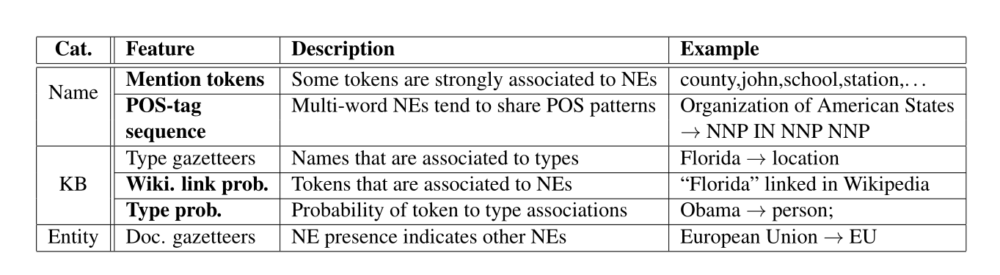

# 外部知识在命名实体识别任务中的重要性研究

A Study of the Importance of External Knowledge in the Named Entity Recognition Task(ACL2018)

## 知识增强NER

利用外部知识进行命名实体识别。用到了四类知识，然后利用这些特征训练CRF.下表列举了三类，分别为Name, KB, Entity.

1. 第一类：知识不可知论（A）

   这个类别包含“local”特征，可以在没有任何外部知识的情况下直接从文本中提取。

2. 基于名称的知识（Name）

   从命名实体名称列表中提取知识。

   - 经常提及的tokens。反映给定token在实体名称列表中的频率。我们标记了列表并计算了频率。该特征赋予对应于它们的归一化频率的文本中的每个token的权重。高权重应该被分配给指示命名实体的token。例如，我们在英语中找到的前5位的符号是“county”, “john”, “school”, “station” 和 “district”。没有出现的所有tokens的权重被分配0。
   - 频繁POS标签序列。识别命名实体常见的POS序列。例如，人名往往被描述为一系列专有名词，而组织可能具有更丰富的模式。“Organization of American States” 和 “Union for Ethical Biotrade”  都具有NNP-IN-NNP-NNP模式。我们排序名称POS标签序列，保留前100名。通过查找输入文本中最长的匹配序列并标记当前token是否属于频繁序列来实现该特征。

3. 基于知识库的知识（KB）

   该类别组特征从KB或实体注释语料库中提取。他们编码关于命名实体本身或用法的知识。我们采用了三个特征：

   - 类型注入地名匹配。
   - 维基百科链接概率。
   - 类型概率。

4. 基于实体的知识（实体）

   首先运行NED，来基于已消除歧义的命名实体生成文档特定特征。这些特征在NER的第二次运行中使用。
   
   第一次运行NER+NED之后，我们从YAGO中提取所有被识别的实体的表面形式。这些被标记并分配了相应实体的类型

## 结论

​	作者定义了四类feature,每一类feature都提高了NER结果，但是也导致需要更多的时间来提取这些feature，在实际运用中要进行结果和时间的性能平衡。

## 参考

- [https://baijiahao.baidu.com/s?id=1627439731312731404&wfr=spider&for=pc](https://baijiahao.baidu.com/s?id=1627439731312731404&wfr=spider&for=pc)

- [https://zhuanlan.zhihu.com/p/46708462](https://zhuanlan.zhihu.com/p/46708462)

