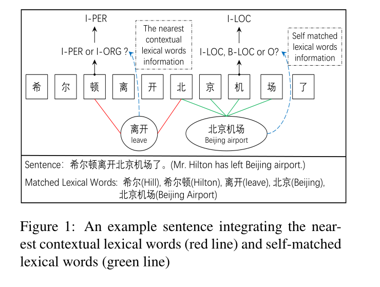
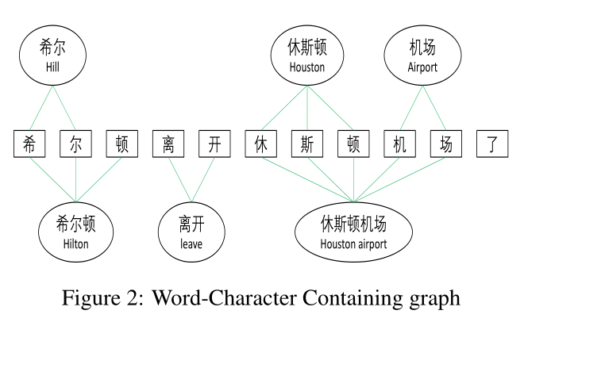
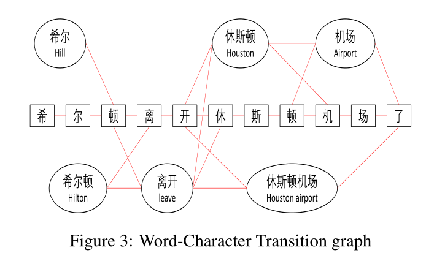
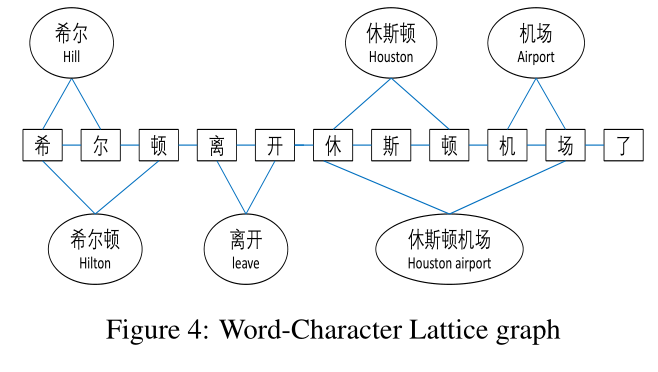
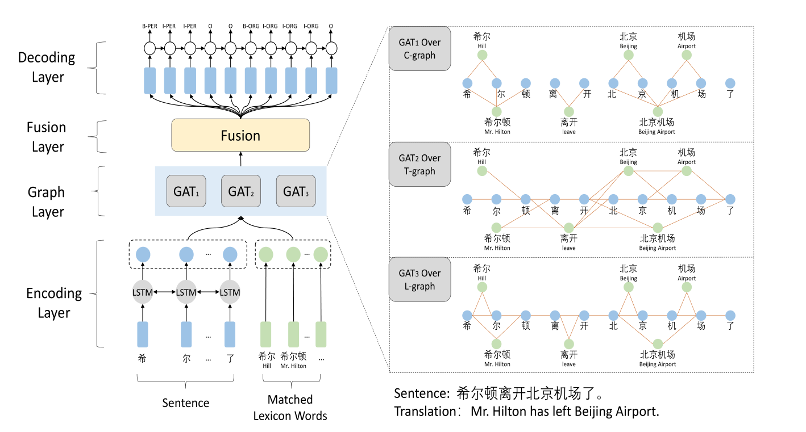
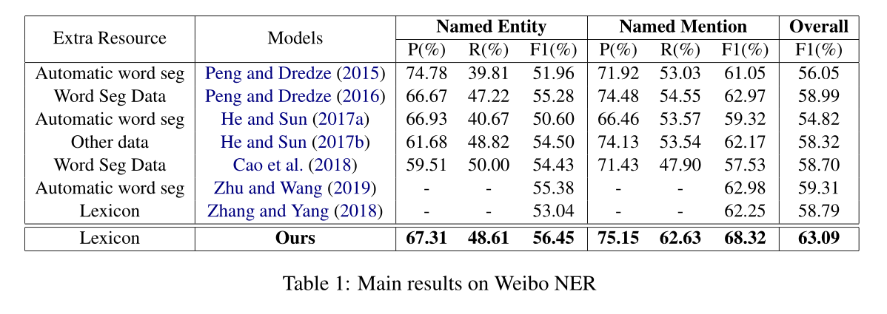
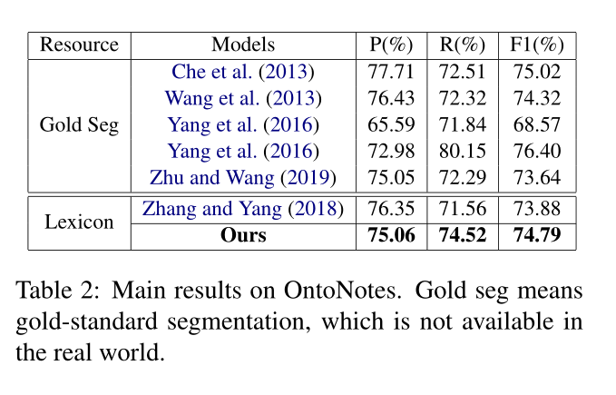
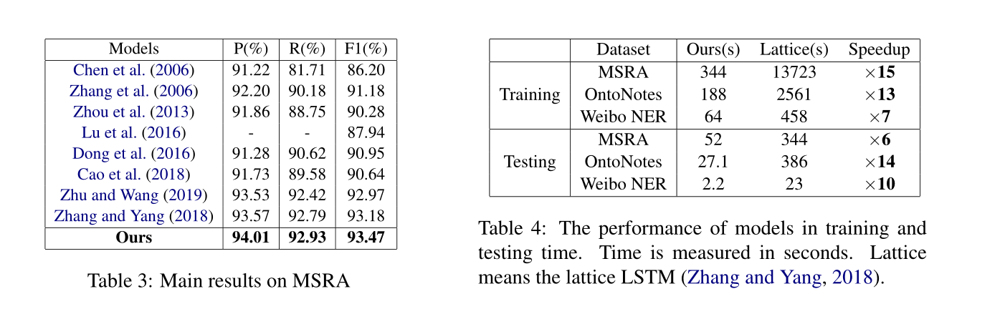
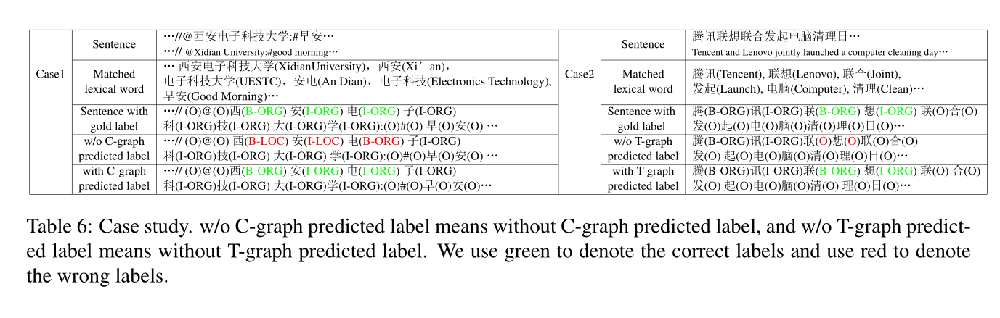
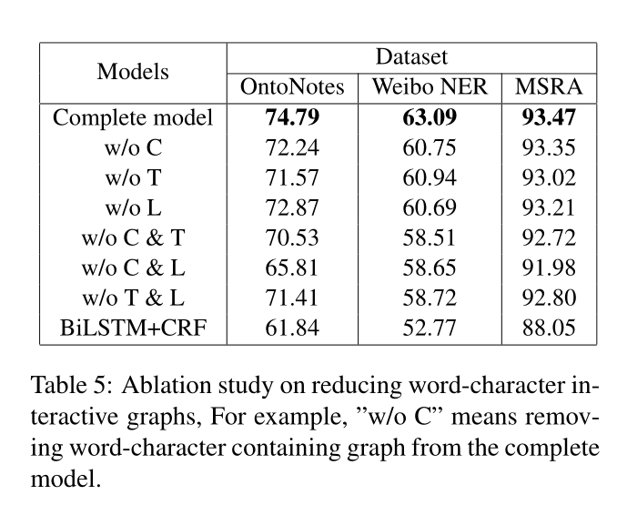

# 通过协同图网络利用词汇知识进行中文命名实体识别

[Leverage Lexical Knowledge for Chinese Named Entity Recognition via Collaborative Graph Network(EMNLP2019)](../../all_paper/)

code:[https://github.com/DianboWork/Graph4CNER](https://github.com/DianboWork/Graph4CNER)

EMNLP(Conference on Empirical Methods in Natural Language Processing)是自然语言处理领域的顶会。

## 摘要

​	缺乏词边界信息已被视为开发高性能中文命名实体识别（NER）系统的主要障碍之一。幸运的是，自动构建的词典包含丰富的词边界信息和词语义信息。然而，在中文 NER  任务中整合词汇知识在自匹配词汇以及最近的上下文词汇方面仍然面临挑战。我们提出了一个协作图网络来解决这些挑战。在各种数据集上的实验表明，我们的模型不仅优于最先进的（SOTA）结果，而且速度比 SOTA 模型快 6 到 15 倍

## 介绍

​	命名实体识别 (NER) 旨在将非结构化文本中出现的某些单词或表达式定位并分类为预定义的语义类别，例如人名、位置、组织等。NER是许多自然语言处理的基本预处理步骤。例如关系提取、事件提取 、问答 等。在英语 NER 中，LSTM-CRF 模型利用词级表示和字符级表示实现了最先进的结果。

​	与英文相比，中文没有明显的词界限。由于没有词边界信息，仅对于中文NER直接用字符信息，尽管这种方法可能会导致忽略词信息。然而，词信息在中文 NER 中非常有用，因为词边界通常与命名实体边界相同。例如，如图1所示，词（北京机场）的边界与命名实体（北京机场）的边界相同。因此，充分利用词信息有助于提高中文NER性能。

​	当前，将词信息整合到中文NER任务的主要方法有三种。第一种是pipeline。管道方法的方式是先应用中文分词（CWS），然后使用基于词的NER模型。然而，管道方法存在错误传播，因为 CWS  的错误可能会影响 NER 的性能。第二种是联合学习 CWS 和 NER 任务，然而，联合模型必须依赖于 CWS 标注数据集，这些数据集成本高昂并且在许多不同的分割标准下进行标注。第三种是自动构建词典。词典通过大规模自动分割的文本预训练得到，词汇知识包括边界和语义信息，边界信息由词本身提供，语义信息由预先训练好的词嵌入提供。

​	将词汇知识整合到句子中还面临着两个挑战：

1. 整合自匹配词汇；

   例如，“希尔顿离开北京机场了”，“北京机场”和“机场”为“机”的自匹配词汇（字符的自匹配词是包含该字符的词。），但是“离开”则不是“机”的自匹配词汇，因为“离开”不包含“机”。这样一来，就可以促进模型对中文进行NER识别。如图1所示，自匹配词“北京机场”的边界和语义知识可以帮助字符“机”预测一个“I-LOC”标签（中间-位置），而不是“O” （其他）或“B-LOC”（开始-位置）标签。

2. 直接整合最近的上下文词汇

   字符的最近上下文词汇是匹配该字符给定句子中最近的过去或未来子序列的词。如图1，直接使用最近的上下文词“离开”的语义知识，可以预测“顿”为‘’I-PER‘’（中间-人）而不是“I-ORG”（组织），因为“希尔顿”如果是“希尔顿酒店”的话，不能作为动词“离开”的主语。

​	为了解决这两个挑战，作者提出一种基于字符的协作图网络，该网络包含编码层、图层、融合层、解码层。图层包含C-graph、T-graph和L-graph。第一个是包含图(C-graph)，该图模拟了字符和自匹配词汇之间的联系，用于整合自匹配词汇。第二种是转换图(T-graph)，它在字符和最近的上下文匹配词之间建立直接连接。L-graph通过多个跃点隐式地捕获自匹配词汇和最近的上下文词汇的部分信息。

主要贡献如下：

- 提出了一个协作图网络，为中文 NER 直接有效地整合词汇知识。
- 为了解决整合自匹配词汇和最近的上下文词汇的挑战，我们提出了三个词字符交互图。这些交互式图表可以捕获不同的词汇知识，并且无需外部 NLP 工具即可构建。
- 在各种流行的中国 NER 数据集中取得了最先进的结果，我们的模型比现有的 SOTA 模型实现了 6-15 倍的加速

## 方法

​	介绍了图的构建，将自匹配的词汇和最近的上下文词汇整合到句子中。然后，介绍了协作图网络的架构，作为解决中文 NER 任务的核心。

### 1. 图的构建

​	为了整合自匹配词汇和最近的上下文词汇，提出了三个词-字符交互图。首先是词-字符包含图（C-graph），它是辅助字符捕捉自匹配词汇的边界和语义信息。第二个是词-字符转换图（T-graph）。  T-graph的作用是辅助字符捕捉最近的上下文词汇的语义信息。第三个是格图（L-graph）。 Zhang and Yang (2018)  提出了一种格结构，嵌套在 LSTM (Hochreiter and Schmidhuber, 1997) 中，以整合词汇知识。

​	这三个图共享相同的顶点集，但三个图的边集完全不同。顶点集由句子中的字符和匹配的词汇组成，例如，如图1所示，顶点集为V={希，尔，...，希尔，希尔顿，...，北京机场}。为了表示边缘集，需要引入邻接矩阵。邻接矩阵的元素表示图中顶点对是否相邻。由于三个图的边集完全不同，下面介绍这三个图的邻接矩阵：

#### 词-字符包含图（C-graph）

​	通过 C-graph，句子中的字符可以捕捉到自匹配词汇的边界和语义信息。如图 2 所示，如果一个词汇 i 包含一个字符 j，则 C-graph 对应邻接矩阵  A 的 (i, j)将被赋值为 1。

#### 词-字符转换图（T-graph）

​	T-graph是为了辅助字符捕捉最近的上下文词汇的语义信息。如图 3 所示，如果一个词汇 i 或一个字符 m 匹配一个字符 j 的最近的前面或后面的子序列，则  T-graph 对应邻接矩阵 A 的 (i, j) 或 (m,  j)将被赋值为1。此外，为了捕捉词汇之间的上下文关系，如果一个词汇i是另一个词汇k的前后上下文，我们将分配“A(ik) =  1”。请注意，T-graph 与中文分词中使用的分词图相同。

#### 词-字符格图（L-graph）

​	L-graph捕获自匹配词汇和最近的上下文词汇的部分信息。如图 4 所示，如果字符 m 是字符 j 的最接近的前面或后面的字符，则 L-graph 对应邻接矩阵 A 的 (m, j)将被赋值为1。此外，如果一个字符 j 匹配词汇 i 的第一个字符或结束字符，我们将分配“A(ij) = 1”。

### 2. 模型

​	基于字符的协同图网络包括编码层、图层、融合层和解码层。编码层是捕捉句子的上下文信息，表示词汇的语义信息。图形层基于 GAT（图注意网络） ，用于对三个词-字符交互图进行建模（在右侧，展示了三个词-字符交互图上的图注意力网络的细节。我们用蓝色表示句子中的字符，用绿色表示匹配的词典词。）。融合层用于融合这三个图捕获的不同词汇知识。最后，使用标准 CRF（条件随机场）模型来解码标签。

## 实验

表 1 显示了在微博 NER 上的结果

### 消融实验

​	从消融实验中，可以发现每个图都可以独立实现，但它们一起可以达到最佳结果，这表明所有这三个图对于我们的模型都是必不可少的。

## 其他

NLP中的序列标注方式常用的有两种：BIO标注法和BIOES标注法。

### BIO标注法：

B-begin，代表实体的开头

I-inside，代表实体的中间或结尾

O-outside，代表不属于实体

### BIOES标注法：

B-begin，代表实体的开头

I-inside，代表实体的中间

O-outside，代表非实体，用于标记无关字符

E-end，代表实体的结尾

S-single，代表单个字符，本身就是一个实体
