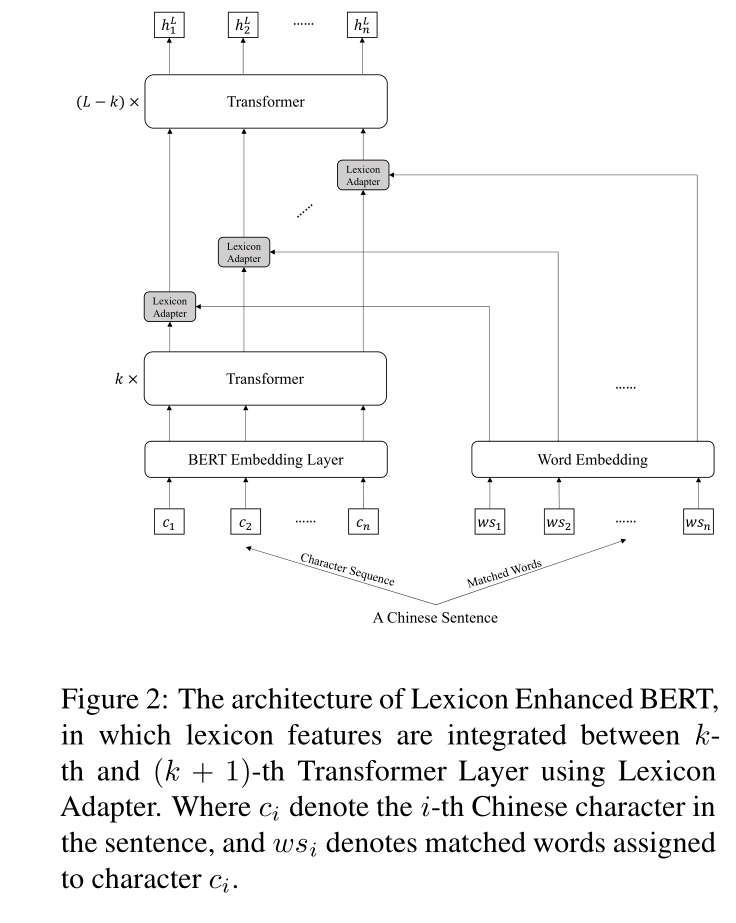
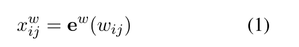

# 使用BERT适配器的词典增强中文序列标记

## 摘要

词典信息和预训练模型，例如BERT，由于各自的优势，被结合起来探索中文序列标注任务。然而，现有方法仅通过浅层和随机初始化序列层来融合词典特征，并没有将它们集成到 BERT  的底层。在本文中，我们提出了用于中文序列标注的词典增强BERT (LEBERT)，它通过 Lexicon Adapter  层直接将外部词典知识集成到 BERT 层中。与现有方法相比，我们的模型有助于在 BERT  的较低层进行深度词典知识融合。在命名实体识别、分词和词性标注三个任务的十个中文数据集上进行的实验表明，LEBERT 取得了最先进的结果。

## 1 介绍

序列标注是自然语言处理（NLP）中的一项经典任务，即为序列中的每个单元分配一个标签（Jurafsky and  Martin，2009）。许多重要的语言处理任务都可以转化为这个问题，例如词性 (POS) 标记、命名实体识别 (NER)  和文本分块。目前最先进的序列标记结果是通过神经网络方法实现的（Lample 等人，2016；Ma 和 Hovy，2016；Chiu 和  Nichols，2016；Gui 等人，2017）。由于中文句子中缺乏明确的词边界，中文序列标注更具挑战性。执行中文序列标记的一种方法是先执行中文分词  (CWS)，然后再应用词序列标记 (Sun and Uszkoreit, 2012; Yang et al., 2016)。然而，它可能会受到从 CWS  系统传播的分割错误的影响。因此，一些方法 (Cao et al., 2018; Shen et al., 2016) 直接在字符级别执行中文序列标注，这已被经验证明更有效 (Ng and  Low, 2004; Liu et al., 2010； Zhang and Yang，2018）。

最近有两个增强基于字符的神经中文序列标注的工作。第一个考虑将单词信息集成到基于字符的序列编码器中，从而可以显式地对单词特征进行建模（Zhang and  Yang, 2018; Yang et al., 2019; Liu et al., 2019; Ding et al., 2019;  Higashiyama等人，2019）。这些方法可以被视为为神经架构设计不同的变体，以集成离散的结构化知识。第二个考虑了大规模预训练上下文嵌入的集成，例如  BERT (Devlin et al., 2019)，它已被证明可以捕获隐含的单词级句法和语义知识 (Goldberg, 2019; Hewitt and  Manning, 2019）。

由于离散和神经表示的不同性质，这两条工作线相互补充。最近的工作考虑了中文 NER（Ma 等人，2020；Li 等人，2020）、中文分词（Gan 和  Zhang，2020）和中文词性标注（Tian 等人， 2020b)。主要思想是将来自 BERT 和词典特征的上下文表示整合到神经序列标记模型中（如图 1  (a) 所示）。然而，这些方法并没有充分利用 BERT 的表示能力，因为外部特征没有集成到底层。

受有关 BERT Adapter 的工作（Houlsby 等人，2019 年；Bapna 和 Firat，2019 年；Wang 等人，2020  年）的启发，我们提出了 Lexicon Enhanced BERT (LEBERT) 来直接在 BERT 的 Transformer  层之间集成词典信息。具体而言，通过将句子与现有词典进行匹配，将中文句子转换为字符-单词对序列。词典适配器旨在使用 char-to-word  双线性注意机制为每个字符动态提取最相关的匹配词。词典适配器应用于 BERT 中的相邻转换器之间（如图 1 (b) 所示），以便词典特征和 BERT 表示通过  BERT 内的多层编码器充分交互。我们在训练期间对 BERT 和词典适配器进行了微调，以充分利用单词信息，这与 BERT 适配器有很大不同（它修复了 BERT  参数）。

## 2 相关工作

我们的工作与使用词典特征和预训练模型来改进中文序列标签的现有神经方法有关。

基于词典。基于词典的模型旨在通过词典信息增强基于字符的模型。 Zhang and Yang (2018) 引入了一个格 LSTM 来编码中文 NER  的字符和单词。在训练效率（Gui et al., 2019a; Ma et al., 2020）、模型退化（Liu et al., 2019）、图结构（Gui  et al., 2019b; Ding et al., 2019)，并消除了词典的依赖性（Zhu and Wang, 2019）。词典信息也被证明对中文分词  (CWS) 和词性 (POS) 标记很有帮助。杨等人。 (2019) 为 CWS 应用了格 LSTM，表现出良好的性能。赵等人。  （2020）通过词典增强的自适应注意力改进了 CWS 的结果。田等人。 （2020b）通过 N-gram 的多通道注意力增强了基于字符的中文词性标注模型。

基于模型的预训练。基于 Transformer 的预训练模型，例如 BERT (Devlin et al., 2019)，在中文序列标注方面表现出优异的性能。  Yang (2019) 只是在 BERT 上添加了一个 softmax，在 CWS 上实现了最先进的性能。孟等人。 （2019）； Hu 和 Verberne  (2020) 表明，使用 BERT 字符特征的模型在中文 NER 和中文 POS 标记方面大大优于基于静态嵌入的方法。

混合模型。最近的工作试图通过利用它们各自的优势来整合词典和预训练模型。马等人。 (2020) 将单独的特征、BERT 表示和词典信息连接起来，并将它们输入到中文  NER 的浅层融合层 (LSTM) 中。李等人。 (2020) 提出了一种浅层 Flat-Lattice Transformer  来处理字符-单词图，其中融合仍处于模型级别。类似地，字符 N-gram 特征和 BERT 向量被连接起来用于联合训练 CWS 和 POS 标记（Tian  等人，2020b）。我们的方法与上述尝试结合词典信息和 BERT 的方法是一致的。不同的是，我们将词典集成到底层，允许在 BERT 内部进行深入的知识交互。

也有使用词典来指导预训练的工作。 ERNIE (Sun et al., 2019a,b) 利用实体级和词级掩码以隐式方式将知识集成到 BERT 中。贾等人。  (2020) 提出了实体增强型 BERT，具有精心设计的字符实体转换器的特定语料库和实体集。ZEN (Diao et al., 2020) 使用多层 N-gram 编码器增强了中文 BERT，但受到 N-gram  词汇量较小的限制。与上述预训练方法相比，我们的模型使用适配器将词典信息集成到 BERT 中，效率更高，并且不需要原始文本或实体集。

BERT 适配器。 BERT Adapter (Houlsby et al., 2019)  旨在为下游任务学习特定于任务的参数。具体来说，他们在预训练模型的层之间添加适配器，并仅针对特定任务调整添加的适配器中的参数。 Bapna 和 Firat  (2019) 将特定于任务的适配器层注入到用于神经机器翻译的预训练模型中。 MAD-X (Pfeiffer et al., 2020)  是一个基于适配器的框架，可实现对任意任务的高可移植性和参数高效传输。王等人。 (2020) 提出了  K-ADAPTER，通过进一步的预训练将知识注入预训练模型。与它们类似，我们使用词典适配器将词典信息集成到 BERT  中。主要区别在于我们的目标是在底层更好地融合词典和 BERT，而不是高效的训练。为了实现它，我们对 BERT 的原始参数进行微调而不是修复它们，因为直接注入，由于这两个信息之间的差异，将词典特征添加到 BERT 中会影响性能。

## 3 模型

提出的  Lexicon Enhanced BERT 的主要架构如图 2 所示。与 BERT 相比，LEBERT  有两个主要区别。首先，鉴于中文句子被转换为字符-单词对序列，LEBERT 将字符和词典特征作为输入。其次，在 Transformer  层之间附加了一个词典适配器，允许将词典知识有效地集成到 BERT 中。在本节中，我们描述： 1) Char-words Pair Sequence（第 3.1  节），它将单词自然地合并到一个字符序列中； 2) Lexicon Adapter（第 3.2 节），通过将外部词典特征注入 BERT； 3) Lexicon  Enhanced BERT（第 3.3 节），通过将 Lexicon Adapter 应用于 BERT。

### 3.1 字符-词 对序列

中文句子通常表示为一个字符序列，仅包含字符级特征。为了利用词典信息，我们将字符序列扩展为字符词对序列。

给定一个汉语词典  D 和一个有 n 个字符 sc = {c1, c2, ..., cn} 的汉语句子，我们通过将字符序列与 D  匹配来找出句子中的所有潜在词。具体来说，我们首先构建一个 单词查找树基于D，然后遍历句子的所有字符子序列，并与单词查找树匹配，得到所有潜在词。以截断句“美国人民（American  People）”为例，我们可以找出四个不同的词，即“美国（American）”、“美国人（American）”、“国人（Compatriot）”、“人民（People）”。随后，对于每个匹配的单词，我们将其分配给它包含的字符。如图  3 所示，匹配的词“美国  (America)”被分配给字符“美”和“国”，因为它们构成了该词。最后，我们将每个字符与指定的单词配对，并将一个中文句子转换为字符-单词对序列，即 scw =  {(c1, ws1), (c2, ws2), ..., (cn, wsn)}，其中ci 表示句子中的第 i 个字符，wsi 表示分配给 ci 的匹配词。

### 3.2 词典适配器

句子中的每个位置都包含两种类型的信息，即字符级特征和单词级特征。与现有的混合模型一致，我们的目标是将词典功能与 BERT 结合起来。具体来说，受最近关于  BERT 适配器的工作（Houlsby 等人，2019 年；Wang 等人，2020 年）的启发，我们提出了一种新颖的词典适配器（LA），如图 4  所示，它可以直接将词典信息注入 BERT。

词典适配器 (LA)  的结构。适配器输入一个字符向量和成对的单词特征。对字符和单词的双线性注意力用于将词典特征加权为一个向量，然后将其添加到字符级向量中，然后进行层归一化。

词典适配器接收两个输入，一个字符和成对的单词。对于一个char-words对序列中的第i个位置，输入表示为(hci,  xwsi)，其中hci是一个字符向量，BERT中某个transformer层的输出，xwsi = {xwi1, xwi2, ..., xwim} 是一组词嵌入。  xwsi 中的第 j 个单词表示如下：

其中 ew 是预训练的词嵌入查找表，wij 是 wsi 中的第 j 个词。

为了对齐这两种不同的表示，我们对词向量应用非线性变换：

其中 W1 是 dc-by-dw 矩阵，W2 是 dc-by-dc 矩阵，b1 和 b2 是缩放器偏置。 dw 和 dc 分别表示词嵌入的维度和 BERT 的隐藏大小。

如图 3  所示，每个字符都与多个单词配对。但是，对每个任务的贡献因词而异。例如，词性标注，“美国（America）”和“人民）”作为“美国人”和“国人（Compatriot）”优于“国人（美国人）”，因为它们是真实的句子。从所有匹配的词中挑选出最相关的词，我们引入了字符到单词的注意机制。

具体来说，我们将分配给第 i 个字符的所有 vwij 表示为 Vi = (vwi1, ..., vwim)，其大小为 m×dc，m  是分配的单词的总数。每个词的相关度可以计算为：

其中 Wattn 是双线性注意力的权重矩阵。因此，我们可以通过以下方式获得所有单词的加权和：

最后，通过以下方式将加权词典信息注入字符向量：

紧随其后的是 dropout 层和层归一化

### 3.3 词典增强型 BERT

Lexicon Enhanced BERT (LEBERT) 是 Lexicon Adapter (LA) 和 BERT 的组合，其中 LA 应用于 BERT  的某一层，如图 2 所示。具体来说，LA 附加在 BERT 内部的某些转换器之间，从而注入外部词典知识进入BERT。

给定一个包含 n 个字符 sc = {c1, c2, ..., cn} 的中文句子，我们构建对应的字符-词对序列 scw = {(c1, ws1), (c2,  ws2), ..., ( cn, wsn)} 如第 3.1 节所述。字符 {c1, c2, ..., cn} 首先输入到 Input  Embedder，通过添加标记、段和位置嵌入输出 E = {e1, e2, ..., en}。然后我们将 E 输入到 Transformer 编码器中，每个  Transformer 层的作用如下：

其中H l = {hl1, hl2, ..., hln}表示第l层的输出，H 0 = E； LN 是层归一化； MHAttn 是多头注意力机制； FFN  是一个以 ReLU 作为隐藏激活函数的两层前馈网络。

为了在第 k 个和第 (k + 1) 个 Transformer 之间注入词典信息，我们首先在 k 个连续的 Transformer 层之后得到输出 H k =  {hk1, hk2, ..., hkn}。然后，每对 (hki , xwsi ) 都通过 Lexicon Adapter 将第 i 对转换为 ~hki ：

由于 BERT 中有 L = 12 个 Transformer 层，我们将 ~H k = {~hk1,~hk2, ...,~hkn} 输入到剩余的 (L−k)  个 Transformer。最后，我们得到 L-th Transformer H L 的输出，用于序列标注任务。

### 3.4 训练和解码

考虑到连续标签之间的依赖关系，我们使用  CRF 层来进行序列标注。给定最后一层 H L = {hL1 , hL2 , ..., hLn } 的隐藏输出，我们首先计算分数 P：

对于标签序列 y = {y1, y2, ..., yn}，我们将其概率定义为：

其中 T 是转换得分矩阵，y 表示所有可能的标签序列。

给定 N 个标记数据 {sj , yj}|Nj=1，我们通过最小化句子级负对数似然损失来训练模型：

在解码时，我们使用维特比算法找出得分最高的标签序列。

