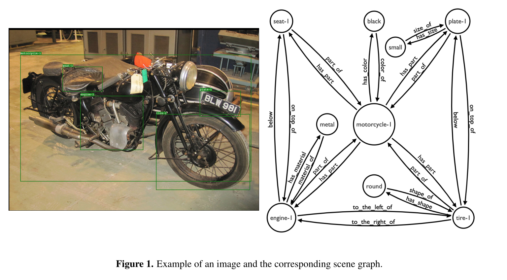
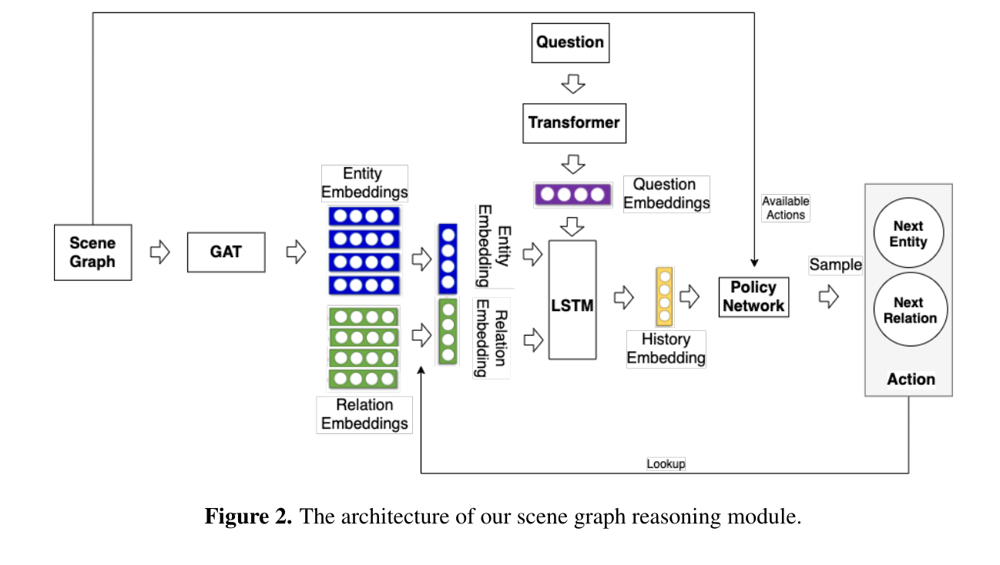
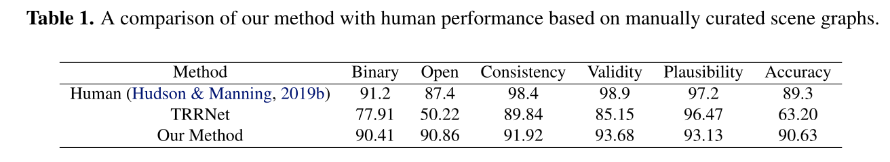
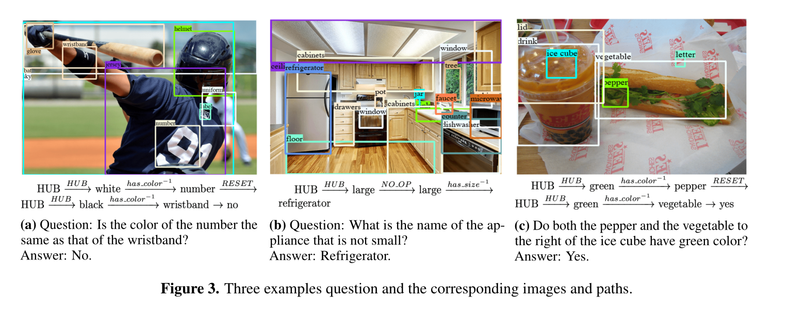

# 视觉问答的场景图推理

ICML, 2020 , [Paper](../../all_paper)

## 场景图

​	[图片场景图生成任务（Image scene graph generation）目标是让计算机自动生成一种语义化的图结构（称为 scene graph，场景图），作为图像的表示。图像中的目标对应 graph node，目标间的关系对应 graph edge（目标的各种属性，如颜色，有时会在图中表示）。这种结构化表示方法相对于向量表示更加直观，可以看做是小型知识图谱，因此可以广泛应用于知识管理、推理、检索、推荐等。此外，该表示方法是模态无关的，自然语言、视频、语音等数据同样可以表示成类似结构，因此对于融合多模态信息很有潜力。](https://zhuanlan.zhihu.com/p/152367996)

## 摘要

​	提出了一种新颖的方法，该方法通过基于场景中存在的对象及其语义和空间关系执行上下文驱动的顺序推理来处理任务。作为第一步，我们导出了一个场景图，它描述了图像中的对象，以及它们的属性和相互关系。然后，强化代理学习在提取的场景图上自主导航以生成路径，然后这些路径是得出答案的基础。

## 介绍

​	视觉问答（VQA）是一项要求很高的任务，涉及对图像和自然语言两种数据模式的理解和推理。给定一幅图像和一个自由形式的问题，该问题阐述了一个关于所呈现场景的问题——问题在于算法如何找到正确答案。

​	在这项工作中，我们的目标是将VQA技术与知识图（KG）统计关系学习领域的最新研究进展相结合。KG通过收集事实陈述，提供人类可读的、结构化的真实世界知识表示。受KG上的多跳推理方法（如Das等人，2018年；Hildebrandt等人，2020年）的启发，我们将VQA任务建模为场景图上的寻路问题。其基本思想可以用这样一句话来概括：学会走到正确的答案。更具体地，考虑到图像，我们考虑场景图并训练强化学习代理，以在场景图上进行策略引导的随机游走，直到获得最终的推理路径。与纯粹基于嵌入的方法相比，我们的方法提供了明确的推理链，从而得出导出的答案。总而言之，我们的主要贡献如下:

- 提出了第一种VQA方法，该方法使用强化学习对场景图进行推理
- 进行了一项实验研究，以分析我们方法的推理能力。 我们没有生成我们自己的场景图，而是考虑从 GQA 数据集中手动策划场景图用于这些第一次实验。 此设置允许隔离与视觉感知任务相关的噪音，并仅关注语言理解和推理任务。 因此，我们可以证明我们的方法实现了类似人类的性能。

## 方法

​	VQA的任务是一个场景图遍历问题。从连接到所有其他节点的中心节点开始，代理依次对场景图上的相邻节点的过渡进行采样，直到到达对应于答案的节点。通过这种方式，通过向当前路径添加转换，推理链将连续扩展。

​	场景图是一种有向多重图，其中每个节点对应于一个场景实体，该场景实体要么是与边界框关联的对象，要么是对象的属性。每个场景实体都有一个对应于预测对象或属性标签的类型。类型化边指定场景实体之间的关联方式。更正式地，让E表示场景实体集合，并考虑二元关系R的集合，然后是场景图SG⊂  E×R×E是主语、谓语和宾语的有序三元组（s、p、o）的集合。如图，三元组（motorcycle-1, has part, tire-1） 在图像中检测到摩托车（对象）和轮胎（对象），谓词has part表示实体之间的关系。p−1表示与谓词p相对应的逆关系，此外，我们在每个场景图中添加一个所谓的中心节点（hub），该节点连接到所有其他节点。

​	在SG中初始化实体和关系，并嵌入它们的类型标签。在场景图中，节点嵌入后通过一个多层图注意网络（GAT），因此生成的嵌入是上下文感知的，这使得具有相同类型但不同图形邻域的节点可以区分。GAT后将实体和关系的embeddings取出一个。为了问题Q的嵌入，使用Transformer，再平均池化。然后，两边通过LSTM形成历史的Embedding，通过强化学习进行迭代。

## 实验

### 数据集

GQA数据集包含113K张图像和大约120万个问题，数据集被划分为8：1：1，用于训练、验证和测试。总词汇量由3097个单词组成。

### 结果

表1显示了我们的方法的性能，除了开放性问题（“开放性”）、二元问题（是/否）（“二元性”）和总体准确性（“准确性”）的准确性外，我们还报告了额外的指标“一致性”（答案不应自相矛盾），“有效性”（答案在问题的范围内；例如，当被问及物体的颜色时，红色是有效的答案），“合理性”（答案应该合理；例如，红色是苹果的合理颜色，蓝色不是）。

1. 问题：数字的颜色和腕带的颜色一样吗？回答：没有。
2. 问题：不小的设备的名称是什么？答案：冰箱
3. 冰块右边的辣椒和蔬菜都是绿色的吗？回答：是的。 

## 总结

提出了一种基于多跳序列推理和深度强化学习的视觉问答方法。具体来说，训练一个agent从场景图中提取结论性推理路径。为了分析我们的方法在受控环境下的推理能力，我们对手动绘制的场景图进行了初步实验研究，得出结论，我们的方法达到了人类的性能。在未来的工作中，我们计划将最先进的场景图生成纳入我们的方法中，以覆盖完整的VQA管道。

